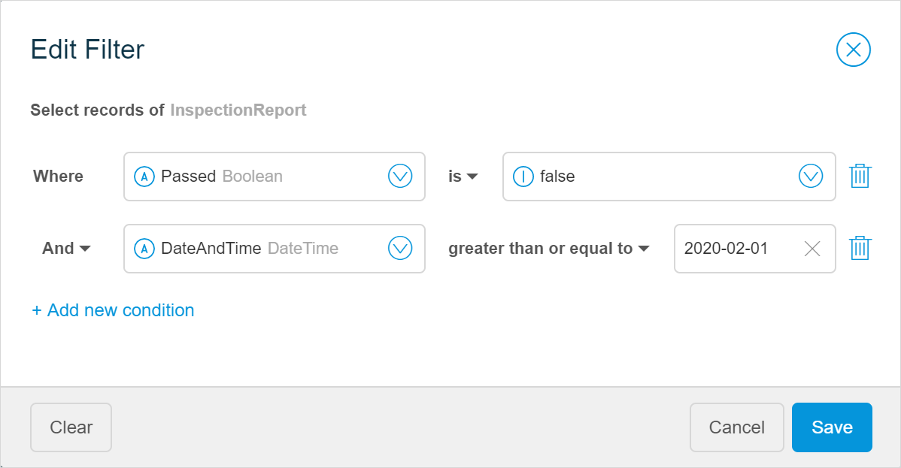
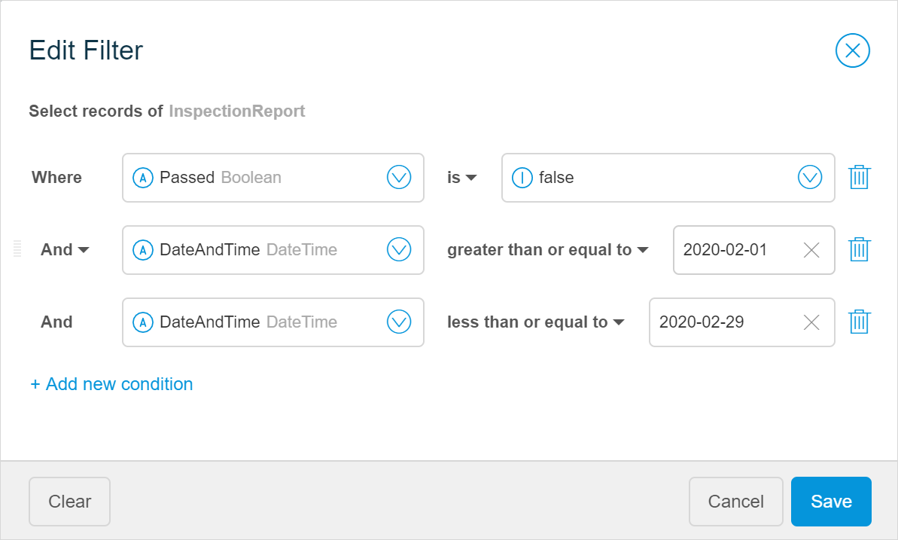
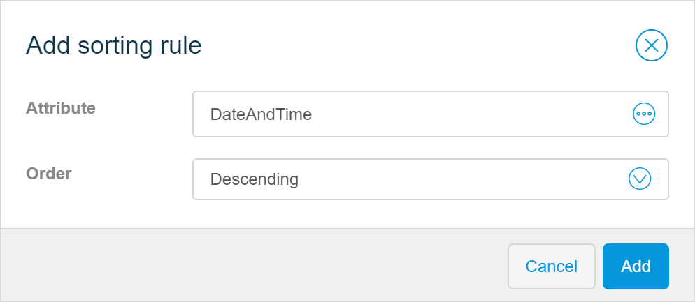

## 1 Introduction 

This how-to explains how you can filter and sort items in a list in Mendix Studio. 

**This how-to will teach you how to do the following:**

* Configure a filter for items in a list
* Sort items in a list

The how-to describes the following use case: 

You have a list inspections reports that shows companies checked on compliance with safety regulations. You would like to display only companies that failed this inspection. You also would like to display reports for February 2020 only. In addition, items should be sorted by date and time starting from the latest one.  

Domain model is configured the following way in this use-case:

A list of inspection reports is displayed on a separate page and looks the following way:

## 2 Prerequisites

Before starting this how-to, make sure you have completed the following prerequisites:

* Familiarize yourself with the domain model terms and learn how to perform basic functions. For more information, see [Domain Model](/studio/domain-models).
* Familiarize yourself with page terms and how to perform basic functions on pages. For more information, see [Pages](/studio/pages). 
* Familiarize yourself with terms on data filters. For more information, see [Data Filters](/studio/filters).

## 3 Filtering Information 

First, you need to add a filter to your list.  As you would like to show only failed ones, the **Passed** attribute (see the domain model example above) should have been marked in the report as *No*. You also would like to show reports that were created or modified in February 2020, that means the **DateAndTime** attribute should fall into a range from February 1st, 2020 to February 29th, 2020. 

To configure a filter, do the following:

1. Select the list view and open its properties.

2. In the **Data Source** section, click **Filter**.

3. In the **Add Filter** dialog box, add conditions for the filter by following the steps below:

    1. Click **Where** and select the **Passed** attribute:

		

	2. Once you select the first part of the condition, you can select the other part of it to complete it. Select *false*:
	
		
	
	3. The first condition is complete, it reads: *Select records of InspectionReport where Passed is false*. 
	
	   To filter inspections reports for February, you need to add two conditions: the date and time should include and should not be earlier than February 1st, 2020, and it should include but should not be later than February 29th, 2020. Click **Add new condition** and do the following:
	
	   1. Select the **DateAndTime** attribute.
	
	   3. Set an operator from *is* to *greater than or equal to*.
	
	   4. Add the second part of the condition: the date should include but should not be earlier than February 1st, 2020. The format for date is YYYY-MM-DD, so type in *2020-02-01*.
	
		
	
4. Now you need to restrict data by the end of the month: click **Add new condition** and do the following:

    1. Select the **DateAndTime** attribute.
    
    2. Set an operator from *is* to *less than or equal to*.
    
    3. Add the second part of the condition: the date should include but should not be later than February 29th, 2020. The format for date is YYYY-MM-DD, so type in *2020-02-29*.
    
		
5.  Click **Save**.

You have created the filter that has three conditions and reads the following way: *Select records of InspectionReport where Passed is false and Date and time is greater than or equal to Feb 1st, 2020 and Date and time is less than or equal to Feb 29th, 2020*. This means this filter will show you only reports which failed the inspection and only the reports that were created or modified in February 2020. 

## 4 Sorting Items  

To sort items in the list by date and time starting from the latest one, follow the steps below:

1. Select the list view and open its properties.

2. In **Sorting Order** property, click **Add Sorting Rule**.

3. In **Add sorting rule** dialog box, select the **DateAndTime** attribute and set **Order** to *Descending*.

	

4. Click **Add**.

Congratulations! You have added a filter and sorting order to your list. You can now preview your app and test your page. For more information on how to preview your page, see [Previewing & Publishing Your App](/studio/publishing-app).