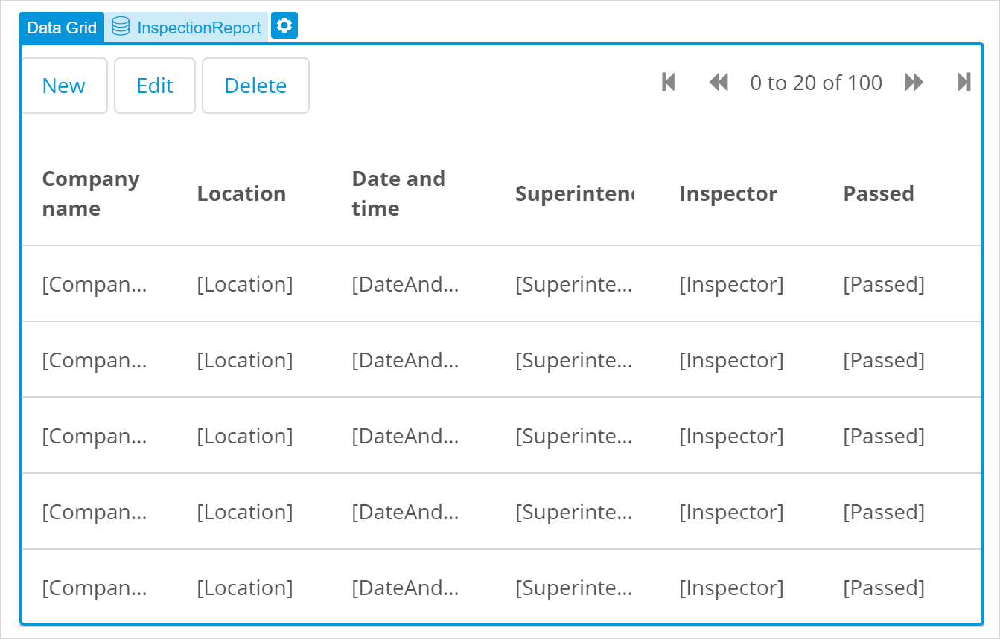
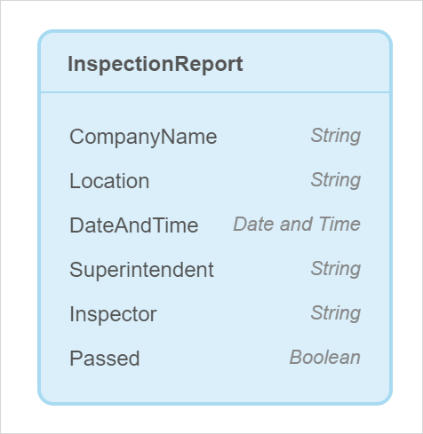
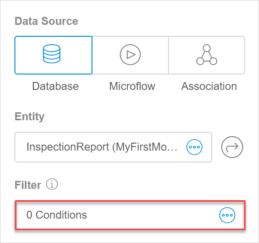
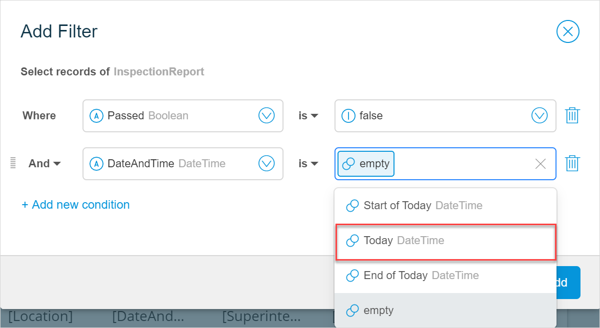

## 1 Introduction 

This how-to explains how you can filter and sort items in a list view or a data grid in Mendix Studio. 

**This how-to will teach you how to do the following:**

* Configure a filter for items in a list
* Sort items in a list

The how-to describes the following use case: 

You have build a page with a list of inspections reports that shows companies checked on compliance with safety regulations. You would like to display only companies that failed this inspection. You also would like to display reports for today only. In addition, items should be sorted by date and time starting from the latest one.  

A list of inspection reports is displayed on a page. If you have the list in a list view, the page can look the following way:

{}

{}

Or the page can look the following way if your list is in a data grid:

{}

{}

Domain model is configured the following way in this use-case:

{}

{}

## 2 Prerequisites

Before starting this how-to, make sure you have completed the following prerequisites:

* Familiarize yourself with page terms and how to perform basic functions on pages. For more information, see [Pages](/studio/page-editor). 
* Familiarize yourself with terms on data filters. For more information, see [Data Filters](/studio/data-filters).
* Familiarize yourself with the domain model terms and learn how to perform basic functions. For more information, see [Domain Model](/studio/domain-models).

## 3 Filtering Information 

First, you need to add a filter to your list.  As you would like to show only companies which failed the inspection check, the **Passed** attribute (see the domain model image above) should have been marked in an inspection report as *No*. 

You also would like to show reports that were created or modified in February 2020, that means the **DateAndTime** attribute should fall into a range from February 1st, 2020 to February 29th, 2020. 

To configure a filter, do the following:

1. Select the list view or the data grid and open its properties:

2. In the **Data Source** section, click **Filter**:

    {}{}

3. In the **Add Filter** dialog box, add conditions of the filter by doing the following:

    1. Select the **Passed** attribute in the drop-down menu:

    	{}{}

    2. Once you select the first part of the condition, you can select the other part to complete it. Select *false*:

    	{}{}

    3. To filter inspection reports for the current day, you need to add another condition to your filter: click **Add new condition** and select the **DateAndTime** attribute in the drop-down menu.

    4. Add the second part of the condition: the date should be today's date. Select *Today* in the drop-down menu: 

		{}{}

    5. Click **Add**.

Good job! You have created the filter that has two conditions and reads the following way: *Select records of InspectionReport where Passed is false and date and time is Today.* This means this filter will show you only the reports that fall under both conditions: which failed the inspection check and which were created or modified in the current day. 

## 4 Sorting Items  

To sort items in the list by date and time starting from the latest one, follow the steps below:

1. Select the list view or the data grid and open its properties.

2. In **Sorting Order** property, click **Add Sorting Rule**.

3. In **Add sorting rule** dialog box, select the **DateAndTime** attribute and set **Order** to *Descending*.

	{}{}

4. Click **Add**.

Congratulations! You have added a filter and sorting order to your list. You can now preview your app and test your page. For more information on how to preview your page, see [Previewing & Publishing Your App](/studio/publishing-app).