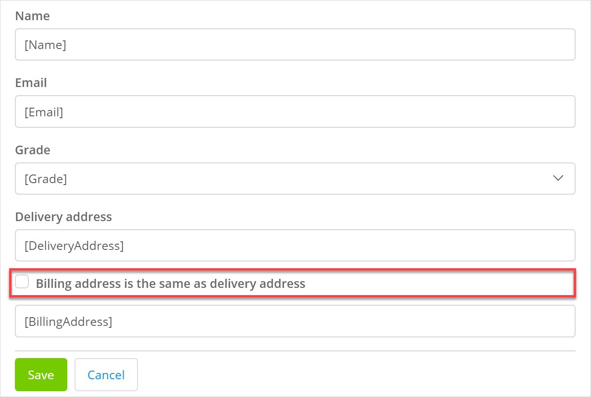
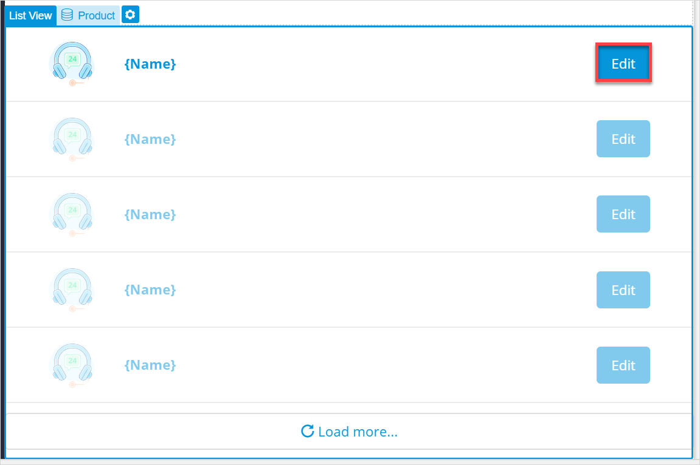
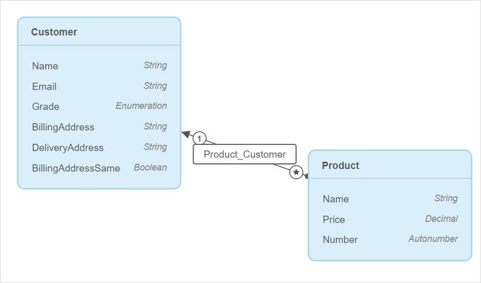
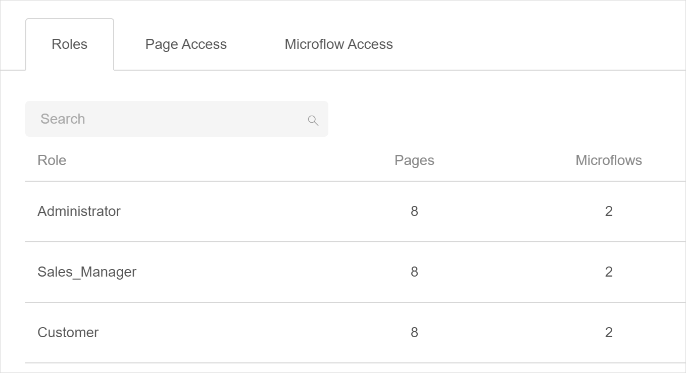
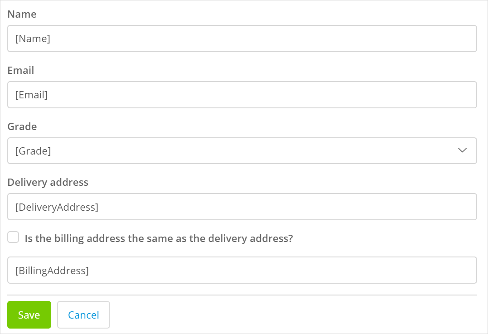
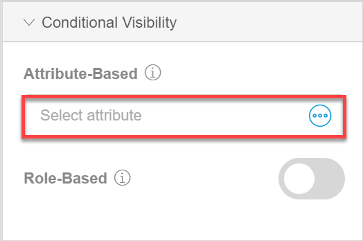
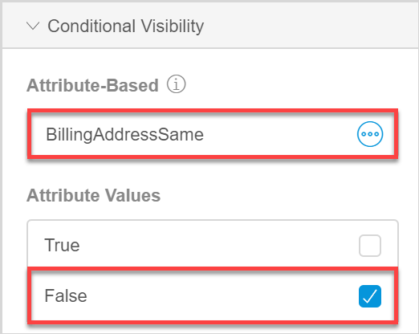
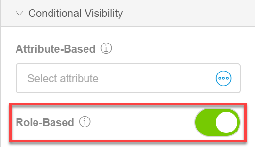
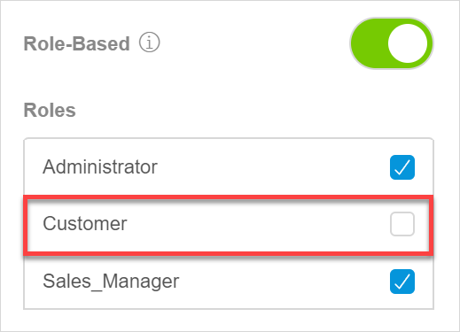
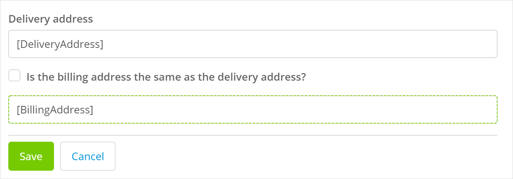

## 1 Introduction 

This how-to explains how you show fields to your end-users only when certain conditions are met. 

**This how-to will teach you how to do the following:**

* Make fields visible only when a customer chooses a certain attribute value
* Make fields visible for a certain user role only
* View fields are visible only under certain conditions

The how-to describes the following use case: 

You have a web shop and you would like to show a field with a billing address only when a customer unchecks the **Billing address is the same as delivery address** option (it is checked by default):

You also have a page called **Product Overview** which lists products and you would like to make the **Edit** button in the list visible to Administrators and Sales managers only:

{}

{}

The domain model looks the following way:

{}

{}

You have the following user roles:

For more information on how to enable security and configure user roles, see [How to Secure Your App and Configure Access to Its Functionality](security-how-to-configure-roles).

## 2 Prerequisites

Before starting this how-to, make sure you have completed the following prerequisites:

* Familiarize yourself with page terms and how to perform basic functions on pages. For more information, see [Pages](/studio/page-editor). 
* Familiarize yourself with conditional visibility. For more information, see [Conditional Visibility Section](/studio/page-editor-widgets-visibility-section).
* Enable security and add user roles to your app. For more information, see [How to Secure Your App and Configure Access to Its Functionality](security-how-to-configure-roles).
* Familiarize yourself with the domain model terms and learn how to perform basic functions. For more information, see [Domain Model](/studio/domain-models).

## 3 Setting Condition for a Billing Address

*Conditional visibility* is a set of properties that allows you to show widgets only when certain conditions are met.

The visibility of the billing address depends whether the customer checks that the billing address is different from the delivery address. In your domain model, you have an attribute of the Boolean type called **BillingAddressSame**, so when it is set to *false*, the billing address should be visible. This means that the visibility of the billing address depends on the value of the **BillingAddressSame** attribute, so the conditional visibility is *attribute-based*. 

{}

Attribute-based conditional visibility can be set only for widgets that are inside data containers (a data view, list view, or data grid). 

{}

To set conditional visibility for the **Billing Address** field, do the following:

1. Open the page where the customers specify their details:

    

2. Select the **Billing Address** field and go to its properties.

3. In **Conditional Visibility** section, click the **Attribute-Based** property:

    {}{}

4. In the **Select Attribute** dialog box, choose the **BillingAddressSame** attribute and click **Select**.

5. The **Attribute Values** property is now displayed in properties. Untick the *True* value as it does not meet the conditions you would like to set, and leave the **False** value selected:

    {}{}

Good job! Now the billing address will only be shown if the customer billing address does not match the delivery one.

## 4 Showing an Element to Certain User Roles Only

 You have a list of products with the **Edit** button. You have three user roles in your app: **Administrators**, **Sales_Managers**, and **Customers**, and you would like to show this button only to Administrators and Sales managers only, hiding it from customers. For more information, on how to create user roles, see [How to Secure Your App and Configure Access to Its Functionality](security-how-to-configure-roles).

To show an element only to a certain user role, do the following:

1. Open the **Product Overview** page with the list of products and select the **Edit** button:

    {}{}

2. Open its properties and in **Conditional Visibility** section toggle the **Role-Based** property:

    {}{}

3. A list of roles available in your app is displayed in the **Roles** property. Untick the **Customer** role:

    {}{}

Well done! Now the **Edit** button will only be shown to **Administrator** and **Sales_Manager** user roles only.

## 3 Viewing Fields With Conditional Visibility

To easily find which elements on your page have conditional visibility, you can highlight them. To show widgets with conditional visibility, do the following:

1. Open the page.

2. Click the eye icon in the top-left corner of the page:

    {}{}

Widgets with conditional visibility are highlighted:

   

Congratulations! You set several conditions for your widgets and you learnt how to view these widgets on a page to find them easily.

You can now preview your app and test the conditions that you have set: when the Billing address is being shown and which user roles can see the **Edit** button. For more information on how to preview your page, see [Previewing & Publishing Your App](/studio/publishing-app).
