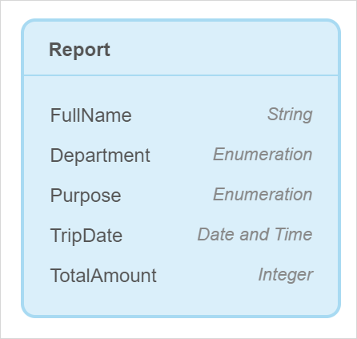
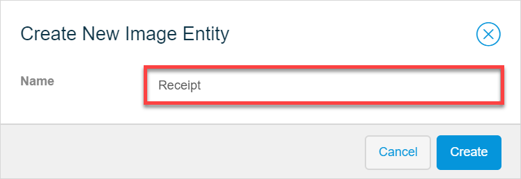
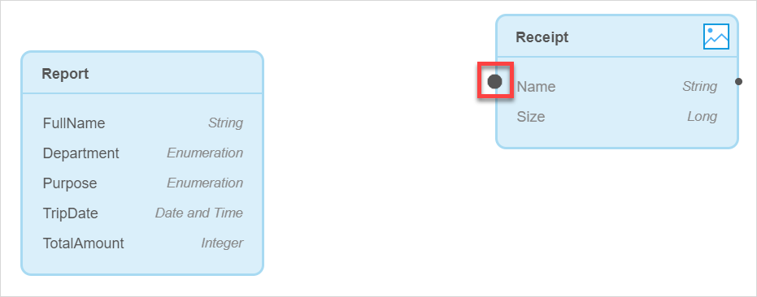
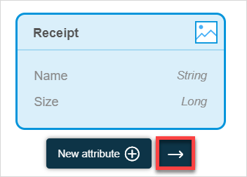
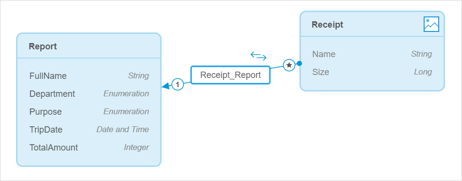
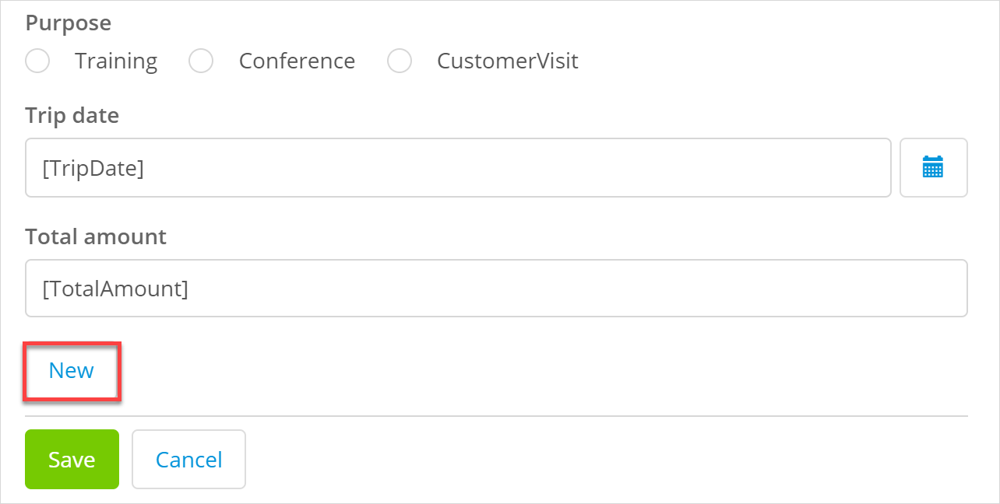
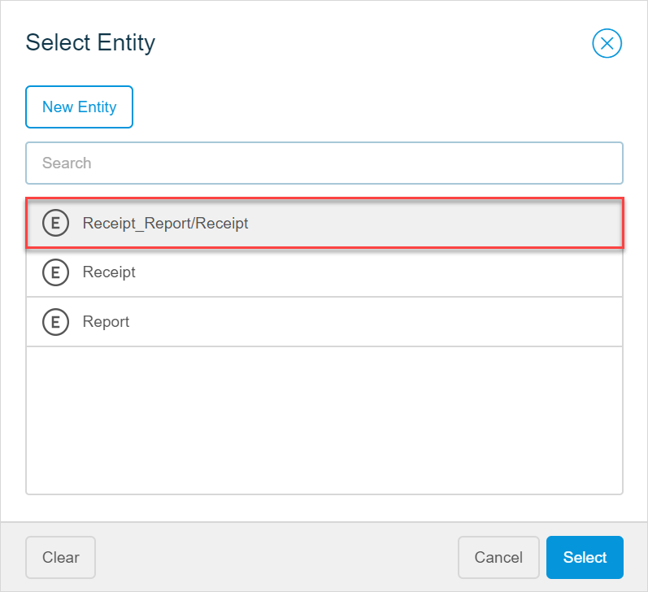
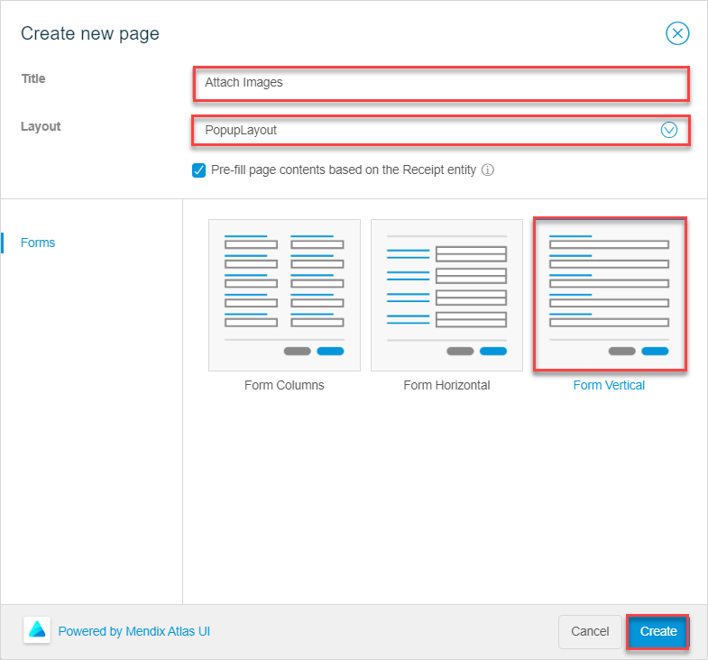
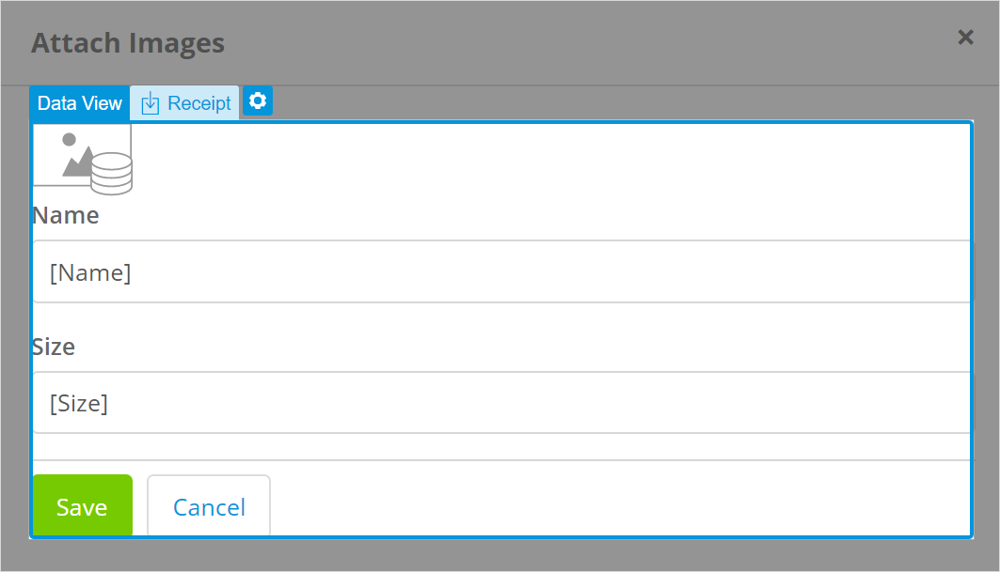

## 1 Introduction 

This how-to explains how you can configure image uploading in your app and enable your end-users to attach images. 

**This how-to will teach you how to do the following:**

* Create image and file entities
* Create a page with a form that allows your end-users to attach images

The how-to describes the following use case: 

You have a **New Report** page with a form (a data view) where employees submit a trip report for  reimbursement. They fill in their name, department, purpose and date of their trip, and total amount to be reimbursed:

Your domain model looks the following way:

When creating a reimbursement report, employees need to upload receipts – screenshots or scanned images of what they paid for.  

## 2 Prerequisites

Before starting this how-to, make sure you have completed the following prerequisites:

* Familiarize yourself with page terms and how to perform basic functions on pages. For more information, see [Pages](/studio/pages). 
* Familiarize yourself with the domain model terms and learn how to perform basic functions. For more information, see [Domain Model](/studio/domain-models).

## 3 Creating Image and File Entities

First of all, to be able to attach and upload images you need to add a special type of entity to your domain model: an image entity. Do the following:

1. Open your domain model and open the **Toolbox** tab.

2. Select the **Image Entity** and drag and drop it to your domain model.

3. In the **Create New Image Entity** dialog box, set **Name** to *Image* and click **Create**.

    

4. Now you need to create an association from the **Image** entity to the **Report** entity. Do one of the following:

    1. Hover over the **Image** entity, click the dot icon, and drag the dot to the **Report** entity:

		

    2. Select the **Image** entity, click the arrow icon, and select **Report** as a second entity for the association:

		

Good job! You have created image and file entities and associations from them to the **Report** entity:

## 4 Adding an Image Uploader to a Form

An **Image Uploader** is a widget that allows your end-users to attach and upload images. However, it can only function inside a data container (a list view or data view) and can only have an image entity as its data source. If you just drag and drop the image uploader to your report form, it will not work, because your current data view has the **Report** entity as its data source, which is not an image entity:

 

To solve this, you can add a button and a pop-up page that will enable end-users to upload images. This page will be connected to your current report form over association (*Image_Report*) and will upload images to a specific report. 

Follow the steps below:

1. Open the **New Report** page where employees submit a new report. 

2. Open the **Toolbox** and search for **Create Object** button.

3. Drag and drop the button to the data view footer next to **Save** and **Cancel** buttons:

    

4. Double-click the button and rename it from *New* to *Attach Images*.

5. Open the button properties, select the **Entity** property and set the **Image** entity over **Image_Report** association (*Image_Report/Image*) for it:

    

6. In the button properties, click **Page**.

7. In the **Select Page** dialog box, click **New Page**.

8. In the **Create new page** dialog box, do the following:

    1. Set the **Title** to *Attach Images*.

    2. Set the **Layout** to *PopupLayout*.

    3. The **Pre-fill page contents based on the InspectionReport entity** option is on, so the page template (Forms) is selected automatically for you. Choose **Form Columns** and click **Create**.

        

9. A new pop-up page with a preconfigured form (a data view) is created:

   

   As you only need to upload images, delete the **Dynamic image** widget, **Name** and **Size** text boxes from the data view. 

   9. Open the **Toolbox**, search for an **Image Uploader**, drag and drop it inside the data view. 

   You have created a pop-up page that will allow employees to attach images to their reimbursement reports. [Preview your app](/studio/publishing-app) to test how the image uploading works:  

    

You can also configure a button to attach files instead of images. For more information on files, see [Images & Files](/studio/page-editor-widgets-images-and-files).