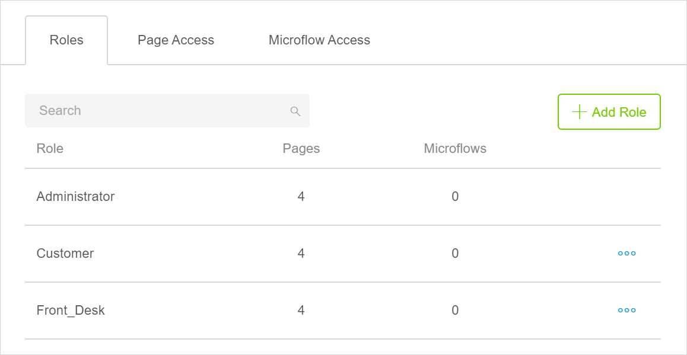
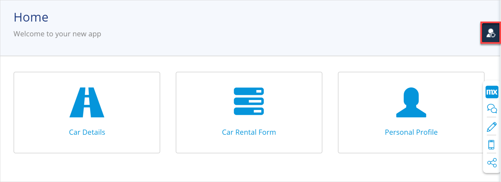
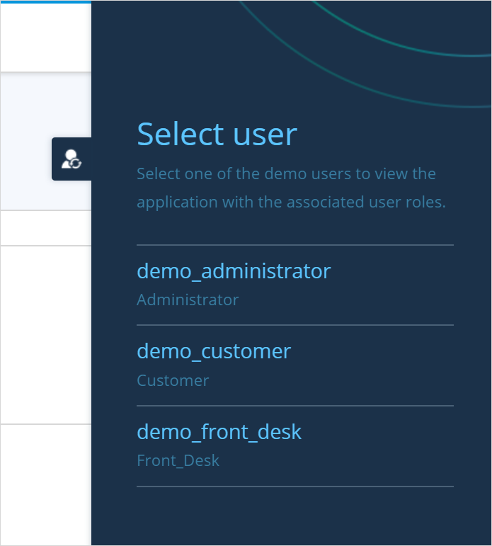

## 1 Introduction 

This how-to explains how you can secure your app, create user roles, and open access to certain pages, microflows, and widgets for specific user roles. As a result, your end-users will be able to view only those pages and widgets and run only those microflows that they have access to. 

**This how-to will teach you how to do the following:**

* Enable security
* Create user roles
* Set access to certain pages and microflows for specific user roles
* Allow only certain roles to see an **Edit** button on a home page
* Test your security configuration

The how-to describes the following use case: 

There is a car rental company that has a car rental app. Customers can register there and pick a car to rent; front-desk agents rent out cars to customers, adding such information as which car has been rented to  which customer and dates when the car was picked-up and dropped-off. Managers should be able to access all information. So, there are three types of users: customers, managers, and front-desk agents. You would like them to access the following information:

* Managers – all information
* Customers – their profile and details about a car
* Front-desk agents – details about a car, a car rental form

The domain model of this app looks the following way:

There are the following pages in this app:

* *Home_Web* – a home page which should be accessed by all roles. However, you have a list of cars on your home page with the **Edit** button that allows users to edit the car details. You would like to show this button only to managers and front-desk agents:

    

* *Personal_Profile* – a customer's profile with their details

* *Car_Details* – a page listing car details

* *Car_Rental_Form* – a form filled out by a front-desk agent when renting out car

There is also a microflow that validates customer's credit card called *Credit_Card_Validation*.

## 2 Prerequisites

Before starting this how-to, make sure you have completed the following prerequisites:

* Familiarize yourself with page terms and how to perform basic functions on pages. For more information, see [Pages](/studio/page-editor). 
* Familiarize yourself with information about security, roles, and permissions in Studio. For more information, see [Security, Roles & Permissions](settings-security).
* Familiarize yourself with information about conditional visibility. For more information, see [Conditional Visibility Section](/studio/page-editor-widgets-visibility-section).

## 3 Enabling Security

Security allows you to control access to your app. 

Depending on your app type and version, you might need to enable security first. Do the following:

1. Click the **App Settings** icon in your app.

2. In the **Roles and Permissions** screen, click **Enable Security**:
	
	
3. After security is enabled, you can see a table with three tabs: **Roles,** **Pages**, **Microflows**. Two roles are created by default: **Administrator** and **User**. The **Administrator** role is read-only, meaning you cannot delete or rename it. As it is already configured and has access to all functionality, you can use it for *managers*.

4.  To rename the **User** role, click the ellipsis icon next to the **User** role and select **Edit** in the drop-down menu:

    

5. In the **Edit Role** dialog box, rename it to **Customer** and click **Save**.

6. To add a role for the front-desk agent, click the **Add Role** button.

7. In the **Create Role** dialog box, fill in the role name as **Front_Desk** and click **Save**:

    

You now have three user roles: Administrator, Customer, and Front_Desk.

## 4 Managing Role Access

If you look at the table of your user roles, you will see that by default they can access all pages and microflows available in your app. To restrict access to certain pages and microflows, do the following:

1. Click the **Page Access** tab. You will see a matrix listing all pages in lines, and all roles in columns.

2. As customers should not have access to the **Rental_Form** page, untick the check-box in the **Customer** column next to the **Rental_Form** page:

    

3. As front-desk agents should not have access to customer's personal profiles, untick the check-box in the **Front-Desk** column next in the **Personal_Profile** line.

4. Now you need to set access for the microflow. Click the **Microflow Access** tab.

5. Among user roles that you have, only the **Administrator** should have access to it. Untick check-boxes in **Customer** and **Front_Desk** columns:

    

Good job! You have set the access for pages and the microflow for all your user roles. 

## 5 Allowing Only Certain Roles to View a Widget

On your home page you have a list view that features cars. This list view has the **Edit** button that you would like to make visible to managers (the **Administrator** role) and front-desk agents only. This button allows them to edit the car details. 

The [Conditional Visibility section](/studio/page-editor-widgets-visibility-section) in widget properties allows you to show a widget (in this case, the button) only when certain conditions are met: for example, to show the button only to certain roles. Follow the steps below:

1. Open the home page.

2. Select the **Edit** button and go to its properties.

3. In **Conditional Visibility** section, toggle the **Role-Based** property:

    

4. A list of roles available in your app is displayed in the **Roles** property. Untick the **Customer** role to hide this button from customers.

Now only users with the **Administrator** or **Front_Desk** role will see this button:

## 6 Testing Your Users

You can test the roles that you set with [demo users](/studio/settings-security#demo-users) when you preview your app. Do the following:

1. Click the **pages** icon to exit the **Roles and Permissions** screen.

2. Click the **Preview** button in the top-right corner to [preview your app](/studio/publishing-app).

3. When your app is previewed, click a user icon in the right side of the screen: 

    

   4. In the displayed menu bar, select a demo user and the app will be viewed from the perspective of the corresponding role. Click the **demo_customer** to test which functionality can the **Customer** role view and access.

    

5. Repeat steps 3-4 to test the **Administrator** and **Front_Desk** roles.
6. Click **Close Preview** in the top-right corner to finish your test.

Congratulations! You have configured access for different user roles in your app. 

You can now manage your app end-users. For more information, see the [Managing App Users](/studio/settings-security#managing-app-users) section in *Security, Roles & Permissions*.

