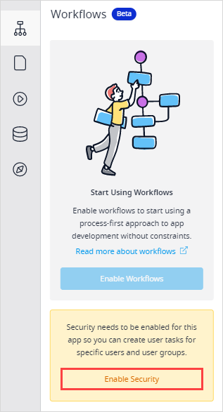
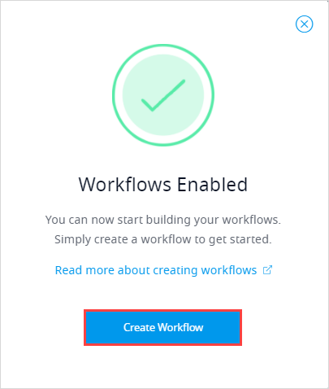
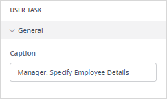
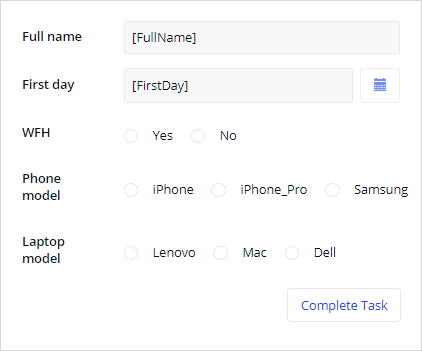
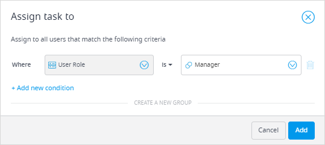
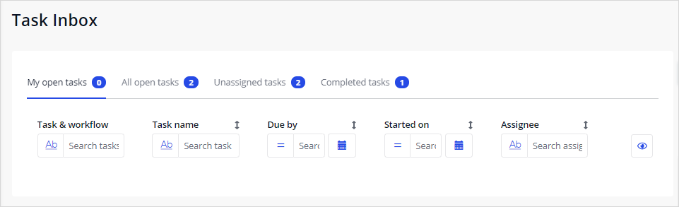

## 1 Introduction 

Workflow is a new visual language in Mendix Studios that allows you to build extendable processes. It is fully integrated with other visual languages, such as microflow editor and page editor. 

This how-to explains how to build an employee onboarding process using the workflow editor. 

**This how-to will teach you how to do the following:**

* Creating a workflow
* Creating user tasks for different user roles
* Configuring pages for the user tasks
* Restricting page access to the relevant user roles
* Creating a decision
* Using a microflow to extend logic of the workflow
* Testing your workflow from the perspective of different users

The how-to describes the following use case: 

You would like to build an employee onboarding process. At first, an HR specialist needs to initiate the onboarding process for a new employee. The employee's manager will then step in and select devices for the employee. Afterwards the manager needs to specify whether the new hire is working from the office or home . The Facilities department will then need to prepare a workspace. Depending on where the new hire works from (the office or home), the Facilities department will either prepare a desk or ship the devices to the employee's address. 

## 2 Prerequisites

Before starting this how-to, make sure you have completed the following prerequisites:

* Familiarize yourself with workflow terms. For more information, see [Workflows](/refguide/workflows). 

* 

  

## 3 Enabling Workflows 

First, you need to enable workflows for your app. Do the following:

1. Click the workflow icon in the left menu bar.

2. Before enabling workflows, you need to enable security first. Click **Enable Security**:

   

3. After security is enabled, click **Enable Workflows**.

4. In the Workflows Enabled pop-up menu, click **Create Workflow**:

   

5. In the **Create new workflow** dialog box, set the Title to Employee_Onboarding, and then click the **Workflow Entity** field to create a new workflow entity.

6. In the **Select Workflow Entity** dialog box, click **Create Workflow Entity**.

7. In The **Create New Workflow Entity** dialog box, set the **Name** to **EmployeeOnboarding** and click **Create**. 

8. Click **Create** to confirm your choice once again.

Good job! You have created a workflow and a workflow-specific entity.

## 4 Configuring a Domain Model

1. Open the domain model. 
2. Add the following attributes to the **EmployeeOnboarding** entity that you already have there (for more information on how to create attributes, see [Adding New Attributes](/studio/domain-models#adding-new-attributes) section in the *Domain Model*):
   1. Add the FullName attribute and set the type to string.
   2. Add the WFH (Work from home) attribute and set its type to Boolean.
   3. Add the FirstDay attribute and set its type to Date and Time.
   4. Add the PhoneModel enumeration  with the following enumeration items (for more information on enumerations and how to create them, see the [Creating a New Enumeration](/studio/domain-models-enumerations#create-new-enumeration) section in *Enumerations*): iPhone, iPhone_Pro, Samsung.
   5. Add the LaptopModel enumeration  with the following enumeration items (for more information on enumerations and how to create them, see the [Creating a New Enumeration](/studio/domain-models-enumerations#create-new-enumeration) section in *Enumerations*): Lenovo, Mac, Dell.

## 5 Configuring Security

In section 2, you have enabled security for your app, and several roles and permissions were added automatically, however, you need to add HR, Manager, and Facilities role to your app. Follow the steps below:

1. Open **App Settings** > **Roles and Permissions**. 
2. Click **Add Role** in the right corner.
3. Set the role's name to **HR** and click **Create**.
4. Repeat steps 2 and 3 to create **Manager** and **Facilities** roles.

Now all necessary roles are created for your app.

## 6 Triggering the Workflow from a Page

To start you workflow, you need to trigger it. In this use case, the workflow is started by an HR specialist who should fill in the new hire's name, the first day, and then click the **Start Onboarding** button that will trigger the workflow. 

You have an **EmployeesToOnboard** page that contains a list of all employees and has the **EmployeeOnboarding** entity as the data source:

The page access is restricted to the HR user role:

To add a button that will initiate the workflow, do the following:

1. Open the **Toolbox** and search for a **Button** widget.

2. Drag and drop the button inside the list view.

3. Open the button properties and set the **On-click** property to **Call workflow**: 

   

4. Click the ellipsis icon in the **Workflow** property.

5. In the **Select Workflow** dialog box, select Employee_Onboarding workflow and click **OK**.

6. Set **Caption** of the button to **Start Onboarding**.

Good job! Now when the HR specialist clicks the button, the workflow will start. 

## 6 Specifying Details of the New Hire {#specify-details}

The manager of a new employee will get a task to specify devices for the new hire. The manager also needs to indicate whether the new hire is working home (WFH) or not. For this functionality you need to add activities to the workflow. Follow the steps below: 

1. Open the Employee_Onboarding workflow.

2. In the **Toolbox** tab, find a **User task** activity, and drag and drop it to the workflow editor.

3. Open the user task properties. 

4. Set the **Caption** property to **Manager: Specify Employee Details** to easily see who this task should be assigned to:

   

5. To create a page where the manager will specify necessary details, click the **Page** property.

6. In the **Select Page** dialog box, click the plus icon.

7. In the **Create new page** dialog box, you can see the templates for workflow pages. Do the following:

   1. Set the **Page name** to **SpecifyDetails**.

   2. Check that **Navigation layout** is set to **Atlas_Default**.

   3. Select the **UserTask Extended** template.

   4. Click **Create**.

      

8. Now you need to make sure that only the relevant information is displayed on the **SpecifyDetails** page. By default, all attributes are added to the data view with the employee details and can be edited. You need to leave only the attributes related to the task. You also need to make sure that the manager can change only a specific field in the form. For example, the name of the employee has been entered by the HR department, so the manager does not need to change it and should have this field as read-only. 

    Do the following:

    1. Select the text box labelled **Full name** and go to its properties.

    2. Set the **Editability** property to *Read-Only*.

    3. Delete the **First day** date picker widgets as it is not relevant for this task. 

    4. Leave **WFH**, **Phone model**, and **Laptop model** fields:

       

9. Only the Manager role can access the **SpecifyDevice** page. To restrict the access to this relevant role, navigate to the page properties > **Allowed Roles** and deselect all roles except **Manager**.

10. Navigate back to the workflow and open the user task properties to finish user task configuration. 

11. As only the Manager should specify details for the new employee, you need to make sure that the user task is assigned to users with the Manager role only. Do the following:

    1. Make sure the **Assign Task Using** property is set to **Filter**. 

    2. Click the **Filter** property.

    3. In the **Assign task to** dialog box, the **Where** condition is set to **User Role** by default. Set the other part of the condition to **Manager** and click **Add**:

       

12. In the **Allowed Roles**  property deselect all roles except **Manager**.

Great job! You have created the user task for the Manager role:

## 8 Following Different Paths for the Hire's Location

Depending on whether the new hire is working from the office or home, there are two different processes to onboard this hire: prepare a desk in the office or send the laptop and phone to the new hire's home address. This step of the onboarding process should be done by the Facilities department.

Do the following:

1. Open the workflow editor > **Toolbox** and drag and drop the **Decision** activity after the **Manager: Specify Location** user task. 

    
    
2. Decision means that the workflow path can split and follow one of the outcomes depending on the condition of the decision. For more information, see [Decision](/refguide/decision). Open the decision properties and do the following:

    1. Set the **Caption** to **WFH?**.

    2. Click the **Condition** property.

    3. In the **Configure condition** dialog box, type in the expression that will split the flow into two depending on the **Location** attribute: `$workflowData/WFH`.

        

    4. Click **Save**.

3. Since the WFH attribute is a Boolean, it has a true (when the new hire works from home) and a false (when they work from the office) outcome. These outcomes are added to the workflow automatically: 

    

4. Now you need to configure what happens in both scenarios: when the new hire works from the home (true) and when the new hire works from office (false). Open the **Toolbox**, drag and drop a **User task** activity to the **false** path, and do the following:

    1. Set its caption to **Facilities: Prepare Desk**.

    2. Set the **Allowed roles** property to **Facilities** for managers to be able to interact with the user task. 

    3. Set a new page called **PrepareDesk** for the **Page** property it referring to steps 6-8 of the [Selecting a Device for the New Hire](#select-device) section.

    4. Restrict the **Prepare Desk** user task to the Facilities role referring to steps 9-10 of the [Selecting a Device for the New Hire](#select-device) section.

        

5. You need to make sure that only the relevant information is displayed on the **PrepareDesk** page. In the Project Explorer, double-click the **PrepareDesk** page to open it.

6. By default, all attributes are added to the employee detail form. You need to make sure that the Facilities department will be able to view the fields but not change them. Do the following: 
   
    1. Delete the **Workflow** reference selector widget from the form.
      
    2. Select the data view with the employee details and go to its properties.
    
    3. Set the **Editable** property to *No* to make the remaining fields in the form read-only.
      
       
   
7. To restrict access to the page to the Facilities role only, follow the step 13 of the [Selecting a Device for the New Hire](#select-device) section.

8. Now you need to create a user task for Facilities when the employee is working from home. Open the workflow editor.

9. Open the **Toolbox**, drag and drop a **User task** activity to the **true** path, and do the following:

    1. Name the user task **Ship_Devices** and set its title to **Facilities: Ship Devices** referring to steps 2-4 of the [Selecting a Device for the New Hire](#select-device) section.
    2. Set the **Allowed roles** property to **Facilities** for managers to be able to interact with the user task. 
    3. Set a new page called **ShipDevices** for the **Page** property it referring to steps 6-8 of the [Selecting a Device for the New Hire](#select-device) section.
    4. Restrict the **Ship Devices** user task and **ShipDevices** page to the Facilities role referring to steps 9-10 of the [Selecting a Device for the New Hire](#select-device) section.

10. You need to make sure that only relevant information is displayed on the **ShipDevices** page and that this page can be accessed by the Facilities department only. In the Project Explorer, double-click the **ShipDevices** page to open it.

11. Repeat steps 6-7 above to make the employee detail form read-only and to restrict the page access to the Facilities role.

Great job! You have configured the decision and user tasks on whether the new hire is working from the office or from home. 

## 10 Testing the Workflow {#test-workflow}

Now you can test your workflow from the perspective of different users. 

For certain user roles, there are default end-user and admin pages. 

For example, users who have tasks assigned to them (Manager, Facilities roles) will see their task inbox and dashboards pages where they can manage and monitor tasks assigned to them:

The Workflow Admin role has access to the Workflow Admin Center and can monitor all workflows, can view the progress of workflows, and change the workflow settings:

The Admin role is able to manage users:

Users who have tasks assigned to them (Manager, Facilities roles) will see their task inbox and dashboards pages where they can manage and monitor tasks assigned to them:

To test your workflow, you need to switch between different user roles. Follow the steps below:

1. In the top bar of Mendix Studio Pro, click **Run locally**.

2. After your app is deployed, click **View**.

3. In your browser, log in as an Admin user.

4. Click the user icon on the right to switch to another user role:

    

5. Switch between different demo user roles to test the use case. Do can do the following:

    1. Start the onboarding process.
    2. Test the process: switch users, view inbox for each user, complete tasks, see how new inbox items are created for the user roles you configured at the next task in the process.
    3. Open the Workflow Admin Center.
    4. Open the Workflow Dashboard.

Great job! You have deployed your app locally and tested your workflow from the perspective of different users. You can now work on adding more functionality to your app. 

## 11 Read More

* [Adding a Workflow to an Existing App: Setting Up the Basics](/refguide/workflow-setting-up-app)