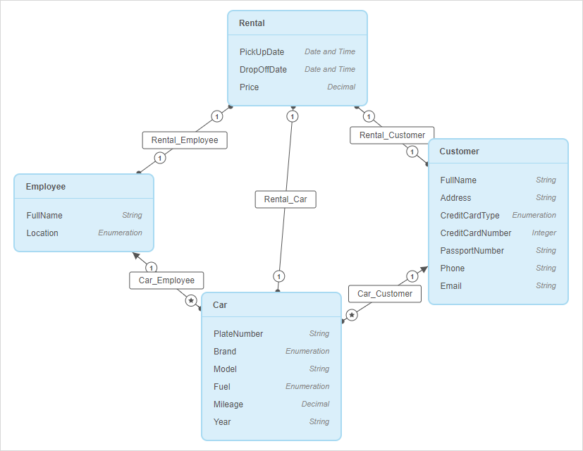
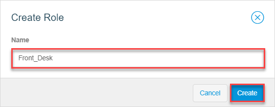
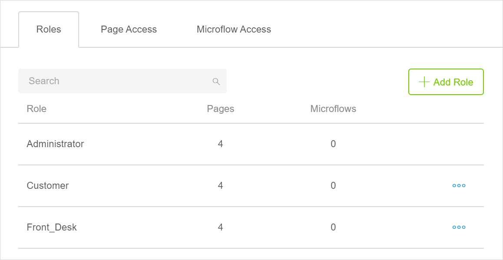
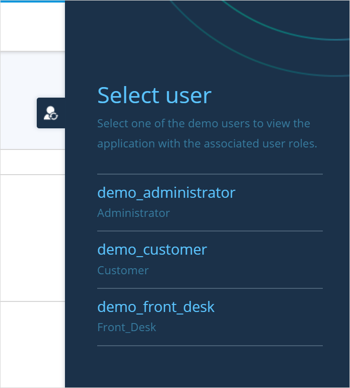

## 1 Introduction 

This how-to explains how you can secure your app, create user roles, and open access to certain pages and microflows for specific user roles. As a result, your end-users will be able to view only those pages that they have access to. 

**This how-to will teach you how to do the following:**

* Enable security
* Create user roles
* Set access to certain pages for specific user roles
* Test your security configuration

The how-to describes the following use case: 

There is a car rental company that has a car rental app. Customers can register there, pick a car to rent, and fill in a car rental form; front-desk agents have access to a car rental form and car details. So, there are two types of users: customers and front-desk agents. You would like them to access the following information:

* Customers – their profile, details about a car, and the car rental form
* Front-desk agents –  details about a car and the car rental form

The domain model of this app looks the following way:

There are the following pages in this app:

* *Home_Web* – a home page which should be accessed by all roles. Buttons on the home page open the corresponding page:

    

* *Car_Details* – a page listing car details

* *Car_Rental_Form* – a form filled out when renting the car

* *Personal_Profile* – a customer's profile with their details

## 2 Prerequisites

Before starting this how-to, make sure you have completed the following prerequisites:

* Familiarize yourself with page terms and how to perform basic functions on pages. For more information, see [Pages](/studio8/page-editor). 
* Familiarize yourself with information about security, roles, and permissions in Studio. For more information, see [Security, Roles & Permissions](/studio8/settings-security).
* Familiarize yourself with the domain model terms and learn how to perform basic functions. For more information, see [Domain Model](/studio8/domain-models).

## 3 Enabling Security

Depending on your app type and version, you might need to enable security first. Do the following:

1. Click the **App Settings** icon in your app.

2. In the **Roles and Permissions** screen, click **Enable Security**:

	{}{}
	
3. After security is enabled, you can see a table with three tabs: **Roles,** **Pages**, **Microflows**. Two roles are created by default: **Administrator** and **User**. The **Administrator** role is read-only, meaning you cannot delete or rename it. As it is already configured and has access to all functionality, you can use this role for your app administrators in the future. 

    To rename the **User** role, click the ellipsis icon next to the **User** role and select **Edit** in the drop-down menu:

    

4. In the **Edit Role** dialog box, rename it to **Customer** and click **Save**.

5. To add a role for the front-desk agent, click the **Add Role** button.

6. In the **Create Role** dialog box, fill in the role name as **Front_Desk** and click **Save**:

    {}{}

You now have three user roles: Administrator, Customer, and Front_Desk.

## 4 Managing Role Access

If you look at the table of your user roles, you will see that by default they can access all pages and microflows available in your app. To restrict access to certain pages, do the following:

1. Click the **Page Access** tab. You will see a matrix listing all pages in lines, and all roles in columns.

2. As front-desk agents should not have access to customer's personal profiles, untick the check-box in the **Front-Desk** column next in the **Personal_Profile** line:

	

Good job! You have set the access for pages for your user roles. 

## 5 Testing Your User Roles

When you restrict access to a certain page or a microflow, widgets that open this page or run this microflow will be automatically hidden to this role. For example, since you have not given access for front-desk agents to customer personal profiles, they will not see a corresponding button which opens the personal profile either.  

After you have set access for pages and microflows, you can test what each user role would see. 

You can test the roles that you set with [demo users](/studio8/settings-security#demo-users) when you preview your app. Do the following:

1. Click the **pages** icon to exit the **Roles and Permissions** screen.

2. Click the **Preview** button in the upper-right corner to [preview your app](/studio8/publishing-app).

3. When your app is previewed, click a user icon in the right side of the screen: 

    

4. In the displayed menu bar, select a demo user and the app will be viewed from the perspective of the corresponding role. Click the **demo_customer** to test which functionality can the **Customer** role view and access.

    {}{}

5. Repeat steps 3-4 to test the **Front_Desk** role:

    

6. Click **Close Preview** in the upper-right corner to finish your test.

Congratulations! You have configured access for different user roles in your app. 

You can see that the button is hidden from the **Front_Desk** role, but the container is not. You can use conditional visibility to hide it entirely. For more information, see [Conditional Visibility Section](/studio8/page-editor-widgets-visibility-section).

When you preview your app, you can test different user role, while after you publish it, you can manage the end-users and assign user roles to them. For more information, see the [Managing App Users](/studio8/settings-security#managing-app-users) section in *Security, Roles & Permissions*.

