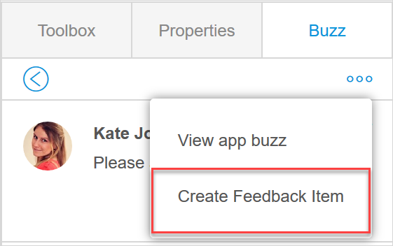
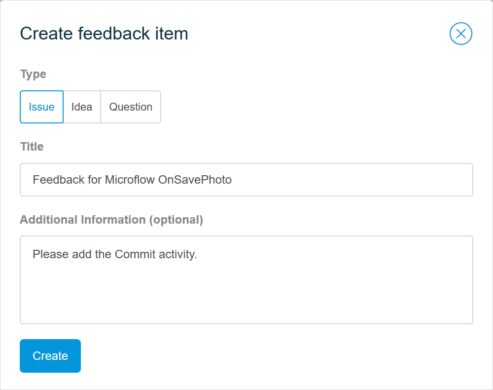

## 1 Introduction 

Via the **Buzz** tab, you can collaborate on your app with team members – leave comments  or create feedback items on pages, microflows, the domain model, or a navigation document. 

Comments from Studio Buzz are automatically posted in [App Buzz](/developerportal/collaborate/buzz#app-buzz) in the Developer Portal giving your team members an opportunity to respond to comments both in Studio and the Developer Portal. 

## 2 Leaving and Editing Comments {#comment}

To *leave a comment*, navigate to the **Buzz** tab, write your comment, and click **Post**:

To *tag a person* by their name use *@*. 

To *edit* a comment, do the following:

1. Open a page, microflow, or the domain model the comment refers to.

2. Open the **Buzz** tab and click the comment.

3. Click the edit icon and change the comment.

   

4. Click **Save**. 

{}

You cannot delete comments in Studio, it is only possible in the [App Buzz](/developerportal/collaborate/buzz#app-buzz) in the Developer Portal.  

{}

## 2 Viewing App Buzz

Your comments are posted and showed in the **App Buzz** in the Developer Portal. To view the **App Buzz**, click the ellipsis icon > **View App Buzz**:

You will be automatically taken to the Developer Portal. For more information on the App Buzz, see the [App Buzz](/developerportal/collaborate/buzz#app-buzz) section in *Buzz*.  

## 3 Creating a Feedback Item

You can create a feedback item via the **Buzz** tab. Feedback items allow you to submit ideas, questions, or issues on the app, and let your team work on them in the Developer Portal. Potentially, a feedback item can be turned into a story and be planned for a sprint. For more information on feedback items, see [Feedback Management](/developerportal/collaborate/feedback). For more information on stories, see the [Adding a Feedback Item to Your Backlog](/developerportal/collaborate/feedback#adding) section in Feedback Management.  

To create a feedback item, do the following:

1. Click the posted comment. For more information on how to leave a comment, see the [Leaving and Editing Comments](#comment) section.

2.  Click the ellipsis icon and select **Create Feedback Item**:

	
	
3. In the **Create feedback** item dialog window, fill in the type of feedback, its title, and additional information if necessary.

   

4. Click **Create**.

The feedback item is submitted and a corresponding comment is posted in the **Buzz** tab with a link to the Developer Portal.

## 4 Read More

* [Buzz](/developerportal/collaborate/buzz)
*  [Feedback Management](/developerportal/collaborate/feedback)
