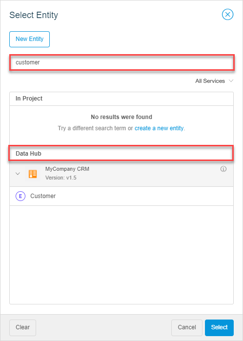
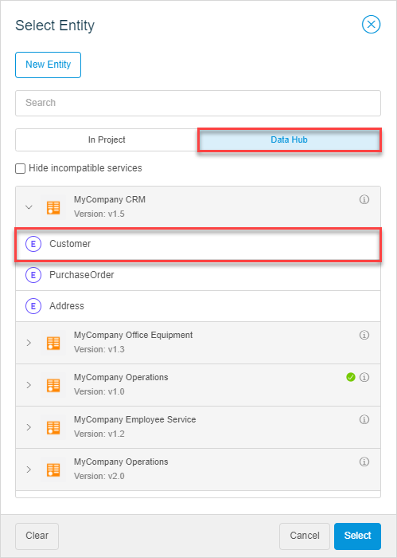
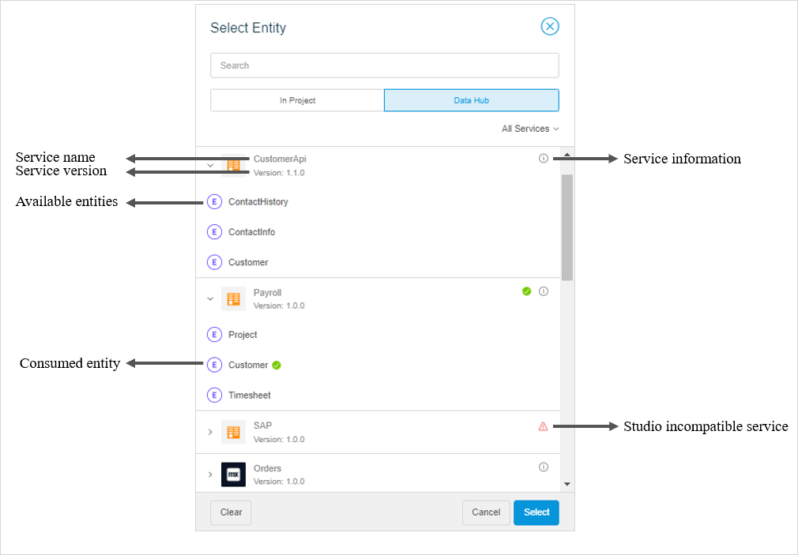
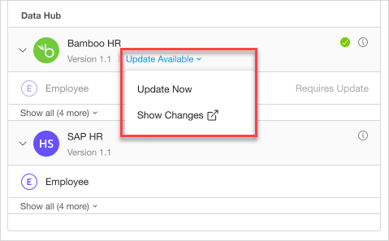
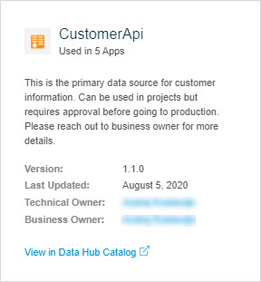
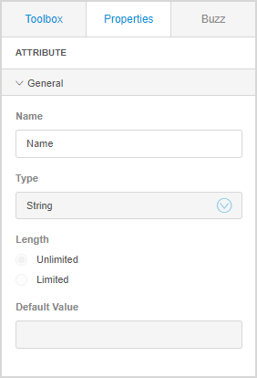
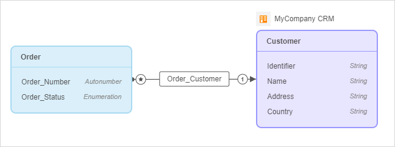

## 1 Introduction

Every organization has apps containing valuable data that can be used in other applications too. [Mendix Data Hub](/data-hub/index) enables you to use data from other apps without having to deal with complex far-from-ideal solutions, such as exporting data, duplicating it, or building complex technical integrations. With Data Hub, all you need to do is just search for the data, select it, and use it. 

Mendix Data Hub is the central hub in the organization that enables you to discover, connect to, and use shared data from different apps in your organization. It also ensures that data is used consistently throughout your organization. 

Shared data is registered as a *service* in the [Data Hub Catalog](/data-hub/data-hub-catalog/index). Through the **Data Hub** tab in Studio, you can access data from the Data Hub Catalog. You can find external entities coming from the service, add them to your app together with their attributes and associations, and use them locally. The properties of entities, attributes, and associations will be read-only.

For example, you have an *Employee Onboarding app* containing information on what devices should be assigned to a new employee. Your organization also has a *Company's HR* app which has all the data on employees. With the Data Hub functionality, you will be able to use (consume) data from the *HR app* in your *Employee Onboarding app* instead of having to duplicate the data and keep it in sync manually.  

For more information on how to use data in your app, see the [Selecting External Entities on Pages](#select-external-entities) section.

{}
You can access Data Hub if your organization has a Data Hub license. 
{}

## 2 Selecting External Entities on Pages {#select-external-entities}

The entities which are available through the Data Hub Catalog are called *external entities* as they are coming from an external source (*a source app*). 

You can select external entities as a data source for data containers (a data view, list view, or data grid) on a page. To select an external entity, do the following:

1. Open the **Properties** of the data container.
2. Click the **Entity** property.
3. In the **Select Entity** dialog box, you can search for external entities in the Data Hub Catalog and use them on your page. There are two ways to discover entities, you can do one of the following:
    1. **Search for a specific service or entity name** – enter a search term in the search field to find an entity you would like to add:

        
        
    2. **Browse through available data** – click the **Data Hub** section and browse through available services and entities:
    
        

3. Click **Select**.

The selected external entity will be added to your domain model automatically together with all integration and security settings. 

When you [publish your app](publishing-app), you can see that the data from the external entity is shown in your app. 

When you [preview your app](publishing-app), you will see data from the external entities, except for external entities from services that require authentication credentials. In this case you have to publish your app to see the data. 

### 2.1 The Data Hub Tab

The **Data Hub** tab of the **Select Entity** dialog box shows you a list of services that expands to a list of entities available for your organization:

In the **Data Hub** tab, you can do the following:

* **Search** – when you enter a search term, you will get a list of services and entities available for your organization, as well as entities and services that are already used in your app.

    {} In Studio, you can discover services that are published to a **Production** environment. {}

* **Filter out Studio incompatible services** – some services require authentication that is not compatible with Studio, you can use them only in Studio Pro. You can view all services, or filter out only compatible ones. Choose one of the following options in the drop-down menu:

    * **All Services** – all services will be shown in the **Data Hub** tab.
    * **Studio Compatible Services** – only services that are compatible with Studio are displayed in the **Data Hub** tab.
    
* **View services used by your project** – services that are already used in your project are marked with a green check-mark.

* **Update services** – when a new version of the service is available, you can update it. However, it is best to check out the changes made to the service in the Data Hub Catalog first. 

    

    Click the drop-down menu to choose the following options:

    * **Update Now** – allows you to update the service to a new version.
    * **Show Changes** – takes you to the Data Hub Catalog where you can check what has been changed in the service.  

* **View external entities available within the service** – you can expand the service information to see which external entities are available.

* **View information on the service** – a service name and version number. Click the information icon to view the following information on the service:

    * **Service name** – the name of the shared data source registered in the Data Hub Catalog.

    * **Used in Apps** – number of apps the service is consumed in.
    
    * **Version** – every service has a version number. When you consume data from a service, you consume from a specific version of a service published to an environment. New versions of a service are issued if changes are made.
    
    * **Last Updated** – indicated the date when the service was last updated.
    
    * **Business Owner** – links to the business owner of the data that the service connects to.
    
    * **Contact** – contact of the business owner. 
    
    * **View in Data Hub Catalog** – a link to the Data Hub Catalog of your organization.
    
        

## 3 External Entity Properties

External entities are colored *purple* in the domain model:

When you add external entities to your app, it is possible to make local changes to the entity, such as change its name. However, these changes are limited and will only apply to your app. Most of the properties of external entities are read-only as they are defined in the source app (this ensures that you will not accidently change the data in the source app):

  

### 3.1 External Entity Attributes

You can rename external entity attributes to better fit your app structure. It will still be the same attribute containing the same data, meaning that this change will be local to your app and not affect the source app. All other properties, except the **Name** property, are read-only. 

{}

You cannot delete attributes of external entities.

{}

### 3.2 External Entity Associations

If you add two entities from the same service that have an association in the source app, this association will be added automatically. 

You can create and edit associations only between a local entity and an external one. However, the association should always point **to** the external entity and not **from** it. That is why creating many-to-many associations between local and external entities is not possible.

For example, you can create an association from a local entity **Order** to an external entity **Customer**:

You cannot change or delete this association. It is also not possible to create an association between two external entities that do not have an association in the source app. 

## 4 Read More

* [Data Hub](/data-hub/index)
* [Data Hub Catalog](/data-hub/data-hub-catalog/index)
