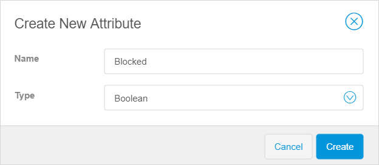

## 1 Introduction

This how-to explains how you can configure the domain model in Mendix Studio. 

**This how-to will teach you how to do the following:**

* 

This how-to describes the following use case: 

You are configuring the domain model for an online shop. 

## 2 Understanding What Data to Include  

The workflow for new customers of the online shop will look the following way:

1. A customer registers in the online shop and enters the following details:
   1. Full name
   2. Address
   3. Email
   4. Date of birth
2. When registration is complete, a *unique ID* is assigned to the customer. 
3. The customer browses through *products* represented by the following:
   1. Image 
   2. Name
   3. Description 
   4. Availability
   5. Price 
   6. Vendor
   7.  Unique product ID 
4. The customer adds products to a shopping cart. 
5. In the shopping cart, every item is presented as a separate line showing the *quantity* and the *price* per line. The customer pays the order and gets a *confirmation* with *order details* and the *date* the order is purchased. 

Based on the description below, you can divide your data to the following elements: 

* Order –  general information about the order such as its status, order number, who placed the order, their address and name, etc. 
* Order line – unique items ordered with their quantity and price
* Order confirmation – confirmation that an order has been created
* Customer – user who made an order
* Product – items that a customer can order

### 2.1 Defining the Product

As products is one of the main elements of the online shop, an entity should be created to represent a product in your domain model. The information that defines the product, such as its name and price, should be attributes of the entity. To define the product in your domain model, follow the steps below:  

1. Create the **Product** entity. (For more information on how to create a new entity, see the [Adding New Entities](domain-models#adding-new-entities) section in *Domain Model*.)

3.  Create attributes for the **Product** entity. (For more information on how to create an attribute, see the [Adding New Attributes](domain-models#adding-new-attributes) section in *Domain Model*). Do the following: 
    1. Create the *Product ID* attribute: set the name to *Product_ID* and set the type to *Autonumber*.
    
    2. Create the *Name* attribute: set the name to *Name* and set the type to *String*.
    
    3. Create the *Description* attribute: set the name to *Description* and set the type to *String*. 
    
    4. Create the attribute to indicate if the product is available: set the name to *Available* and set the type to *Boolean*.
    
    5. Create the *Price* attribute: set the name to *Price* and set the type to *Decimal*. 
    
    6.  Create the *Vendor* attribute: set the name to *Vendor* and set the type to *String*. 
    
		

4. Each product has an *image*, but you did not create it as an attribute. You need to create an image entity for it, a special type of entity that allows you to store images and set its name to *Product_Image*. (For more information on how to create image entities, see the [Adding Image or File Entities](domain-models#adding-image-or-file-entities) section in Domain Model)

    {} *Name* and *Size* are created automatically and are read-only.
    {}

Good job! You created the **Product** entity, its attributes, and the **Product_Image** image entity. 

### Defining the Order

Information on an order consist of two parts:

* General information about the order such as its status, order number, who placed the order, their address and name, etc. 
* Items ordered, their quantity and price

Therefore, you need to create two entities: *Order* (general information about the order) and *Order_Line* (information on the items ordered). 

### 2.2 Creating Associations

## 3 Configuring the Decision with Attribute of the Boolean Type  

In this example, you will create a microflow and configure a decision to prevent a blocked customer from making an order. The reasons for blocking the customer can be that customer's credit score is too low, or password has expired. 

This use case will require a decision with an attribute of the Boolean type (true or false). For more information on the types of attributes, see [Attributes](domain-models-attributes).

### 3.1 Adding an Entity and an Attribute to the Domain Model 

As you will verify customers by their statuses, you need to create a corresponding attribute for the entity first. For this, do the following:

1. Open your [domain model](domain-models).
2.  For the Customer entity, create an attribute (for more information on how to create attributes, see the [Adding New Attributes](domain-models) section),  and do the following:  
    a. Set name to *Blocked*.  
    b. Set the [Type](domain-models-attributes) to **Boolean**.  
    c. Click **Create**. 

    

The attribute for the **Customer** entity is created.

1. 

Congratulations! You have now configured the domain model for the online shop!

