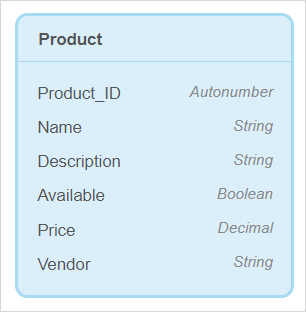
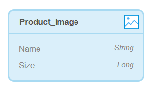
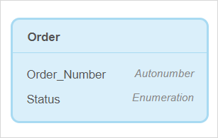
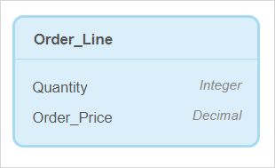

## 1 Introduction

This how-to explains how you can configure the domain model in Mendix Studio. 

**This how-to will teach you how to do the following:**

* 

This how-to describes the following use case: 

You are configuring the domain model for an online shop. 

## 2 Understanding What Data to Include  

The workflow for new customers of the online shop will look the following way:

1. A customer registers in the online shop and enters the following details:
   1. Full name
   2. Address
   3. Email
   4. Date of birth
2. When registration is complete, a *unique ID* is assigned to the customer. 
3. The customer browses through *products* represented by the following:
   1. Image 
   2. Name
   3. Description 
   4. Availability
   5. Price 
   6. Vendor
   7.  Unique product ID 
4. The customer adds products to a shopping cart. 
5. In the shopping cart, every item is presented as a separate line showing the *quantity* and the *price* per line. The customer pays the order and gets a *confirmation* with *order details* and the *date* the order is purchased. 

Based on the description below, you can divide your data to the following elements: 

* Order –  general information about the order such as its status, order number, who placed the order, their address and name, etc. 
* Order line – unique items ordered with their quantity and price
* Order confirmation – confirmation that an order has been created
* Customer – user who made an order
* Product – items that a customer can order

## Defining the Product

As products is one of the main elements of the online shop, an entity should be created to represent a product in your domain model. The information that defines the product, such as its name and price, should be attributes of the entity. 

To define the product in your domain model, follow the steps below:  

1. Create the **Product** entity (for more information on how to create a new entity, see the [Adding New Entities](domain-models#adding-new-entities) section in *Domain Model*).

3.  Create attributes for the **Product** entity. (For more information on how to create an attribute, see the [Adding New Attributes](domain-models#adding-new-attributes) section in *Domain Model*). Do the following: 
    1. Create the *Product ID* attribute: set the name to *Product_ID* and set the type to *Autonumber*.
    
    2. Create the *Name* attribute: set the name to *Name* and set the type to *String*.
    
    3. Create the *Description* attribute: set the name to *Description* and set the type to *String*. 
    
    4. Create the attribute to indicate if the product is available: set the name to *Available* and set the type to *Boolean*.
    
    5. Create the *Price* attribute: set the name to *Price* and set the type to *Decimal*. 
    
    6.  Create the *Vendor* attribute: set the name to *Vendor* and set the type to *String*. 
    
		

4. Each product has an *image*, but you did not create it as an attribute. You need to create an image entity for it, a special type of entity that allows you to store images and set its name to *Product_Image*. (For more information on how to create image entities, see the [Adding Image or File Entities](domain-models#adding-image-or-file-entities) section in Domain Model).
	

    {} *Name* and *Size* attributes are created automatically and are read-only.
    {}

You created the **Product** entity, its attributes, and the **Product_Image** image entity. 

#### Creating Associations

## Defining the Order

Order information consist of three parts:

* Order – general information about the order such as its status, order number, name of the customer and their address, etc. 
* Order line – items ordered, their quantity and price
* Order confirmation – confirmation that is sent to the customer that the order is created

So, you need to create three entities: *Order*, *Order_Line*, and *Order_Confirmation*. 

Do the following:

1. Create the **Order** entity (for more information on how to create a new entity, see the [Adding New Entities](domain-models#adding-new-entities) section in *Domain Model*).
2. Create attributes for the **Order** entity: *Order_Number* and *Status*. (For more information on how to create an attribute, see the [Adding New Attributes](domain-models#adding-new-attributes) section in *Domain Model*). Do the following: 
   1. Create the *Order_Number* attribute: set **Name** to *Order_Number* and **Type** to *Autonumber*. 
   
   2. Create the *Order_Number* attribute: set the attribute **Name** to *Status* and **Type** to *Enumeration*. For more information on what enumeration is, see [Enumeration](domain-models-enumeration).
   
   3. Click **Select enumeration** to create a new enumeration.
   
   4. In the **Select enumeration** dialog window, click **New**.
   
5. In the **Create new enumeration** dialog window, click **Add Item** (*Status* is filled out automatically for the **Name**).
   
   6. Enter *Ordered* for the **Caption** (**Name** is filled out as *Ordered* automatically).
   
   7. Click **Add Item** and repeat the step above to create the **Paid**, Shipped, Delivered, and Cancelled statuses.
   
   8. Click **Create** to close the dialog windows and create the attribute.
   
      
   
3. Create the **Order_Line** entity. 

4. Create attributes for the **Order_Line** entity. Do the following: 

   1. Create the *Quantity* attribute: set **Name** to *Quantity* and set **Type** to *Integer*.

   2. Create the *Order_Price* attribute: set **Name** to *Order_Price* and set **Type** to *Decimal*.

      

5.  Create the **Order_Confirmation** entity. As order confirmation is a file sent to users, you need to create a special type of entity that allows you to store files – **File** entity. (For more information on how to create file entities, see the [Adding Image or File Entities](domain-models#adding-image-or-file-entities) section in *Domain Model*).

6. Create attributes for the the **Order_Confirmation** entity. Do the following: 

   1. Create the *Date_Sent* attribute: set **Name** to *Date_Sent* and set **Type** to *Date and Time*.

      {} *Name* and *Size* attributes are created automatically and are read-only.
      {}

You configured three entities that define the order in your online shop.

## Defining the Customer

A customer is another crucial part of the online shop that needs a separate entity. The information that defines the customers, such as its name and price, should be attributes of this entity.

Follow the steps below:

1. Create the **Customer** entity (for more information on how to create a new entity, see the [Adding New Entities](domain-models#adding-new-entities) section in *Domain Model*).

2. Create attributes for the **Customer** entity (for more information on how to create an attribute, see the [Adding New Attributes](domain-models#adding-new-attributes) section in *Domain Model*). Do the following:

   1. Create the *Customer ID* attribute: set **Name** to *Customer_ID* and **Type** to *Autonumber*. 

   2. Create the *Name* attribute: set **Name** to *Name* and **Type** to *String*.

   3. Create the *Address* attribute: set **Name** to *Address* and **Type** to *String*.

   4. Create the *Email* attribute: set **Name** to *Email* and **Type** to *String*.

   5. Create the *Date_Of_Birth* attribute: set **Name** to *Date_Of_Birth* and **Type** to *Date and Time*.

      

## Creating Associations

You connect the newly created entities between each other and the **Product** entity.

Order is connected to Order_Line. One order can contain multiple items in it, that means you need a one-to-many association for it.

Order_Line will use information about the product, it needs to access the name of the product, its ID, etc. One product can be associated with several order lines.

One order confirmation is issued per one order. This means one **Order** object is associated with one **Order_Confirmation** object. 

Congratulations! You have now configured the domain model for the online shop!

