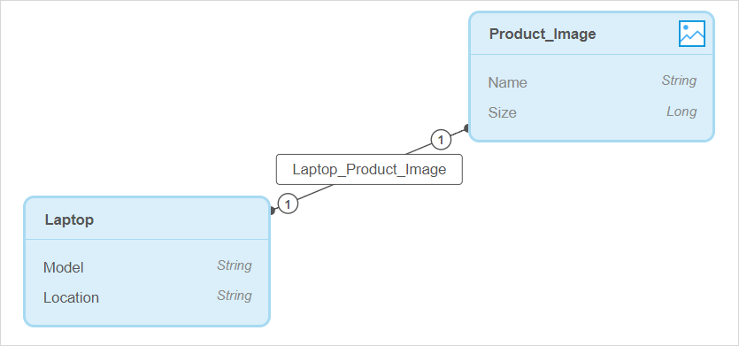

## 1 Introduction

The Mendix project consists of *modules*. A module is a unit that divides functionality of your project into separate parts. By default, you have one module in Studio called MyFirstModule. 

Each module has its own *domain model*. The domain model is a data model that describes the information in your application domain in an abstract way. It is central to the architecture of your application. 

The domain model in Studio consists of the following:

* [Entities](#entity)
* [Associations](domain-models-association-properties) 

Let us say you have a collection of CDs like the one in the table below.

| Title                           | Artist                   |
| ------------------------------- | ------------------------ |
| How to Dismantle an Atomic Bomb | U2                       |
| Exodus                          | Bob Marley & The Wailers |

The rows in the table are CDs. The type of the two rows is "CD" and this is the entity name. A specific CD like "How to Dismantle an Atomic Bomb" of the band U2 is called an object of the "CD" entity. Characteristics like the "Title" and "Artist" are called attributes.

To view the **Domain Models** of your app in Studio, click the **Domain Models** icon in the left menu bar of Studio.

{}
{}

After opening a domain model, you will see an overview of all the entities, attribute, and associations of the entities. The complexity of your domain model depends on the complexity of your app.

The **Auto Arrange** option in the top-left corner groups and aligns entities by associations. Entities with no associations will be vertically aligned. 

## 2 Components 

The domain model can contain the following components:

* [Entities](#entity-types) – represents a class of real-world objects. Entities can have attributes:
  * [Attributes](#attributes) – characteristics that describe and/or identify the entity
* [Associations](#associations) – describes a relation between entities

### 2.1 Entities and Their Types {#entity-types}

 An entity represents a class of real-world objects, such as customers, invoices, work items, etc. If we draw a parallel with databases, the entity is a table.

You can add different type of entities to your domain model:

* **Entity** – an entity that can have attributes, associations, and represents a class of real-world objects
* **Image Entity** – a special type of entity that allows you to store an image. For example, on pages, users will be able  to view and upload images with the help of an image entity
* **File Entity** – a special type of entity that allows you to store a file. For example, on pages, users will be able to upload and download files (such as, a text document, a pdf, a spreadsheet) with the help of a file entity

### 2.2 Entity Properties

Entities have the following properties:

* **General** properties define the name of the entity and its [persistability](/refguide/persistability):

  * **Name** – defines the name of the entity

  * **Persistable** – defines whether an object of the entity is stored in the database (for more information on persistability, see [Persistability](/refguide/persistability) in *Studio Pro Guide*)

		

*  **Stored Information** properties define information stored about the entity, such as when the entity was created and when it was last changed.  This information can be used in microflow expressions and/or page filters.  You can toggle the following properties: 

  * **Store 'Created by'** – when enabled, the user's name who created the entity is stored in the database

  * **Store 'Creation Date'** – when enabled, the date when the entity was created is stored in the database

  * **Store 'Last Changed by'**– when enabled, the user's name who was the last to make changes to the entity is stored in the database

  * **Store 'Last Changed Date'** – when enabled, the date when the entity was last changed is stored in the database

		

		{}You cannot toggle **Stored Information** properties for Image and File entities.{}

### 2.3 Attributes {#attributes}

Attributes are characteristics that describe and/or identify the entity. For example, a *Customer* entity typically has attributes for the name of the customer, an e-mail address, and other personal information. If we draw a parallel with databases, the attribute is a column. 

For more information on attribute types and their properties, see [Attributes](domain-model-attributes). 

### 2.4 Associations {#associations}

An association describes a relation between entities. In the domain model, an association is represented by a line/arrow between two entities. If we draw a parallel with databases, the association is a foreign key. 

For more information on association types and their properties, see [Associations](domain-model-asscoation-properties).  

## 3 Adding New Entities {#adding-new-entities}

You can add new entities in the **Toolbox**. 

{}
{}

To add an entity, do the following:

1. Open the **Toolbox** tab of the domain model.

2. Choose the entity type you would like to add, and drag and drop it the working area.

3.  Fill out the name for the entity and click **Create**:

    

The new entity is added to the domain model.

{}
{}

### 3.1 Adding New Image or File Entities

While adding new entities from the **Toolbox** works for all types of entities, you can use a specific way of adding image and file entities to your domain model.

For example, you have an entity named *Laptop* and you want to be able to show users a specific image depending on the laptop model. In this case, you need to create an image entity (for example, named *Product_Image*). However, to get data and dynamically show the right image per laptop model, the *Product_Image* entity should also have a specific connection (an association) to the *Laptop* entity. For more information on associations and their types, see [Associations](domain-models-association-properties). 

To create a new image/file entity with an association automatically, follow the process described below:

1. Select an entity of the *Entity* type that will have a connection to the new image or file entity. 

2. Click **New attribute** button.

3.  In the **Create New Attribute** dialog window, click **Add image or file** in the bottom-right corner:

    

4. In the **Image and Files** dialog window, select the type or entity (image or file).

5. In the **Create New Image/File Entity** dialog window, specify the name of the special entity and click **Create**. 

The new image or file entity is created with default *Name* and *Size* attributes and the association to the entity that you selected in the first step:

## 4 Adding New Attributes {#adding-new-attributes}

To add attributes in the domain mode, do the following: 

1.  Select a block with entity you want to add an attribute to. The **New attribute** option appears:

    {}
    {}

2.  Click **New attribute** and specify its **Name** and **Type**:

    

3. Click **Create**.

A new attribute is added to the entity. 

{}
{}

## 5 Adding New Associations

To add an association in the domain model, do the following:

1. Select a block with an entity you want to add an association to.
2.  Click the arrow icon:

    {}
    {}
   
3.  Select a second entity for the new association from the list of existing entities and click **Select**. You can also create a new entity for the association from the dialog box. 

    

A module name is indicated next to the entity name in brackets. 

{}

If you select the entity from another module, you will create a cross-module association. For more information, see the [Cross-Module Associations](domain-models-association-properties#cross-module-associations) section in *Associations*. The entities of the current module are listed first. 

{}

## 6 Specifying Properties

In the domain model, you can manage the properties of entities, attributes, and associations on the **Properties** tab.

At the bottom of the tab you can see the **Delete** button.

### 6.1 Specifying Entity Properties

You can manage the following properties of an entity:

* The **Name** of the entity

* [Persistability](/refguide/persistability) of the entity

	

To change the entity properties, click the entity in the domain model. The **Properties** tab for the selected entity is displayed automatically. 

### 6.2 Specifying Attribute Properties

You can manage the following properties of an attribute:

*   The **Name** of the attribute
*   The [**Type**](domain-models-attributes)  of the attribute

	

To change the attribute properties, click the attribute in the domain model. The **Properties** tab for the selected attribute is displayed automatically. 

{}

Fields that are displayed in **Properties** may vary depending on the type of the attribute.

{}

{}

Properties of *Name* and *Size* attributes of image and file entities are read-only, i.e. you cannot edit them. 

{}

### 6.3 Specifying Association Properties

You can manage the following properties of an association:

*   The **Name** of the association
*   **Multiplicity** of the association
*   The delete behavior of the objects

For more information, see [Associations](domain-models-association-properties). 

To change the association, click the line in the domain model. The **Properties** tab for the selected entity is displayed automatically. 

If the association type is one-to-many or many-to-many, you can swap direction of it clicking the corresponding icon. For more information, see section [3 Multiplicity](domain-models-association-properties#multiplicity) in *Associations*. 

{}
{}

## 7 Deleting Entities, Attributes, or Associations

To delete an entity, attribute, or association, do the following:

1. Select the entity, attribute or association you want to delete.

2.  Press **Delete** or click the **Delete** button at the bottom of the **Properties** tab.

    {}
    {}

{}

You cannot delete *Name* and *Size* attributes of image and file entities. 

{}

## 8 Read More

* [Attributes](domain-models-attributes)
* [Associations](domain-models-association-properties) 
