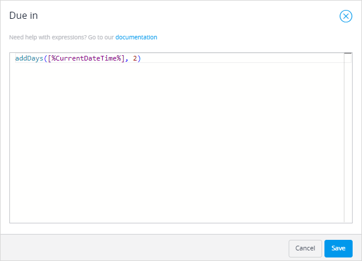
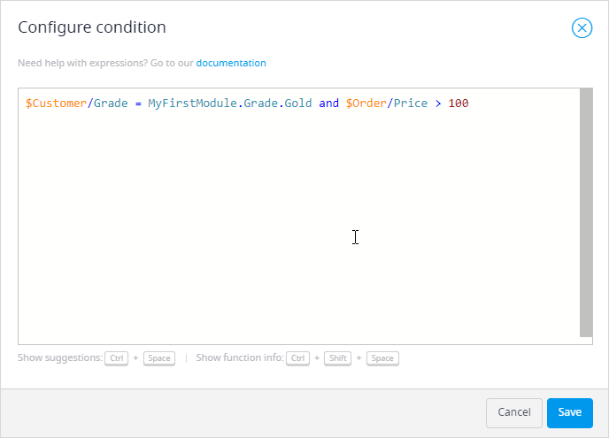

## 1 Introduction 

Expressions changes a value based on a function or combination of functions. 

You can use expressions for microflows and workflows. The expressions are usually used to configure a condition for a certain activity or property, for example, a condition for a decision in a microflow or a workflow. 

You can use expression for the following elements in a workflow:

* [Decision](workflows-general-activities)
* **Due date** property of a [workflow](workflow-properties) and a [user task](workflows-user-task)

Expressions can be used for the following activities in a microflow: 

*  End Event
*  [Decision](microflows-decision)
*  Create Object
*  Change Object
*  Create Variable 
*  Change Variable

For more information on setting and changing values for microflow activities, see [Set & Change a Value for Different Activities in the Microflows](microflows-setting-and-changing-value).

## 2 Writing an Expression

Named items in microflows and workflows (for example, objects, lists, or variables) can be called in an expression by inserting the name of the item and adding a dollar sign (for example,  `$Customer` could refer to an object named `Customer`).

Attributes and associations of objects are accessed using a slash (for example, the **Name** attribute of the customer object is referred to as `$Customer/Name`).

You can use brackets to determine the priority and associativity of calculations. For example, the **SellingPrice** is being calculated based on the default **Price** and **Discount** attributes:

```
$CurrentPrice/Price - (($CurrentPrice/Price **div** 100) * $OrderLine/Discount)
```

Arithmetic functions (subtraction, dividing, and multiplying) are being combined here.

You can use a list of suggestions to help you write an expression. Use <kbd>Ctrl</kbd> + <kbd>Space</kbd> shortcut to display this list. Suggestions can be divided into the following categories:

* **Suggestions from your microflow** – variables or attributes that you have created or retrieved in your microflow
* **Enumeration values** – values of [enumeration type of attributes](domain-models-enumeration) that can be used in an expression
* **Functions** – operations you can use in an expression (for more information, see the [Expression Types](#expression-types) section below)
* **Keywords** – key phrases or words that you can use in an expression (for example, **Empty** – a value that can be used to check if a variable is empty)
* **Booleans** – true or false expressions
* **Operators** – code elements that perform logical or mathematical operations. You can use Boolean or relational expressions (for more information, see the [Expression Types](#expression-types) section below)

If an error appears in the expression, error messages with explanations will be displayed. 

{}
{}

### 2.3  Expression Examples

Below are two examples that illustrate how expressions can be used. 

#### 2.3.1 Example 1

You have a [user task](workflows-user-task) in a workflow and would like to add a **Due Date** as a reminder that the user task should be done by the day after tomorrow. You can write the following expression for it:



#### 2.3.2 Example 2

You have a [Decision](microflows-decision) in a microflow and you would like to write an expression that checks whether the customer grade is gold and the price of the order is more than 100 (you can configure a discount after the **Decision** that is allowed if this expression is true):

 

The expression will look the following way:



#### 2.3.2 Example 3

You add a [Decision](microflows-decision) to a microflow to check if an object (in the example below the object is *Customer*) exists. And you also check if the Customer's name matches a particular one (in the example below Customer's name is *Mendix*). The expression will look the following way:


## 3 Expression Types {#expression-types}

The list of expressions that are used in Studio the most is represented below. For the full list of available expressions, see [Expressions](/refguide/expressions) in the *Studio Pro Guide*.

### 3.1 Unary Expressions

* [Unary minus ( - )](/refguide/unary-expressions)

### 3.2 Arithmetic Expressions

* [Multiplication ( * )](/refguide/arithmetic-expressions)
* [Division ( div or : )](/refguide/arithmetic-expressions)
* [Modulo ( mod )](/refguide/arithmetic-expressions)
* [Addition ( + )](/refguide/arithmetic-expressions)
* [Subtraction ( - )](/refguide/arithmetic-expressions)

### 3.3 Relational Expressions

* [Less than ( < )](/refguide/relational-expressions)
* [Greater than ( > )](/refguide/relational-expressions)
* [Less than or equal to ( <= )](/refguide/relational-expressions)
* [Greater than or equal to ( >= )](/refguide/relational-expressions)
* [Is equal to ( = )](/refguide/relational-expressions)
* [Is not equal to ( != )](/refguide/relational-expressions)

### 3.5 Boolean Expressions

* [and](/refguide/boolean-expressions)
* [or](/refguide/boolean-expressions)
* [not](/refguide/boolean-expressions)

### 3.6 Mathematical Function Calls

* [`max`](/refguide/mathematical-function-calls) – the maximum of a list of numbers
* [`min`](/refguide/mathematical-function-calls) – the minimum of a list of numbers
* [`round`](/refguide/mathematical-function-calls) – rounds a number to a certain precision
* [`random`](/refguide/mathematical-function-calls) – random number generation
* [`floor`](/refguide/mathematical-function-calls) – the rounding of a floating-point number down
* [`ceil`](/refguide/mathematical-function-calls) – the rounding of a floating-point number up
* [`pow`](/refguide/mathematical-function-calls) – the exponentiation
* [`abs`](/refguide/mathematical-function-calls) – the absolute value

### 3.7 String Function Calls

* [`toUpperCase`](/refguide/string-function-calls) – converts the string to upper-case
* [`toLowerCase`](/refguide/string-function-calls) – converts the string to lower-case
* [`length`](/refguide/string-function-calls) – the string length
* [`substring`](/refguide/string-function-calls) – gets a part of a string
* [`find`](/refguide/string-function-calls) – gets a sub-string position
* [`findLast`](/refguide/string-function-calls) – gets the last sub-string position
* [`contains`](/refguide/string-function-calls) – contains the sub-string
* [`startsWith`](/refguide/string-function-calls)  – determines whether a string starts with the specified sub-string
* [`endsWith`](/refguide/string-function-calls) – determines whether a string ends with the specified sub-string
* [`trim`](/refguide/string-function-calls) – removes the leading and trailing whitespace
* [`replaceAll`](/refguide/string-function-calls) – replaces the occurrences of a sub-string
* [`replaceFirst`](/refguide/string-function-calls) – replaces the first occurrence of a sub-string
* [`String concatenation ( + )`](/refguide/string-function-calls) – concatenates strings

### 3.8 Date Creation

* [`dateTime`](/refguide/date-creation) – creating a date value using the server's calendar

### 3.9 Between Date Function Calls

* [`millisecondsBetween`](/refguide/between-date-function-calls) – the milliseconds between two dates
* [`secondsBetween`](/refguide/between-date-function-calls) – the seconds between two dates
* [`minutesBetween`](/refguide/between-date-function-calls) – the minutes between two dates
* [`hoursBetween`](/refguide/between-date-function-calls) – the hours between two dates
* [`daysBetween`](/refguide/between-date-function-calls) – the days between two dates
* [`weeksBetween`](/refguide/between-date-function-calls) – the weeks between two dates
* [`calendarMonthsBetween`](/refguide/between-date-function-calls) - the months between two dates
* [`calendarYearsBetween`](/refguide/between-date-function-calls) - the years between two dates

### 3.10 Add Date Function Calls

* [`addMilliseconds`](/refguide/add-date-function-calls) – adds milliseconds to a date
* [`addSeconds`](/refguide/add-date-function-calls) – adds seconds to a date
* [`addMinutes`](/refguide/add-date-function-calls) – adds minutes to a date
* [`addHours`](/refguide/add-date-function-calls) – adds hours to a date
* [`addDays`](/refguide/add-date-function-calls) – adds days to a date
* [`addWeeks`](/refguide/add-date-function-calls) – adds weeks to a date
* [`addMonths`](/refguide/add-date-function-calls) – adds months to a date
* [`addYears`](/refguide/add-date-function-calls) – adds years to a date

## 4 Read More

* [Microflows](microflows)
* [Workflows](workflows)
* [Set & Change a Value for Different Activities in the Microflows](microflows-setting-and-changing-value)
* [Expressions](/refguide/expressions)
