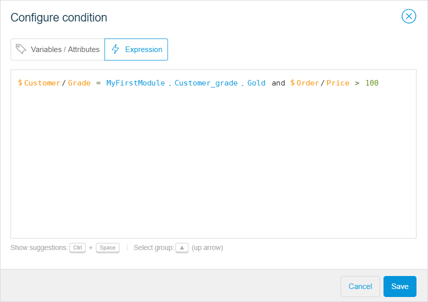

## 1 Introduction 

Expressions changes a value based on a function or combination of functions. 

Named items in microflows and workflows (for example, objects, lists, or variables) can be called in an expression by inserting the name of the item and adding a dollar sign (for example,  `$customer` could refer to an object named `customer`).

Attributes and associations of objects are accessed using a slash (for example, the **Name** attribute of the customer object is referred to as `$customer/Name`.

You can combine functions in an expression. In this case, you can use brackets to determine the priority and associativity of calculations. For example, the **SellingPrice** is being calculated based on the default **Price** and **Discount** attributes:

```
$CurrentPrice/Price - (($CurrentPrice/Price **div** 100) * $OrderLine/Discount)
```

Arithmetic functions (subtraction, dividing, and multiplying) are being combined here.


The **Expression** tab is available for the following activities in a microflow:

*  End Event
*  [Decision](microflows-decision)
*  Create Object
*  Change Object
*  Create Variable 
*  Change Variable


For more information on setting and changing values for microflow activities, see [Set & Change a Value for Different Activities in the Microflows](microflows-setting-and-changing-value).

## 2 Writing an Expression

There are two ways of writing an expression:

* [Using suggestions](#suggestions)
* [Writing expressions manually](#manually)

If an error appears in the expression, error messages with explanations will be displayed. 

{}
{}

### 2.1 Writing an Expression Using Suggestions {#suggestions}

When you start typing your expression, a list of suggestions appears divided into the following categories:

* **Suggestions from your microflow** – variables or attributes that you have created or retrieved in your microflow
* **Enumeration values** – values of [enumeration type of attributes](domain-models-enumeration) that can be used in an expression
* **Keywords** – key phrases or words that you can use in an expression
* **Booleans** – true or false expressions
* **Operators** – code elements that perform logical or mathematical operations. You can use Boolean or relational expressions (for more information, see the [Expression Types](#expression-types) section below)
* **Empty** – an empty value


To write an expression using suggestions, do the following:

1. Browse through the list of suggestions and select the element for your expression with a mouse or a keyboard.
2. Select an element from the list.
4. Click **Add** when the expression is completed.

{}

To call the list of suggestions, press <kbd>Ctrl</kbd> + <kbd>Space</kbd>

{}

### 2.2 Writing an Expression Manually {#manually}

If you want to write the expression manually, pay attention to the following:

* Variables in the microflow can be called in an expression by inserting the dollar sign followed by the name of the variable. For example, *$Customer* refers to the variable *Customer*  
* Attributes and associations of object variables are accessed using a slash. For example, *$Customer/Name*, *$Customer/Grade* refer to the attributes Name and Grade of the entity Customer 
* Unary, Boolean, and relational types of expressions are available in Studio (for more information, see the [Expression Types](#expression-types) section)

### 2.3  Expression Examples

Below are two examples that illustrate how expressions can be used. 

#### 2.3.1 Example 1

You have a [Decision](microflows-decision) and you want to write an expression that checks whether the customer grade is gold and the price of the order is more than 100 (you can configure a discount after the **Decision** that is allowed if this expression is true):

 

The expression will look the following way:



#### 2.3.2 Example 2

You add a [Decision](microflows-decision) to check if an object (in the example below the object is *Customer*) exists. And you also check if the Customer's name matches a particular one (in the example below Customer's name is *Mendix*). The expression will look the following way:


## 3 Expression Types {#expression-types}

A list of the operators you can use in expressions in Studio can be found below:

## 2 Unary Expressions

* [Unary minus ( - )](/refguide/unary-expressions)

## 3 Arithmetic Expressions

* [Multiplication ( * )](/refguide/arithmetic-expressions)
* [Division ( div or : )](/refguide/arithmetic-expressions)
* [Modulo ( mod )](/refguide/arithmetic-expressions)
* [Addition ( + )](/refguide/arithmetic-expressions)
* [Subtraction ( - )](/refguide/arithmetic-expressions)

## 4 Relational Expressions

* [Less than ( < )](/refguide/relational-expressions)
* [Greater than ( > )](/refguide/relational-expressions)
* [Less than or equal to ( <= )](/refguide/relational-expressions)
* [Greater than or equal to ( >= )](/refguide/relational-expressions)
* [Is equal to ( = )](/refguide/relational-expressions)
* [Is not equal to ( != )](/refguide/relational-expressions)

## 5 Special Checks

* [Checking for an empty object](/refguide/special-checks)
* [Checking for an empty object member](/refguide/special-checks)
* [`isNew`](/refguide/special-checks) – checks whether an object is new

## 6 Boolean Expressions

* [and](/refguide/boolean-expressions)
* [or](/refguide/boolean-expressions)
* [not](/refguide/boolean-expressions)

## 7 If Expressions

* [if](/refguide/if-expressions) – performs a conditional action

## 8 Mathematical Function Calls

* [`max`](/refguide/mathematical-function-calls) – the maximum of a list of numbers
* [`min`](/refguide/mathematical-function-calls) – the minimum of a list of numbers
* [`round`](/refguide/mathematical-function-calls) – the rounding of a floating-point number, optionally to a specified precision
* [`random`](/refguide/mathematical-function-calls) – random number generation
* [`floor`](/refguide/mathematical-function-calls) – the rounding of a floating-point number down
* [`ceil`](/refguide/mathematical-function-calls) – the rounding of a floating-point number up
* [`pow`](/refguide/mathematical-function-calls) – the exponentiation
* [`abs`](/refguide/mathematical-function-calls) – the absolute value

## 9 String Function Calls

* [`toUpperCase`](/refguide/string-function-calls) – converts the string to upper-case
* [`toLowerCase`](/refguide/string-function-calls) – converts the string to lower-case
* [`length`](/refguide/string-function-calls) – the string length
* [`substring`](/refguide/string-function-calls) – gets a part of a string
* [`find`](/refguide/string-function-calls) – gets a sub-string position
* [`findLast`](/refguide/string-function-calls) – gets the last sub-string position
* [`contains`](/refguide/string-function-calls) – contains the sub-string
* [`startsWith`](/refguide/string-function-calls)  – determines whether a string starts with the specified sub-string
* [`endsWith`](/refguide/string-function-calls) – determines whether a string ends with the specified sub-string
* [`trim`](/refguide/string-function-calls) – removes the leading and trailing whitespace
* [`isMatch`](/refguide/string-function-calls) – matches a regular expression
* [`replaceAll`](/refguide/string-function-calls) – replaces the occurrences of a sub-string
* [`replaceFirst`](/refguide/string-function-calls) – replaces the first occurrence of a sub-string
* [`String concatenation ( + )`](/refguide/string-function-calls) – concatenates strings
* [`urlEncode`](/refguide/string-function-calls) – converts a string to be used in a URL
* [`urlDecode`](/refguide/string-function-calls) – converts a string back from a URL

## 10 Date Creation

* [`dateTime`](/refguide/date-creation) – creating a date value using the server's calendar
* [`dateTimeUTC`](/refguide/date-creation) – creating a date value using the UTC calendar

## 11 Between Date Function Calls

* [`millisecondsBetween`](/refguide/between-date-function-calls) – the milliseconds between two dates
* [`secondsBetween`](/refguide/between-date-function-calls) – the seconds between two dates
* [`minutesBetween`](/refguide/between-date-function-calls) – the minutes between two dates
* [`hoursBetween`](/refguide/between-date-function-calls) – the hours between two dates
* [`daysBetween`](/refguide/between-date-function-calls) – the days between two dates
* [`weeksBetween`](/refguide/between-date-function-calls) – the weeks between two dates
* [`calendarMonthsBetween`](/refguide/between-date-function-calls) - the months between two dates
* [`calendarYearsBetween`](/refguide/between-date-function-calls) - the years between two dates

## 12 Add Date Function Calls

* [`addMilliseconds`](/refguide/add-date-function-calls) – adds milliseconds to a date
* [`addSeconds`](/refguide/add-date-function-calls) – adds seconds to a date
* [`addMinutes`](/refguide/add-date-function-calls) – adds minutes to a date
* [`addHours`](/refguide/add-date-function-calls) – adds hours to a date
* [`addDays`](/refguide/add-date-function-calls) – adds days to a date
* [`addDaysUTC`](/refguide/add-date-function-calls) – adds days to a date using the UTC calendar
* [`addWeeks`](/refguide/add-date-function-calls) – adds weeks to a date
* [`addWeeksUTC`](/refguide/add-date-function-calls) – adds weeks to a date using the UTC calendar
* [`addMonths`](/refguide/add-date-function-calls) – adds months to a date
* [`addMonthsUTC`](/refguide/add-date-function-calls) – adds months to a date using the UTC calendar
* [`addYears`](/refguide/add-date-function-calls) – adds years to a date
* [`addYearsUTC`](/refguide/add-date-function-calls) – adds years to a date using the UTC calendar

## 13 Trim to Date

* [`trimToSeconds`](/refguide/trim-to-date) – trims to seconds
* [`trimToMinutes`](/refguide/trim-to-date) – trims to minutes
* [`trimToHours`](/refguide/trim-to-date) – trims to hours
* [`trimToHoursUTC`](/refguide/trim-to-date) – trims to hours using the UTC calendar
* [`trimToDays`](/refguide/trim-to-date) – trims to days
* [`trimToDaysUTC`](/refguide/trim-to-date) – trims to days using the UTC calendar
* [`trimToMonths`](/refguide/trim-to-date) – trims to months
* [`trimToMonthsUTC`](/refguide/trim-to-date) – trims to months using the UTC calendar
* [`trimToYears`](/refguide/trim-to-date) – trims to years
* [`trimToYearsUTC`](/refguide/trim-to-date) – trims to years using the UTC calendar

## 14 To String

See [To String](/refguide/to-string) for details.

## 15 Parse Integer

See [Parse Integer](/refguide/parse-integer) for details.

## 16 Parse & Format Decimal Function Calls

* [`parseDecimal`](/refguide/parse-and-format-decimal-function-calls) – converts a string to a decimal
* [`formatDecimal`](/refguide/parse-and-format-decimal-function-calls) – converts a decimal to a string

## 17 Parse & Format Date Function Calls

* [`parseDateTime[UTC]`](/refguide/parse-and-format-date-function-calls) – converts a string to a date value
* [`formatDateTime[UTC]`](/refguide/parse-and-format-date-function-calls) – converts a date value to a string
* [`formatTime[UTC]`](/refguide/parse-and-format-date-function-calls) – converts the time part of a date value to a string
* [`formatDate[UTC]`](/refguide/parse-and-format-date-function-calls) – converts the date part of a date value to a string
* [`dateTimeToEpoch`](/refguide/parse-and-format-date-function-calls) – converts a date to a long
* [`epochToDateTime`](/refguide/parse-and-format-date-function-calls) – converts a long to a date

## 18 Enumerations in Expressions

* [`getCaption`](/refguide/enumerations-in-expressions) – gets the caption of an enumeration value in current language
* [`getKey`](/refguide/enumerations-in-expressions) – gets the technical name of an enumeration value

## 4 Read More

* [Microflows](microflows)
* [Set & Change a Value for Different Activities in the Microflows](microflows-setting-and-changing-value)
* [Expressions](/refguide/expressions)
