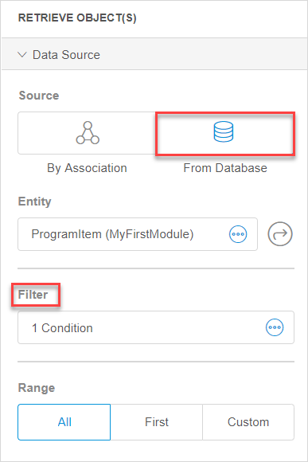
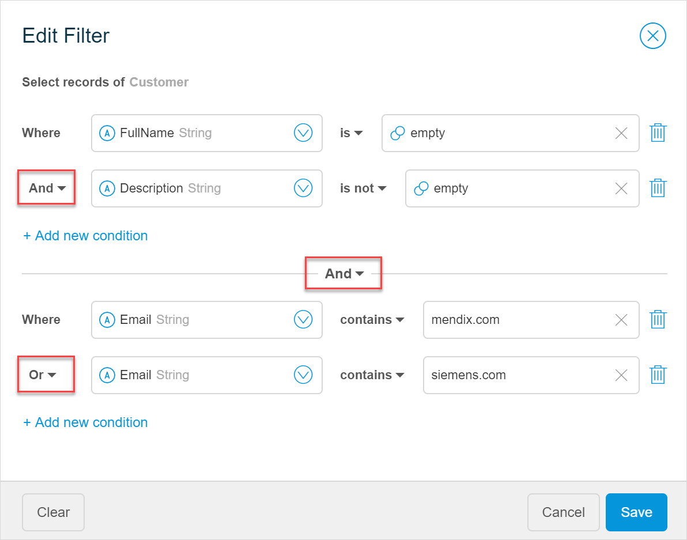

## 1 Introduction 

In Mendix Studio, you can filter data in pages and microflows.

*In a microflow*, you can filter the retrieved data by creating filters for the **Retrieve** activity. To add a filter objects should be retrieved from the database:

{}

{}

*In a page*, you can add a filter to a list view or a data grid. Mind that the data source of the list view or the data grid should be **Database**: 

{}

{}

## 2 Conditions and Groups

A filter consists of conditions and groups. 

A *condition* is an expression that restricts the retrieved data. For example, you can retrieve all customers who do not have an email filled out.

When you have more than one condition, `and` and `or` operators are used. For *conditions*, operators define if all (`and` operator) or only one of conditions (`or` operator) should be met. In the example below all three conditions should be satisfied for the data to be retrieved:

*Groups* are sets of conditions that are connected with `and`  or `or` logic.

For *groups*, operators define the following:

* `and` – all groups of conditions should be met 
* `or` – only one (or more) of the groups of conditions should be met when filtering the data

In the example below, only program items that meet the following conditions are retrieved:

* If the full name is empty, the description is filled in, and email contains "mendix.com"
* If the full name is empty, the description is filled in, and email contains "siemens.com"

## 3 Operators Used in Conditions

While `and` and `or` operators are used between conditions and groups, other operators are used to define the condition itself.  

Available operators depend on the attribute type you have selected in the left part of a condition. Possible operators used in conditions are described in the table below:

| Operator                 | Description                                                  | Example                                    |
| ------------------------ | ------------------------------------------------------------ | ------------------------------------------ |
| is                       | the attribute data exactly matches the given value           | CompanyName is Mendix                      |
| is not                   | the attribute data should not equal the given value          | CustomerName is not John                   |
| contains                 | the attribute data should contain the selected value         | Address contains Rotterdam                 |
| does not contain         | the attribute data should not contain the selected value     | Address does not contain Boston            |
| starts with              | the attribute data should start with the given value         | CustomerNumber starts with 1000            |
| ends with                | the attribute data should end with the given value           | PostCode ends with 1122                    |
| less than                | the value of the attribute data should be less than the given value | Creation Date less than Today              |
| less than or equal to    | the value of the attribute data should be less than or equal to the given value | Price less than 150                        |
| greater than             | the value of the attribute data should exceed the given value | OrderNumber greater than 555               |
| greater than or equal to | the value of the attribute data should equal or exceed the given value | CustomerNumber greater than or equal to 10 |
| in same quarter as       | the value (a date) of the attribute data falls into the same quarter of the year as the given value | Last Changed Date in same quarter as Today |

## 4 Creating a New Filter

To create a new filter, do the following:

1. To add a filter to a *microflow*, open the **Retrieve** action properties. 

    To add a filter to a *page*, open properties of a list view or a data grid).

2. Make sure the database is selected as the data source and that an entity is selected.

2. Click the **Filter** field.

    {}{}

3. In the **Add Filter** dialog box, specify the attribute/association on the left first, as operators depend on the type of attribute that you have chosen. For example, if you choose *Date and Time* attribute type, you will be able to select the **in same quarter as** operator, while this operator is unavailable for other attribute types. 

    

4. Select an operator and a value on the right. 

    The value on the right can be a literal value that you type in (only available for string, long, integer, decimal, and autonumber attribute types), or it can be an attribute, association, or value you choose from the drop-down list. The options in the drop-down list depend on the left attribute/association. 

    

5. To add more conditions and manage them, do the following:  

    a. Click **Add new condition**.  

     

    b. If needed, change the `and` operator to `or` operator clicking the drop-down arrow.  
    c.  If you want to change the order of conditions, click the icon on the left (appears when you hover over it) and drag it. 

     

6. To create a new group and manage it, do the following:  

    a.  Hover over the bottom of the dialog-box and click **Create a New Group** that appears there. 

     

    b. To change the `and` operator applied to groups to `or` operator, click the drop-down arrow. 

7. Click **Add** to save the filter.

The new filter is added. In the properties, you can see the total amount of conditions in the filter.

## 5 Deleting a Filter

To delete a filter, do the following:

1. In a *microflow*, navigate to properties of the **Retrieve** action. 

    In a *page*, navigate to properties of a list view or a data grid.

2. Click the **Filter** field.

3. In the **Edit Filter** dialog box, click **Clear**. 

    

All conditions in the filter are deleted.

{}
If you want to delete just one condition and not all of them, click the trash bin icon on the right. 
{}

## 6 Read More

* [Microflows](microflows)
* [Pages](page-editor)
