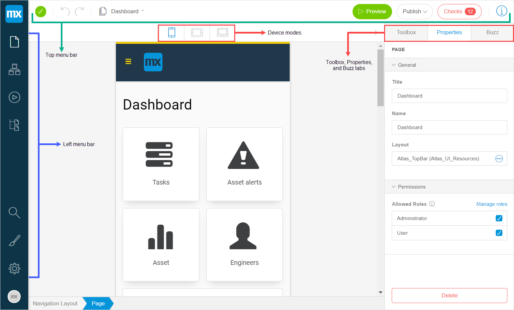
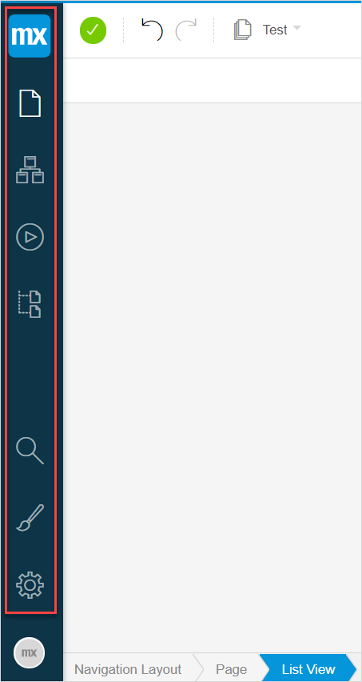

## 1 Introduction {#studio-overview}

Mendix Studio is the place where you can create, view and edit your Mendix applications without going into technical details. For this purpose you can use [Studio Pro](/refguide/modeling) and [develop apps together with Studio Pro users](collaborative-development) anytime. 

With Studio you can create and edit applications in your browser without installing software on your PC.   

The picture below shows the components of Studio's interface:

## 2 Opening Studio

You can open Mendix Studio via [Developer Portal](#opening-studio-via-dev-portal) or [Studio Pro](#opening-via-studio-pro). 

### 2.1 Opening Studio via Developer Portal {#opening-studio-via-dev-portal}

You can edit an app in Mendix Studio by opening it in the [Developer Portal](https://sprintr.home.mendix.com) and clicking **Edit in Studio**:

{}

{}

If you do not see **Edit in Studio**, go to [General Settings](/developerportal/collaborate/general-settings) in the Developer Portal and [enable Studio](/developerportal/collaborate/general-settings#web).

### 2.2 Opening Studio via Studio Pro {#opening-via-studio-pro}

You can also open your app in Studio via Studio Pro. Do the following:

1. In Studio Pro, open the app in that you want to view in Studio.
2.  Click the globe icon in the top right corner (only available if Studio is enabled).

	

The app opens in Studio.

## 3 Upgrading Studio

After clicking **Edit in Studio** you may need to upgrade your app to the latest version.

{}
{}

You may also see a top bar suggesting an upgrade to the next Mendix version. For more information on Studio upgrades and Mendix versions, see [Studio Ranges & Mendix Versions](general-versions).

{}
When you upgrade your app in Studio to the latest  Mendix version, you will need to upgrade your app in the Studio Pro to the same version as well. 

If you are working in a team with others, it is wise to check with your team members if everyone is OK to upgrade the app to the latest Mendix version. 

{}

## 4 Switching App Modes

After opening Studio, the home page of the app opens. 

You can change the view of your page to different views by clicking the corresponding icons:

* Mobile
* Tablet
* Responsive (Desktop) 

    {}
    {}

## 5 Left Menu Bar

The left menu bar allows you to access pages, the domain model, microflows, workflows, and the navigation document in Studio, search for different elements in your app, open settings, and customize the look of your app:

{}

{}

All items of the left menu bar are described in the table below:

| Menu item                            | Shortcut     | Description                                                  |
| ------------------------------------ | ------------ | ------------------------------------------------------------ |
| [Pages](page-editor)                 | 1            | Shows a list of all pages in the app. Select a page to open it. |
| [Domain Models](domain-models)       | 2            | Shows the domain models of the app.                          |
| [Microflows](microflows)             | 3            | Shows a list of all microflows in the app. Select a microflow to open it. |
| [Workflows](workflows)               | None         | Shows a list of all workflows in the app. Select a workflow to open it. |
| [Navigation Document](navigation)    | 4            | Shows a configured menu in the form of a navigation tree. You can expand the menu structure of the navigation tree up to two levels with an unlimited amount of pages. |
| Search (magnifying glass) icon       | <kbd>/</kbd> | Helps you search through microflows, entities, and pages. Start typing the name of the item you are looking for and the search feature will return any matches it finds, using exact matches as well as fuzzy matches based on the characters entered.  You can also use "/" shortcut to search through your app. |
| [Theme Customizer](theme-customizer) | None         | Allows you to style your app with custom branding, colors, and typography. |
| [Settings](settings)                 | None         | **Settings** consists of **Roles and Permissions** and **Widget Overview**.  Via [Roles and Permissions](settings-security) you can manage access to your app for different type of users.   The [Widget Overview](settings-widget-overview) gives you an overview of all widgets and their status. Widgets are user interface elements (alerts, buttons, charts, etc.) that are used to build pages. |

## 6 Toolbox, Properties, and Buzz

The top right menu of Studio consists of the **Toolbox**, **Properties** , and **Buzz** tabs: 

The **Toolbox**, **Properties** , and **Buzz** tabs are described in the table below:

| Tab          | Description                                                  |
| ------------ | ------------------------------------------------------------ |
| Toolbox      | Shows tools available for the current editor.                |
| Properties   | Shows the properties of the selected item.                   |
| [Buzz](collaboration-buzz) | Allows an app development team to make comments to different pages, microflows, domain models, and layouts of Studio, and interact with each other. |

## 7 Top Menu Bar

The top menu bar allows to undo or redo actions, view your recent documents, preview or publish your app, and view checks in your app. You can also access help and learning and view various information in the top menu bar. 

The top menu bar items are described in the table below: 

| Menu item | Description |
|------|------|
| **Switch-to** menu | The **Switch-to** menu allows you to switch to other parts of the Mendix platform. This menu contains the following options: <ul><li>**Mendix Home** – takes you to the [Developer Portal](/developerportal/)</li><li>**Studio** – opens **My Apps** screen in the Developer Portal</li><li>**Get Studio Pro** – downloads the latest version of Mendix Studio Pro</li><li>**Academy** – a link to the [Mendix Academy](https://gettingstarted.mendixcloud.com)</li><li>**Docs** – a link to the [Mendix Documentation](https://docs.mendix.com/)</li></ul> |
| Undo/Redo actions | There buttons undo or redo the last action. You can also use <kbd>Ctrl</kbd>+<kbd>Z</kbd> and <kbd>Ctrl</kbd>+<kbd>Y</kbd> shortcuts correspondingly. |
| Recent documents drop-down menu | A document that you are currently viewing is displayed in this option. When you click the drop-down menu, documents that you have recently viewed are displayed in the list. Click the document to open it. |
| [Preview button](publishing-app) | Shows you what your app will look like after it is published. |
| [Publish button](publishing-app) | You can publish your app with this button. Click **Publish** > **Update** to publish the latest changes you made in Studio. For more information, see [Previewing & Publishing Your App](publishing-app) |
| [Checks button](checks) | Displays consistency errors (if any) that prevent your app from being previewed and published. For more information on errors, see [Consistency Errors](consistency-errors). You can also use <kbd>C</kbd> shortcut to view the **Checks** panel. |
| Help icon | Opens the **Help & Learning** side menu, where you can find just-in-time help – videos and how-to's that will provide you explanations and instructions in the context of your current task. For example, when working in the domain model, you will see videos and how-to's on the domain model, entities, and attributes as a recommended topic for you. However, you can also browse through the categories and other topics that cover all the main features in Studio. |
| **More Options** icon | Provides additional information. You will find the following:<ul><li>**About** – shows the information on the [Studio version and Mendix version](general-versions) </li><li>**Keyboard Shortcuts** – opens the list of shortcuts in Studio</li><li>**Take a Product Tour** – starts a  the guided product introduction tour and shows you around Studio</li><li>**Contact Mendix Support** – a link to the [Mendix Support Portal](https://support.mendix.com/hc/en-us)</li><li>**Mendix Assist Is ON** – a setting that enables/disables [Mendix Assist](mx-assist)</li><li>**Open App Buzz** – takes you to the [App Buzz](/developerportal/collaborate/buzz#app-buzz) in the Developer Portal</li><li>**Edit in Studio Pro** – opens your app in Studio Pro</li></ul> |

## 8 Cut/Copy/Paste Function 

You can copy and paste pages and microflows. You can also cut, copy, and paste separate elements such as widgets or microflow activities. 

### 8.1 Copy/Paste Workflows, Pages, Microflows, and Enumerations {#copy-paste-documents}

Workflows, pages, microflows, and enumerations can be copied to clipboard and then pasted to a different Studio app. You can also copy and paste them to the same app, however, there is the **Duplicate** option you can use for this purpose. For more information on how to copy, paste, or duplicate workflows, pages, microflows, and enumerations, see [Workflows](workflows), [Pages](page-editor), [Microflows](microflows), and [Enumerations](domain-models-enumeration) respectively.  

Mind the following when copying and pasting pages, microflows, and enumerations:

* You can copy/paste workflows, pages, microflows, and enumerations only to Studio apps that have the same Mendix version 
* You can copy/paste workflows, pages, microflows, and enumerations only between instances of the same browser
* You *cannot* copy/paste from Studio to Studio Pro or vice versa

### 8.2 Cut/Copy/Paste Separate Elements

Cut/copy/paste function is available in all editors of Studio: pages, microflows, workflows, domain models, and navigation document. To cut/copy/paste you can use <kbd>Ctrl</kbd> + <kbd>X</kbd> /  <kbd>Ctrl</kbd> + <kbd>C</kbd> / <kbd>Ctrl</kbd> + <kbd>V</kbd> or  <kbd>Cmd</kbd> + <kbd>X</kbd> /  <kbd>Cmd</kbd> + <kbd>C</kbd> / <kbd>Cmd</kbd> + <kbd>V</kbd>. 

Mind the following characteristics when using cut/copy/paste:

* You can cut/copy/paste elements within one visual editor; that means that you can cut/copy/paste elements within one page or to other pages in Studio, and copy microflow activities within one microflow or to other microflows
* You can cut/copy/paste elements to different apps in Studio if they have the same Mendix version
* You cannot copy/paste pages, microflows, or workflows, only elements of a page or a microflow 
* You cannot cut/copy/paste from Studio to Studio Pro or vice versa

## 9 Main Documents in This Category

* [Studio Ranges & Mendix Versions](general-versions) – explains how Studio version correlates to the Mendix version

