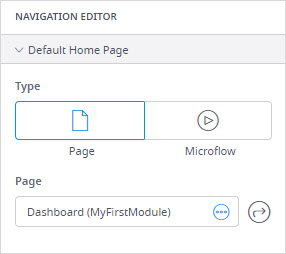

## 1 Introduction 

A **Navigation Document** in Mendix Studio shows a configured menu of your app in a form of a tree. You can create items and sub-items in your navigation. 

To open the **Navigation Document**, click the corresponding icon in the left menu bar.

The **Navigation Document** consists of menu items that allow end-users navigate your app or that perform certain actions. For example, you can configure a menu item to open a specific page or to log an end-user out of their profile. For more information on actions you can assign to menu items, see the [Events Section](#events-section-navigation).

You can also add a sub-item to a menu item. Mind that you cannot assign an action to the menu item that has the sub-item.  

To create a new menu item, do the following:

1. Click the **Navigation Document** icon in the left menu bar to open the **Navigation**.

2. Click a plus at the bottom of the navigation tree to create a menu item, or click a plus next to the existing navigation item to create its sub-item

   

3. Specify the properties of the created item if needed (For more information, see [Properties of Menu Items](#properties-of-menu-items)). 

A new menu item or a sub-item is added to the navigation.

{}

In Studio, you are viewing and editing a Responsive type of the navigation profile, while there are more types of profiles in Studio Pro. For more information on profiles in Studio Pro, see the [Profiles](/refguide/navigation#profiles) section in *Navigation* in the *Studio Pro Guide*. 

{}

For more information on how to configure navigation in your app, see [How to Configure a Navigation Bar](/studio-how-to/navigation-how-to-configure).

## 2 Navigation Editor Properties

In navigation editor properties, you can set a [default home page](#default-home-page) and [role-specific home pages](#role-specific-home-page). 

### 2.1 Default Home Page {#default-home-page}

You can set a page or a microflow as a default home page:

The **Default Home Page** section consists of the following properties:

* **Page** – Allows you to set a page that is opened when an end-user opens the app. 
* **Microflow** – Allows you to set a microflow that is performed when an end-user opens the app. A microflow can be used to execute some logic or gather specific data that should be passed to the homepage.

A home page icon is displayed in a list of pages or microflows against a page or microflow that is set as a home page:

### 2.2 Role-Specific Home Page {#role-specific-home-page}

A role-specific home page is a home page that that overrides the [default home page](#default-home-page) and is opened only for users with the specified role. You can set a separate home page per each role in your app. For more information on roles and how to create them, see [Security, Roles & Permissions](settings-security).

For example, an Administrator role can have the **Admin_Dashboard** page as its home page, while other users will have the default home page opened when they open the app:

When adding or editing the role-specific home page, you can set the following properties:

* **Role** – Defines what role has a dedicated home page.

* **Type** – Defines whether a page or a microflow is opened/performed when the user opens the app. The following types are available:

  * **Page** – A page is set as a home page.
  * **Microflow** – A microflow is set as a home page, i.e. a microflow is performed when a user opens the app. A microflow can be used to execute some logic or gather specific data that should be passed to the homepage.

* **Page** – This property is only available when the **Type** is set to **Page**. Allows you to set a dedicated home page that is opened for the selected role.

* **Microflow** – This property is only available when **Type** is set to **Microflow**. Allows you to set a microflow that is performed when a user with the selected role opens the app.

    

A role-specific home page icon is displayed in a list of pages or microflows against a page or microflow that is set as a home page:

### 2.3 Adding a Role-Specific Home Page

To add a role-specific home page, do the following:

1. Make sure your [security](settings-security) is enabled and configured.

2. Open the navigation editor > Navigation Editor properties.

3. In the **Role-Specific Home Page** section, click the **Add Role-Specific Home Page**.

4. In the **Role** drop-down menu, select a role that will have a dedicated home page:

    

5. Select the **Type** of the home page: a page or a microflow.

6. Depending on the selected type, choose either a page or a microflow that is be opened or performed when the user with the selected role opens the app.  

The role-specific home page is set.

## 3 Menu Item Properties {#properties-of-menu-items}

Properties of the menu items consists of the following sections:

* [Events](#events-section-navigation) 
* [General](#general-section-navigation) 

### 3.1 Events Section {#events-section-navigation}

You can choose the **On Click Action** in the **Events** section. The **On Click Action** defines what action is performed when the user clicks a menu item. 

{}
If a menu item has a sub-item(s), it cannot have an action configured for it.
{}

The available actions are described in the table below:

| Action         | Description                                                  |
| -------------- | ------------------------------------------------------------ |
| Nothing        | No action is taken.                                          |
| Page           | The specified page is opened.                                |
| Microflow      | The selected microflow is executed.                          |
| Save Changes   | Saves (commits) all changes made in the currently opened page and closes the page. |
| Cancel Changes | Rolls back all changes made in the currently opened page and closes the page. |
| Close Page     | Closes the pop-up window (for pop-up pages) or navigates to the previously visited page. Note that this action will close the page and the changes if any will not be saved. Use **Save Changes** for this purpose. |
| Sign Out       | The current user is signed out of the app.                   |
| Open Link      | Triggers an action based on the link type: <ul><li>**Web** – navigates to a website </li><li>**Email** – composes an email</li><li>**Phone Call** – starts a phone call</li><li>**Text Message** - sends a text message</li></ul>**Note** When you configure **Email**, **Phone Call** or **Message** options, the corresponding default app will be opened on the device when the action is triggered, for example, the default email client will be opened to compose a message. |

{}

If a menu item has a sub-item, the **On Click Action** should be **Nothing**. 

{}

### 3.2 General {#general-section-navigation}

The properties that can be configured in the **General** section are the following:

* **Caption** – Allows you to fill in the name of the menu item.
  * **Translations** – Only available if multiple languages are set up in your app in Mendix Studio Pro. This option allows you to add translations of the button caption to other languages. For more information on how to add translations, see [Translating Your App to Multiple Languages](language-support).

* **Icon** – Allows you to set the icon of the menu item.

## 4 Read More

* [How to Configure a Navigation Bar](/studio-how-to/navigation-how-to-configure)
* [General Info](general)
* [Navigation Consistency Errors](consistency-errors-navigation)
