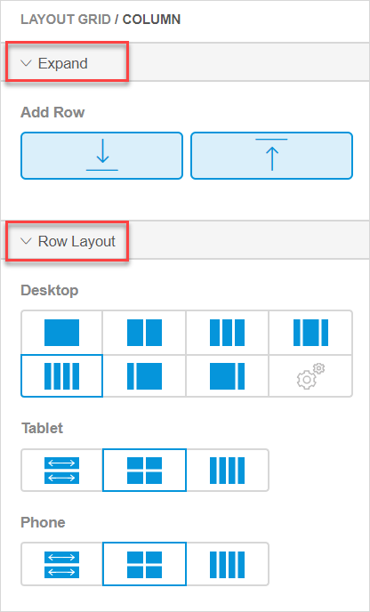

---

title: "Column Widgets"
parent: "page-editor-widgets"
description: "Describes column widgets in Mendix Studio."
menu_order: 60
tags: ["studio", "page editor", "layout", "layout grid", "columns" "widgets"]
---

## 1 Introduction 

The **Columns** category contains widgets with a pre-set number of columns that allow you to structure your page. All widgets in this category are based on a [layout grid](#layout-grid) – an element that structures your page with rows and columns. 

The number of columns are predefined in these widgets, however, if you want to add more columns, you can do it in the [layout grid properties](#layout-grid-properties).  

## 2 Layout Grid Overview {#layout-grid}

The **Layout Grid** helps you to configure a page and make it responsive immediately. This means that a layout grid has a built-in behavior to show how a page will look like on different devices. Switch **Device** modes in the top bar to see how a page will be displayed on a phone, tablet or desktop.

{}
{}

Layout grid contains [columns and rows](#columns-and-rows). 

A row consists of items that are placed next to each other in a responsive (desktop) view. 

A column is a cell inside a row. You can place one or several elements inside a column, for example, you can place two buttons inside it.

{}
{}

Use a column to align items in a row.  For more information on rows and columns, see section [2.2 Row and Column Properties](#columns-and-rows). 

### 2.1 Layout Grid Properties {#layout-grid-properties}

You can access the **Layout Grid** properties through the breadcrumb trail (for more information, see the **[Breadcrumb Trail](page-editor#breadcrumb)** section in *Pages*). 
Layout grid properties consist of the following sections:

* [Expand](#expand-section) 
* [General](#general-section)
* [Design](page-editor-widgets-design-section)

#### 2.1.1 Expand Section {#expand-section}

The **Expand** section > **Add Row** allows you to add a row above or below the selected one to create more space to place widgets in. 

{}
{}

To add a row, select a row in the layout grid and click one of the buttons in **Add Row**. A row identical to the selected one will be inserted.

{}

**Row** and **Column** also have the **Expand** section with the same properties.  

{}

#### 2.1.2 General Section {#general-section}

The **General** section of the layout grid contains the **Full Width** property. When this property is enabled, the layout grid takes the whole width of a container it is placed in. When disabled, the layout  grid will have a fixed size in the center of your page, adjusted automatically according to your device.

#### 2.1.3 Design Section

For information on the **Design** section and its properties, see [Design Section in Widgets](page-editor-widgets-design-section).

### 2.2 Row and Column Properties {#columns-and-rows}

**Row** and **Column** properties consist of the following sections:

* [Expand](#expand-section) 
* [Row Layout](#row-layout)

{}
{}

#### 2.2.1 Expand Section

The **Expand** section for **Column** and **Row** has the same properties and functions as the **Expand** section of a layout grid. For details, see the [Expand Section](#expand-section) in the *Layout Grid Overview*.

#### 2.2.2 Row Layout Section {#row-layout}

In the **Row Layout** section you can change the way columns in a row are arranged, for example, change the number of columns and select the way they will be displayed on a desktop, a tablet, and a phone.  

| Property | Description                                                  |
| -------- | ------------------------------------------------------------ |
| Desktop  | Changes the number and width of columns for a desktop.       |
| Tablet   | Changes the number and width of columns for a tablet. Options available for the **Tablet** layout depend on the option selected for the **Desktop**. |
| Phone    | Changes the number and width of columns for a phone. Options available for the **Phone** layout depend on the option selected for the **Desktop**. |

In the example below, you can see that you can select different row layouts for different types of devices and check the way the layout is shown in your app. 

## 6 Read More

* [Pages](page-editor) 
* [Widgets](page-editor-widgets)
