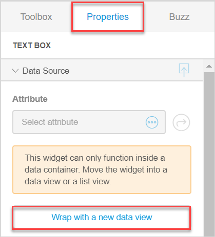

## 1 Introduction 

Image [widgets](page-editor-widgets) are used to show images to the users. 

There are the following image and file widgets in Mendix Studio:

* Image – allows you to show a static (non-changing) image in your app

*  Dynamic Image – allows you to show a dynamic image (for example, a relevant profile picture that is different for each customer) in your app

*  Image Uploader – allows end-users to upload an image

*  File Manager – allows end-users to upload or/and download a file (in the **Toolbox**, you see  preconfigured file managers: **File Uploader** and **File Downloader**)

   {}
   {}

## 2 Image and Dynamic Image 

An image (or a static image) and a dynamic image allow you to display an image either from a file (statically) or from a database (dynamically).  

You can switch from one widget to another in properties:

### 2.1 General Section {#image-general}

In the **General** section, you can switch between static and dynamic image, select an image, configure its width and height, etc. 

Before configuring settings in the **General** section for the **Dynamic Image**, keep in mind that it can only function inside a data container (a list view or a data view). You can either place widget in an existing data container; or click **Wrap with a new data view** in **Properties** to create a data view automatically and place an input element inside it. 

{}
{}

Settings available for **Static Image** and **Dynamic Image** are described in the table below:

| Property      | The property applies to   | Description                                                  |
| ------------- | ------------------------- | ------------------------------------------------------------ |
| Image Source  | Static and Dynamic Images | Switches between static and dynamic image.                   |
| Entity        | Dynamic Image             | Specifies which entity will be shown in the dynamic image. You can only set an entity for the dynamic image if the entity has been configured as image in Studio Pro. For more information, see section [General Properties](/refguide/entities#entities-general-properties) in *Entities* in the *Mendix Studio Pro Guide* and [Dynamic Image (document template)](/refguide/dynamic-image-document-template) in the *Mendix Studio Pro Guide*. |
| Image         | Static Image              | Sets an image that will be shown to the end-user.            |
| Default Image | Dynamic Image             | This is the image that is displayed if no image is uploaded. |
| Width Unit    | Static and Dynamic Images | The width of an image can be specified in the following ways:   <ul><li>**Auto** – the width of the given image is used.</li><li>**Pixels** – the width is specified in a number of pixels. If you specify both width and height, the image will be scaled automatically: the proportions will be kept, the picture will not be stretched.</li><li>**Percentage** –  the width is specified in a percentage of the original width. It can be larger than its original width in which case the image is stretched.</li></ul> Default value for **Width Unit**: Auto |
| Width         | Static and Dynamic Images | The **Width** option is only displayed when **Pixels** or **Percentage** are selected for the **Width Unit**. It specifies the width of the image in pixels or percentage. |
| Height  Unit  | Static and Dynamic Images | The height of an image can be specified in the following ways:   <ul><li>**Auto** – the height of the given image is used.</li><li>**Pixels** – the height is specified in a number of pixels. If you specify both width and height, the image will be scaled automatically: the proportions will be kept, the picture will not be stretched.</li><li>**Percentage** –  the height is specified in a percentage of the original height. It can be larger than its original height in which case the image is stretched.</li></ul> Default value for **Height Unit**: Auto |
| Height        | Static and Dynamic Images | The **Height** option is only displayed when **Pixels** or **Percentage** are selected for the **Height Unit**. It specifies the height of the image in pixels or percentage. |

### 2.2 Events Section 

You can choose the **On Click Action** in the **Events** section. The **On Click Action** defines what action is performed when the user clicks an image.

#### 2.2.1 Common Properties 

The static image and the dynamic image share the properties in the **Events** section, except for one property that is [specific for the dynamic image](#events-dynamic-image). 

For more information on the **Events** section for static and dynamic images, see [Events Section in Widgets](page-editor-widgets-events-section).

#### 2.2.2 Dynamic Image Specific Property {#events-dynamic-image}

The dynamic image has a specific on-click action **Enlarge on Click**. The full-size image will be displayed when the user clicks it. This property overrides other on-click actions. 

### 2.3 Design Section

For information on the **Design** section and its properties, see [Design Section in Widgets](page-editor-widgets-design-section).

## 3 Image Uploader and File Manager

An **image uploader** allows end-users to upload images to you app and it generates a thumbnail of the uploaded image. 

{}

The image uploader must be placed inside a data view or a list view that have an image entity as their data source.  For more information on image entities, see the [Types of Entities](#entity-types) section in *Domain Model*. 

{}

A **file manager** allows end-users to upload and/or download files.

{}

The file manager must be placed inside a data view or a list view that have a file entity as their data source.  For more information on file entities, see the [Types of Entities](#entity-types) section in *Domain Model*. 

{}

### 3.1 Data Source Section

### 3.2 General Section

### 3.3 Design Section

For information on the **Design** section and its properties, see [Design Section in Widgets](page-editor-widgets-design-section).

## 5 Read More

* [Pages](page-editor) 
* [Widgets](page-editor-widgets)
