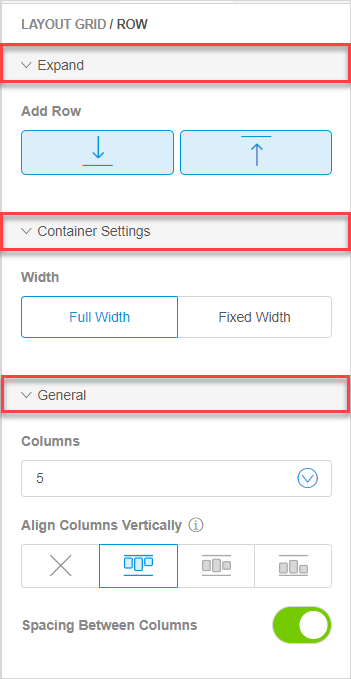
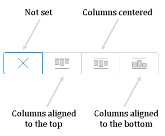
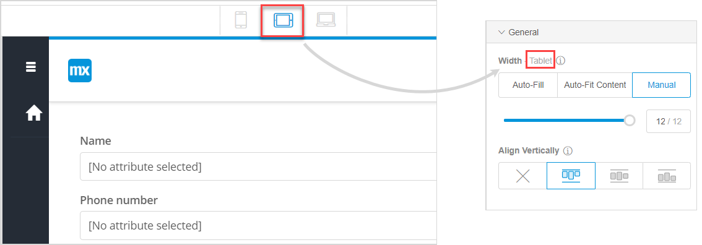

---

title: "Structure"
parent: "page-editor-widgets"
description: "Describes Structure widgets in Mendix Studio."
menu_order: 60
tags: ["studio", "page editor", "layout", "layout widgets", "structure widgets"]
---

## 1 Introduction 

Structure widgets are widgets that allow you to provide structure to your page and group other widgets inside them. 

There are the following Structure widgets:

* [Columns and Sidebars](#columns) 
* [Container](#container-overview)
* [Group Box](#group-box-overview)
* [Tab Container](#tab-container)

## 2 Columns and Sidebars{#columns}

**Column** and **Sidebar** widgets are widgets with a pre-set number of columns. All widgets in this category are based on a [layout grid](#layout-grid) – an element that structures your page with rows and columns. 

## 3 Layout Grid {#layout-grid}

The **Layout Grid** helps you to configure a page and make it responsive immediately. This means that a layout grid has a built-in behavior to show how a page will look like on different devices. Switch **Device** modes to see how a page will be displayed on a phone, tablet, or desktop:

{}
{}

Layout grid contains [columns and rows](#columns-and-rows). 

A row consists of items that are placed next to each other in a responsive (desktop) view. 

A column is a cell inside a row. You can place one or several elements inside a column, for example, you can place two buttons inside it.

{}
{}

For more information on rows and columns, see section the [Row Properties](#row) and [Column Properties](#column) sections. 

### 2.1 Layout Grid Properties {#layout-grid-properties}

You can access the **Layout Grid** properties through the breadcrumb (for more information, see the [Breadcrumb](page-editor#breadcrumb) section in *Pages*). 
Layout grid properties consist of the following sections:

* [Expand](#expand-section) 

* [General](#general-section)

* [Design](page-editor-widgets-design-section)

    {}
    {}

#### 2.1.1 Expand Section {#expand-section}

The **Expand** section > **Add Row** allows you to add a row above or below the selected one to create more space to place widgets in. 

To add a new row, do the following:

1. Select a row in the layout grid and 
2. In **Properties** > **Add Row**, click one of the buttons to insert the row above or below. 

A row identical to the one you selected in step 1 will be inserted.

#### 2.1.2 General Section {#general-section}

In the **General** section, you can set the width of the layout grid. You can choose one of the following:

* **Full Width** – the layout grid takes the whole width of a container it is placed in
* **Fixed Width** –  the layout  grid will have a fixed size in the center of your page, adjusted automatically according to your device

#### 2.1.3 Design Section

For information on the **Design** section and its properties, see [Design Section](page-editor-widgets-design-section).

### 2.2 Row Properties {#row}

*Row* properties consist of the following sections:

* [Container Settings](#container-settings) 
* [General](#general-section-row)

	{}
	{}

#### 2.2.1 Container Settings Section {#container-settings}

In the **Container Settings** section, you can set the width for the layout grid and choose between full width or fixed width. 

{}

This property is the same as the property in the [General Section](#general-section) of the layout grid. For details, see the [General Section](#general-section).

{}

#### 2.2.2 General Section

In the **General** section of a row you can select the number of columns in it, align columns and add spacing between them. This section contain the following settings:

* **Columns** – sets the number of columns in the row 

    * You can also set the number of columns in the working area: select one of the columns and click a plus icon on top of it to add a new column to the right

        

* **Align Columns Vertically** – aligns all columns in the row vertically, you can select the following options:

    {}
    {}

* **Spacing Between Columns** – when enabled, adds spacing between columns

### 2.3 Column Properties {#column}

*Column* properties consist of the **General** section, where you can set the column [width](#column-width) and [align](#align-column) an individual column. 

#### 2.3.1 Width {#column-width}

You can set the column width for desktop, tablet, or phone by choosing the corresponding device mode:

You can choose the following options:

* **Auto-fill** – takes the available space for a column (for example, if there is one column, it will span the column for the whole row, and for two columns, it will divide the space equally between them)

* **Auto-fit content** – automatically fits the size of the column to its content

* **Manual** – allows you to manually set the size of the columns 

    * When you select **Manual** the slider appears that allows you to set the width of the column from 1 to 12:
    
	    

{}

You can also resize columns manually in the working area: drag the column border to change its size. 

{}

The **Width** property can be used to make your layout more flexible and adaptive to different types of devices.

For example, you have a layout grid with one row and two columns: a picture is in one column, and a text with details is in another.

For the *desktop*, you might want to set the first column with a picture to **Auto-fit content** and and the second one to **Auto-fill**, this way the first column will adjust to the size of the picture, while the second one will take the rest of the row:

For *tablet*, you can set both columns to **Auto-fill** and you will get two equal columns:

For *phone*, it can be a good idea to place two columns one under another, setting them to **Manual** width of *12*. In this case, the second column will be automatically wrapped to another line:

 

#### 2.3.2 Align Vertically {#align-column}

The **Align Vertically** property overrides the [Align Columns Vertically](#align-columns) property on the row and sets alignment for an individual column. 

## 4 Container Overview {#container-overview}

A **Container** is used as a layout element where you can place a widget or a group of widgets and simultaneously style, drag or delete them. For example, you can place a section title and input widgets for filling out program's details in one container, and subsequently reposition the whole container at once to a different location on the page. 

{}
{}

Container properties consist of the **Design** section. For information, see [Design Section](page-editor-widgets-design-section).

## 5 Group Box Overview {#group-box-overview}

A group box is used to group widgets together. The group box can be configured to collapse or expand dynamically with all the elements inside it. 

{}
{}

### 5.1 Group Box Properties

Group box properties consist of the **General** section and the **Design** section. For information on the **Design** section and its properties, see [Design Section](page-editor-widgets-design-section).

Properties available in the **General** section are described in the table below.

| Property    | Description                                                  |
| ----------- | ------------------------------------------------------------ |
| Show Header | **Show Header** defines whether a header is shown above the group box.  *This property is enabled by default.* |
| Caption     | This property is only displayed when the **Show Header** option is enabled. It defines the caption that is shown in the header. |
| Collapsible | This property is only displayed when the **Show Header** option is enabled. It defines whether the group box and its elements can be collapsed or expanded. Possible values of this property are the following:<ul><li>**Yes (start expanded)** – the elements inside the group box will be initially expanded and can be collapsed when a user clicks a minus icon in the header</li><li>**Yes (start collapsed)** – the elements inside the group box will be initially collapsed and can be expanded when a user clicks a plus icon in the header </li><li>**No** – group box elements cannot be expanded or collapsed</li></ul> |

## 6 Tab Container Overview {#tab-container}

A tab container is a container that is used to show information categorized into tabs. This can be useful if the amount of information that you would like to display is larger than the amount of space on the screen. For example, you can show a list of customers on one tab, and orders on the other one. 

{}
{}

You can place a widget or a group of widgets inside each tab and configure information in them separately. 

### 6.1 General Section

In the **General** section, you can configure the following properties:

*  **Tabs** – use radio buttons to switch from one tab to another; click the tab and drag it to change the order of tabs; click the **Edit** icon to open the tab properties and configure it (for more information, see section the [Tab Properties](#tab-properties) section)

	{}
	{}

*  **Add New Tab** – adds a new tab to your tab container; tab properties will open automatically (for more information, see section the [Tab Properties](#tab-properties) section)

	{}
	{}

### 6.2 Design Section

For information on the **Design** section and its properties, see [Design Section](page-editor-widgets-design-section).

### 6.3 Tab Properties {#tab-properties}

Each tab has the following properties: 

* **Caption** – defines the name of the tab; you can also edit the caption by double-clicking it in the page 

*  **Default Tab** – defines which tab is active when the page is opened. If no tab is set as the default one, the first tab page will be shown. By default, none of the tabs are set as a default tab.

	{}
	{}

## 7 Read More

* [Pages](page-editor) 
* [Widgets](page-editor-widgets)
