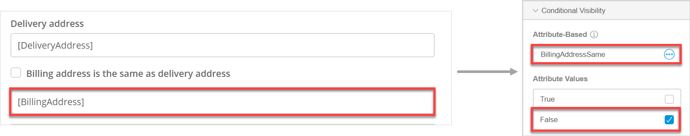
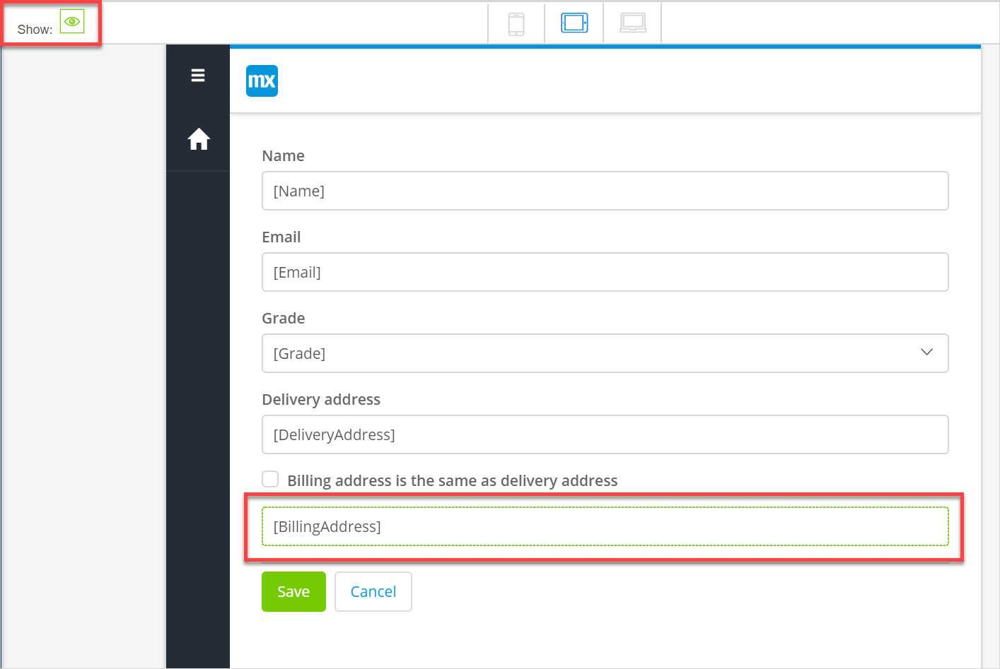
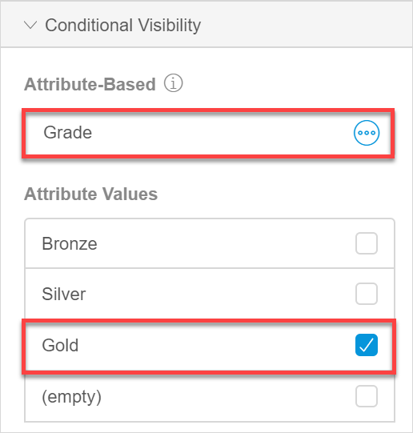
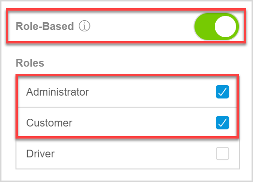
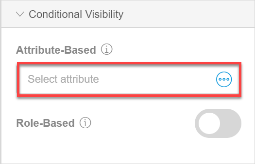
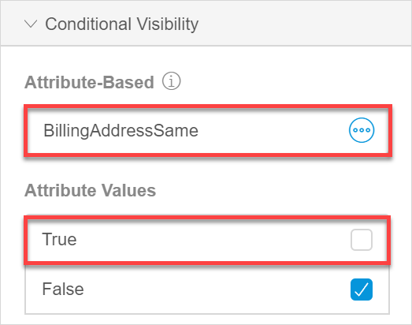
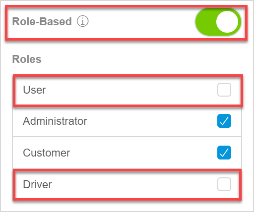

## 1 Introduction 

The **Conditional Visibility** section in widget properties allows you to show a widget only when certain conditions are met. You can make widgets visible based on the following conditions:

* [An attribute value of a widget](#attribute-based)
* [User roles in your app](#role-based) 

For example, you have a web shop and you do not want to bother users with filling in the same address twice when the delivery address matches the billing address. You would like to show fields to fill the billing address in only when a user unchecks the **Billing address is the same as delivery address** option (which is checked by default). In this case you can make the billing address fields visible based on an *attribute value*: the field will be displayed only when the *BillingAddressSame* is unticked (set to *false*):

You can also show a widget to a certain *user role* only. For example, you can show a widget showing salary amounts only to Finance Managers. 

To see which widgets that have conditional visibility configured, click the eye icon is the **Show** option in the top-left corner of a page:

## 2 Conditional Visibility Properties

You can enable conditional visibility based on the selected attribute value and/or a user role. Conditional visibility properties are described below. 

### 2.1 Visible Based on Data {#based-on-data}

**Visible Based on Data** allows you to show widgets based on the outcome of the dynamic data. 

### 2.2 Condition Based on {#condition}

The **Condition is Based on** property is only shown when [Visible Based on Data](#based-on-data) is enabled. The following options are available:

* **Attribute** – Defines whether the condition is based on the attribute value. In this case the widget will be shown only when it matches a certain value of the selected attribute.
* **Expression** – Defines whether the condition is based on the expression. In this case the widget will be shown only when the expression returns the Boolean value `true`. For more information on expressions, see [Expressions](#expressions).

### 2.3 Attribute {#attribute}

This property is shown only when the expression the [Condition is Based on](#condition) is set to **Attribute**. Allows you to select the attribute the condition will be based on. The attribute must be of the Boolean or enumeration type.

### 2.3 Attribute Values {#attribute-values}

This property is shown only when the attribute is selected for the [Attribute](#attribute) property. The **Attribute Values** property allows you to select certain attribute values.

For example, you would like to show a special offer price only for customers with the **Gold** grade. Select *Grade* in the **Attribute** property and *Gold* in as the **Attribute Value**:

{}

{}

### 2.4 Expression

This property is shown only when the expression the [Condition is Based on](#condition) is set to **Expression**. The property allows you to create an expression. For more information, see [Expressions](#expressions).

### 2.5 Visible Based on Role {#role-based}

The widget can be made visible to a specific of the user roles available in your app. When enabled, this setting will render the widget visible to all users that are linked to one of the selected user roles.

{}

You can only configure role-based conditional visibility when security is enabled. For more information, see [Security, Roles & Permissions](settings-security).

{}

### 2.6 Roles

The **Roles** property is only shown when the [Visible Based on Role](#role-based) property is enabled and shows a list of roles available in your app. Select the roles that you would like to make a widget visible for. For example, in a taxi booking app, you would like to show a taxi driver rating to customers and administrators, but hide it from taxi drivers:

{}

{}

## 3 Performing Basic Functions

### 3.1 Configuring Visibility Based on Attribute Value

To configure visibility based on the attribute values, follow the steps below:

1. Select a widget you would like to make visible only for certain attribute values and go to its properties.

2. In **Conditional Visibility** section, toggle the **Visible Based on Data** property.

3. The **Condition Based on** is set to **Attribute** by default. Click the **Attribute** property: 

    {}{}

4. In the **Select Attribute** dialog box, select an attribute of the Boolean or enumeration type and click **Select**.

5. The **Attribute Values** property is now displayed in properties. Untick the values that do not meet the conditions you would like to set:

    {}{} 

Conditional visibility based on the attribute value is set for the widget.

### 3.2 Configuring Conditional Visibility Based on a Role

To configure role-based conditional visibility, do the following:

1. Select a widget you would like to make visible only for certain user roles and go to its properties.

2. In **Conditional Visibility** section, toggle the **Visible Based on Role** property.

3. A list of roles available in your app is displayed in the **Roles** property. Untick the roles who would like to hide the widget from:

    {}{} 
    

Conditional visibility based on user roles is set for the widget.

## 4 Read More

* [Widgets](page-editor-widgets)
* [Security, Roles & Permissions](settings-security)
