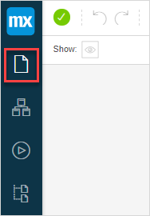
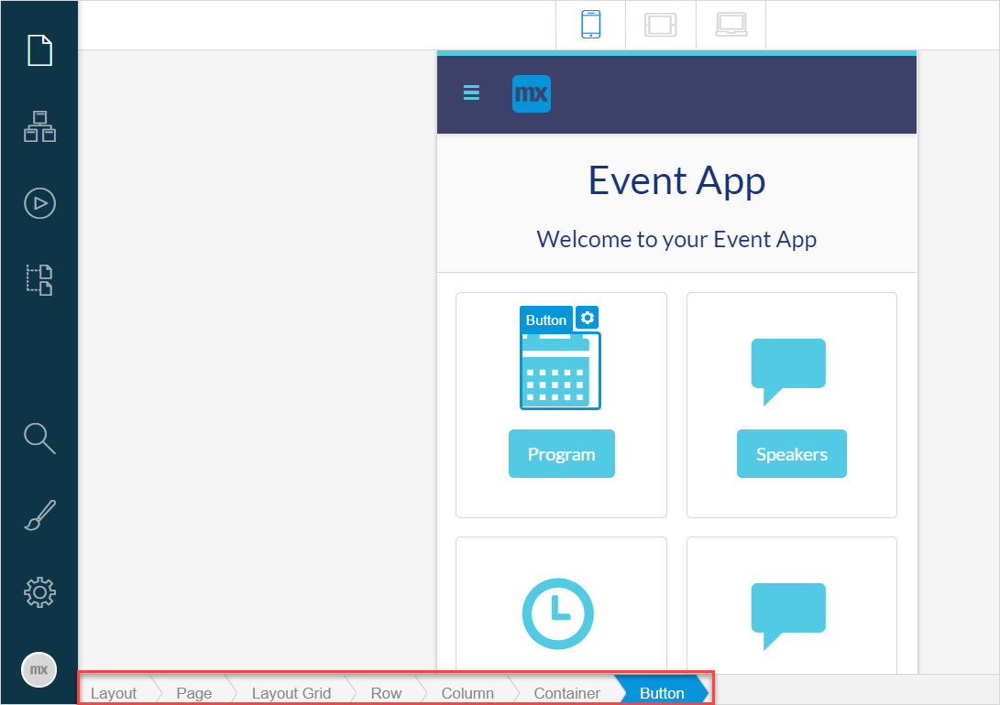

## 1 Introduction 

Pages define the end-user interface of a Mendix application. Pages are created and edited in the *page editor*.

To view the **Pages** of your app in Mendix Studio, click the **Pages** icon in the left menu bar of Studio.

{}
{}

{}

Studio supports apps based on the Atlas UI framework only. For details on Atlas UI, see [Atlas UI](../../howto/front-end/atlas-ui).

{}

Every page is *based on* a layout and a template:

* **Layout** – a frame you put your page in. Every page is based on a layout. For example, **Atlas_Default** or **PopupLayout** are types of layouts you can choose when creating a page. Layouts define a position and look of such UI elements as a page header and menu bars. 
* **Template** – a starting point for a new page. Every time you create a new page, you select a template depending on data you want to display on your page and the way you want to display it: a list, a dashboard, a form. Depending on your choice, a page template can have a number of predefined elements on it, such as lists with images, forms. For example, **Dashboard Action Tiles**, **List Default**, **Master Detail** are types of templates. 

*Look and structure* of a page is defined by the following elements:

* **Widgets** – single user-interface elements. For more information, see the [Widgets](#widgets) section and [Widgets](page-editor-widgets).
* **Building blocks** – pre-configured set of *widgets* that speeds up the process of building your page and styling it. For more information, see the [Building Blocks](#building-blocks) section. 

The diagram below explains function of layouts, templates, and widgets:

All elements described above (layouts, templates, widgets, and building blocks) are powered by Atlas UI. For more information on what Atlas UI is, see [Atlas UI](../../howto/front-end/atlas-ui). 

## 2 Performing Basic Functions {#page-editor-basic-functions}

### 2.1 Opening Pages

After opening Studio, it automatically opens the home page of the app.

To open a page in Studio, do the following:

1. Click the **Pages** icon in the left menu bar. 

2.  In the displayed list of app pages, select the one you want to open and click it.

    {}
    {}

The selected page is opened. 

### 2.2 Creating a New Page {#creating-new-page}

To create a new page in Studio, do the following:

1. Click the **Pages** icon.

2.  Click **New** in the top right corner of the displayed side panel.

    {}
    {}

3.  In the **Create new page** dialog window, fill out the title of the page, select a layout and a page template.  

	

5. Click **Create**.

A new page is created.

### 2.3 Duplicating a Page

To duplicate an existing page, do the following:

1. Click the **Pages** icon in the left menu bar.

2. In the side panel, click the ellipsis icon and select **Duplicate** in the drop-down menu:

    

The page is duplicated.

### 2.4 Deleting a Page

To delete a page in Studio, do one of the following:

1. Open the page you want to delete and follow the steps below:
    1. Open the **Properties** tab.
    2. Click **Delete** at the bottom of the **Properties** tab.

    

2. Click the **Pages** icon in the left menu bar and do the following:

    1. In the side panel, click the ellipsis icon and select **Delete** in the drop-down menu:

		

The selected page is deleted.

### 2.5 Adding Elements on a Page

To add elements on a page, do the following:

1. In **Toolbox**, open the [Widgets](#widgets) tab or the [Building Blocks](#building-blocks) tab.
2. Select an element you would like to add, drag and drop this element on a page. 

### 2.6 Viewing Elements On a Page

There are two ways to view an element and its [properties](#page-editor-properties):

* Clicking the element on a page itself
* Clicking the element in a breadcrumb (for more information, see the [Breadcrumb](#breadcrumb) section)

The selected element is indicated with an blue border. Additionally, if the element is inside a data container (data view or a list view), it will be indicated with a data container icon:

{}
{}

### 2. Deleting Elements from a Page

To delete an element from a page, do one of the following:

* Select this element and press <kbd>Delete</kbd>
* Open the **Properties** tab of this element and this click **Delete** at the bottom of the tab

## 3 Breadcrumb {#breadcrumb}

A breadcrumb is displayed on every page in the left bottom corner of Studio.

The breadcrumb serves two functions:

* Shows a bottom-up layering of a selected item on a page. For example, when you select a button on a page, you will see that it is placed in a container, which is in a column.  Whereas, the column is in a row, and this row is placed in a layout grid on the page:

  

* Allows you to select an element on the page and view its properties. To navigate to an element on a page and view element's properties, click this element in the breadcrumb.

## 4 Toolbox Tab

The **Toolbox** shows the tools that can be used on pages. 

This tab consists of the following:

* [Widgets](#widgets)
* [Building Blocks](#building-blocks)

### 4.1 Widgets {#widgets}

Widgets are single user-interface elements that can be configured. 

You can [quickly configure](page-editor-widgets#quick-config) most of the non-custom widgets when adding them on a page. For more information on how to configure widgets, see [Widgets](page-editor-widgets). 

You can update widgets in the [Widget Overview](settings-widget-overview). 

### 4.2 Building Blocks {#building-blocks}

Building blocks consist of pre-set widgets that allow you to build a page faster:  

Building blocks of Studio are divided into the following categories:

| Building Block | Description                                                  |
| -------------- | ------------------------------------------------------------ |
| Headers        | A header combines the functionality of a page title and a control bar for your page. Due to its compact design and versatility it is often used in mobile pages. |
| Lists          | Use these blocks when you need to display a list of data.    |
| Cards          | Cards contain diverse building blocks for different purposes. |
| Charts         | Use these building blocks if you want to present your data as a chart. |
| Forms          | Use these building blocks for a form to be filled out by users in your app. |
| List Controls  | Represent data as a control list and help you to sort and search items in the list. |
| Master Detail  | Use these building blocks to display the list of many items, but to show the details only for the selected element. |
| Breadcrumbs    | Use these building blocks when you want to show the current page location in your application. |
| Timeline       | Contains building blocks that show a list of events.         |
| Wizards        | Use these building blocks for inputting information step by step. |
| Notifications  | Contain building blocks used for different notifications.    |
| Alignments     | Use these building blocks to align elements.                 |

If you want to read documentation on a particular building block and to know more about how and when to use it, click the small icon in the top right corner of the building block.

{}

Building blocks categories may differ because Atlas UI can be customized using Studio Pro.

{}

## 5 Properties Tab {#page-editor-properties}

The **Properties** tab displays the properties of the currently selected element and can differ per element. 

{}
{}

For example, if you click **Layout**—which is the layout that you choose when [creating a page](#creating-new-page)—in the breadcrumb, properties will display reference information on page-related actions that you can perform, such as changing the page title and customizing pages' look: 

{}
{}

## 6 Read More

* [Widgets](page-editor-widgets)
