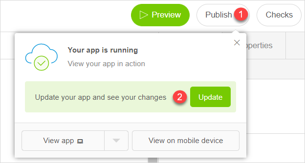
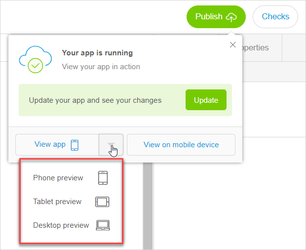
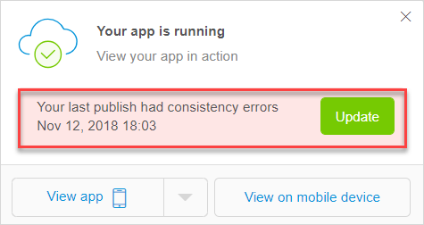
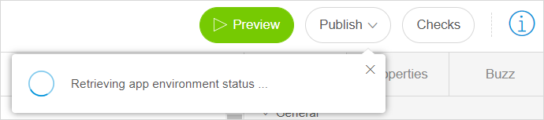
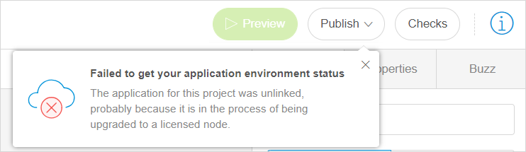
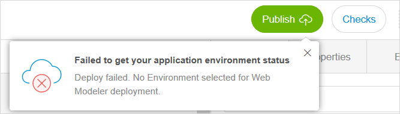

## 1 Introduction

In Mendix Studio, **Preview** allows you to see how your app will look like for other people such as business stakeholders or end-users. In this way, you will use the preview mode to verify your own changes while developing your app. 

Publishing means getting your app up and running in a cloud environment to make it available for the end-users.  

## 2 Previewing Your App

The app preview shows you what your app will look like after it is published.  

To preview your app, click **Preview** in the top-right corner of Studio. 

Your app will now get built and launched in a preview environment, and will appear in your browser window so you can interact with the app.

You can preview your app in the Phone, Tablet, and Responsive (Desktop) mode. Click the corresponding icon to change the mode.

To exit the preview environment, click **Close Preview** in the top-right corner of the screen.

You cannot preview your app if it has [consistency errors](consistency-errors). You will be notified when this is the case, and you will need to fix errors first to preview your app.

Previewing your app does not change the published app. Also, the preview environment has a separate database from the published app, that means you can create your own test data without polluting the data in the published application.

If your app has security enabled, in the preview mode you will be able to check how your app looks like for different user roles. For more information on how to test different user roles, see the [Testing Your Roles](settings-security#testing-your-roles) section in *Security, Roles & Permissions*. 

{}

The app preview is your personal preview of the app. Hence, only users logged into Studio can preview the app, and the preview app will no longer be running when you exit Studio.  

{}

## 3 Publishing Your App {#publishing-your-app}

When you publish your app, you deploy it to a cloud environment. A cloud environment is a location in the cloud that can host your app, and deployment is a process to put the latest version of your app in that location. For more technical information, see [Environments](/developerportal/deploy/environments) in *Developer Portal Guide*.

By default all apps created in Mendix Studio are Free Apps. A Free App is a complete deployment environment in the Mendix Cloud with some limitations. You can upgrade your Free App to a licensed app. The main differences between a Free App and a licensed app are described in the table below: 

|                     | Free App                                                     | Licensed App                                                 |
| ------------------- | ------------------------------------------------------------ | ------------------------------------------------------------ |
| **Number of Users** | Unlimited users.                                             | Depends on your pricing plan.                                |
| **Storage**         | 100MB of data and 100MB of file storage space.               | Depends on your pricing plan.                                |
| **Environments**    | Single environment in the Mendix Cloud.                      | A node in the cloud which has one or more environments, for example, production, acceptance, and test. |
| **Sleep Mode**      | Goes into Sleep Mode after an hour or so of inactivity and automatically resumes when a user accesses it. All your data is retained while the app is in Sleep Mode. | Does not have a Sleep Mode. |

To publish your application, follow these steps:

1. Click **Publish** in the top menu bar of Studio (the dialog box with your app status will open). 
2.  Once your cloud environment has been set up, you will see the **Update** button. Click it to push the latest changes from Studio to the published app or to publish the app for the first time. 

    

{}

If Studio is not able to retrieve the status of your environment yet, you will not see the **Update** button. For more information, see section [5 Retrieving Your App Status](#retrieving-app-status). 

{}

## 4 Viewing Your App

After you have updated your app, you are able to instantly view it in your browser or on a mobile device. 

### 4.1 Viewing Your App in a Browser 

To view your app in a browser in the currently selected view mode (Phone, Tablet, or Responsive), click **View app** in the **Your app is running** dialog box.

To select a different preview mode, click the drop-down menu on the **View app** button.

### 4.2 Viewing your App on a Mobile Device

To view your app on a mobile device, follow these steps:

1.  Click **View on mobile device**.

    

2. Scan the QR-code with your mobile device or open the link in your mobile device.

## 5 Possible Statuses When Publishing Your App

The process of your app publishing starts the moment you click the **Update** button. For more information on how to publish your app, see section [2 Publishing Your App](#publishing-your-app). 

You may see different statuses in dialog box when your app is publishing (when clicking **Publish** > **Update**). The statuses can be divided into the following groups:

1. Environment statuses (such statuses as, **Your app is running**, **Provisioning your app**).
2. Deployment status (the status of your last publishing: if it has succeed or failed because of the consistency errors)

The list below shows you the examples of the environment statuses you may see (note that this is not the list of all possible statuses):

*  **Provisioning your app** (when being shown as a progress bar) – your application is in the publishing process 

    

*  **Provisioning your app** (when being shown as a separate message) – your app is being published by someone else, or you have triggered the publishing process from another tab or in another browser

    

*  **Your app is running** – your application has been published

    

*  **Updating your app** – your application is the process of deployment

    

    {}It is possible that you see "Your app has failed to set up". This can happen during deployment, please wait until the process is completed.

   
  {}

Deployment statuses are divided into the following ones:

1.  If your project does not have [consistency errors](consistency-errors), your application will be deployed and the dialog box with the information on the last deployment highlighted in green will be opened.  

	

2.  If your app has [consistency errors](consistency-errors), you need to fix them first and then click the **Update** button again. If you do not click the **Update** button after solving consistency errors and click **View app**, the last successfully deployed version of your app will open without the recent changes. 

	

For more information on how to view consistency errors and to fix them , see [Checks](checks) and [Consistency Errors](consistency-errors). 

## 6 Retrieving Your App Status {#retrieving-app-status}

Before the deployment can start, Studio needs to get the environment status from the cloud. Thus, when you click the **Publish** button, you may see the dialog box "Retrieving app environment status", meaning that Studio is getting the status of the deployed application from the cloud. 

Once the status is retrieved, you will normally see **Your app is running** dialog box upon clicking **Publish**.

However, Studio may fail to get your environment status. This can happen when there is no deployment environment; technically it means that the app has been unlinked from one environment and is not linked to another environment yet. In this case you will not be able to publish. 

Studio can fail to get your environment status in the following cases:

*  Your app was a Free App, was unlinked from the Free App environment, but was not upgraded to the licensed app (for more information on Free Apps and licensed apps, see section [2 Publishing Your App](#publishing-your-app)) 

	

*  Your app is a licensed app, and no environment has been set for the Studio deployment by a [Technical Contact](/developerportal/company-app-roles/technical-contact):

	

For more technical information, see [Studio Deployment Settings](/developerportal/deploy/studio-deployment-settings) in *Developer Portal Guide*. 

## 7 Read More

* [Checks](checks)
* [Consistency Errors](consistency-errors)
