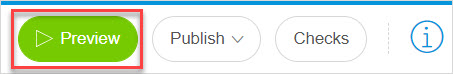

## 1 Introduction

In Mendix Studio, the **Preview** allows you to experience how your app will look like for end-users and business stakeholders when it is published. In this way, you will use the preview mode to verify your own changes while developing your app. This is an opportunity to test your app logic, design, and behavior: since end-users cannot access the preview environment, you can fill your app with various test data. Also, the preview allows you to switch between different user roles in your app (when [security](settings-security) is enable) and test your app from the perspective of each role. For more information on testing your user roles, see [Demo Users](settings-security#demo-users) in *Security, Roles & Permissions*.

**Publishing** means getting your app up and running in a cloud environment to make it available for the end-users. When the app is ready to be shared with end-users, you need to publish it. At a later stage, when you add new features and improve your app, you need to publish your app to make these changes available to your users.  

## 2 Previewing Your App

The app preview shows you what your app will look like for end-users. Previewing your app does not change the published app. Also, the preview environment has a separate database from the published app, that means you can create your own test data without polluting the data in the published application.

To preview your app, click **Preview** in the top-right corner of Studio. 

Your app will now get built and launched in a preview environment, and will appear in your browser window so you can interact with the app.

You can preview your app in the Phone, Tablet, and Responsive (Desktop) mode. Click the corresponding icon to change the mode.

To exit the preview environment, click **Close Preview** in the top-right corner of the screen.

You cannot preview your app if it has [consistency errors](consistency-errors). You will be notified if there are, and you need to fix errors first to preview your app.

If your app has security enabled, in the preview mode you will be able to check how your app looks like for different user roles. For more information on how to test different user roles, see the [Testing Your Roles](settings-security#testing-your-roles) section in *Security, Roles & Permissions*. 

{}

The app preview is your personal preview of the app. Hence, only users logged into Studio can preview the app, and the preview app will no longer be running when you exit Studio.  

{}

## 3 Publishing Your App {#publishing-your-app}

Published app is the real app that you and your end-users will access and use. When you publish your app, you deploy it to a cloud environment. A cloud environment is a location in the cloud that can host your app, and deployment is a process to put the latest version of your app in that location. For more technical information, see [Environments](/developerportal/deploy/environments) in the *Developer Portal Guide*.

To publish your application, follow these steps:

1. Click **Publish** in the top menu bar of Studio. 
2.  In the **Publish your app** pop-up message, click the **Publish** button to push the latest changes from Studio to the published app or to publish the app for the first time. 

    

Your app is published and can be viewed in the browser or on a mobile device. For more information on how to view your app, see the [Viewing Your App](#viewing-your-app) section below.

By default all apps created in Mendix Studio are Free Apps. A Free App is a complete deployment environment in the Mendix Cloud with some limitations. You can upgrade your Free App to a licensed app. The main differences between a Free App and a licensed app are described in the table below: 

|                     | Free App                                                     | Licensed App                                                 |
| ------------------- | ------------------------------------------------------------ | ------------------------------------------------------------ |
| **Number of Users** | Unlimited users.                                             | Depends on your pricing plan.                                |
| **Storage**         | 100MB of data and 100MB of file storage space.               | Depends on your pricing plan.                                |
| **Environments**    | Single environment in the Mendix Cloud.                      | A node in the cloud which has one or more environments, for example, production, acceptance, and test. |
| **Sleep Mode**      | Goes into Sleep Mode after an hour of inactivity and automatically resumes when a user accesses it. All your data is retained while the app is in Sleep Mode. | Does not have a Sleep Mode.                                  |

The Mendix Cloud is the default deployment option when you get started with the Mendix Platform. When you create an app, you can choose dedicated app templates that use other environments, such as SAP BTP. For more technical information, see [Deployment](/developerportal/deploy) in the *Developer Portal Guide*.

## 4 Viewing Your App {#viewing-your-app}

After you have published your app, you are able to instantly view it in your browser or on a mobile device. You can also invite users to your app. For more information on user roles and managing users, see the [Managing App Users](settings-security#managing-app-users) section in *Security, Roles & Permissions*. 

### 4.1 Viewing Your App in a Browser 

To view your app in the browser in the currently selected view mode (Phone, Tablet, or Responsive), do the following:

1. Click **Publish** button in the top-right corner.
2. In the **Publish your app** pop-up message, click **View current app**.
3. Click the link under **View the published app here**:

    

Your published app is opened in the browser.

### 4.2 Viewing your App on a Mobile Device

To view your app on a mobile device, follow these steps:

1.  Click **Publish** button in the top-right corner.

2. In the **Publish your app** pop-up message, click **View current app**:

    

3. Scan the QR code to view your app on your mobile device: 

    

Your app is opened on your mobile device.

## 5 Read More

* [Checks](checks)
* [Consistency Errors](consistency-errors)
* [Security](settings-security)
