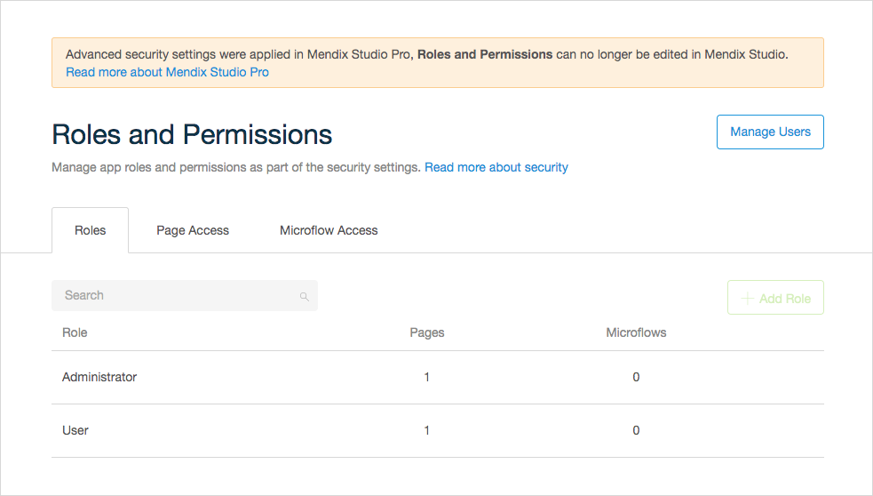
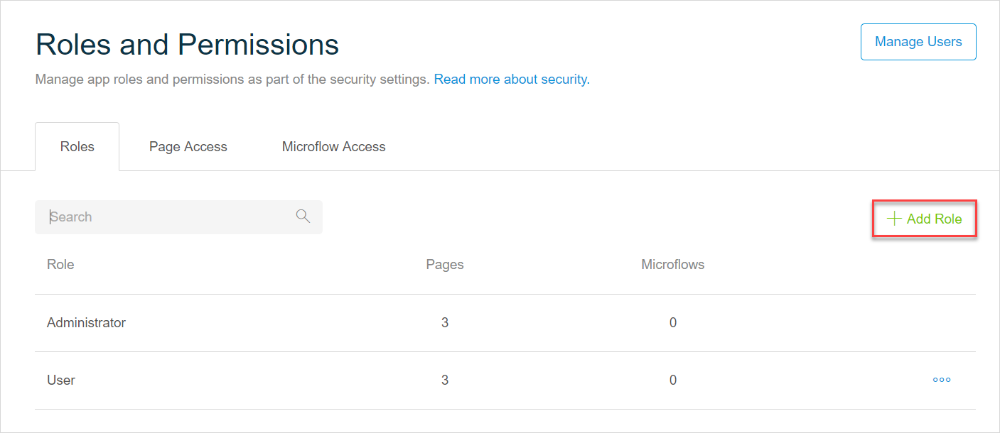
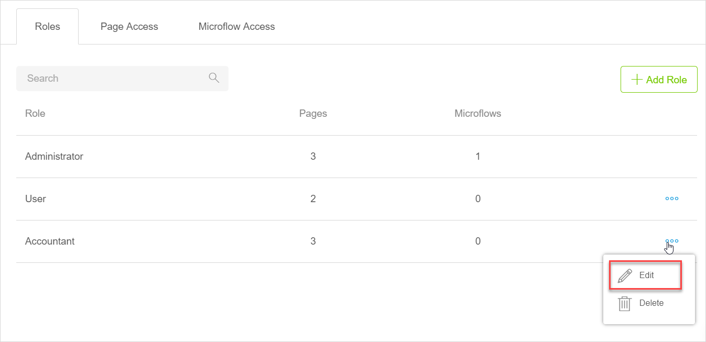

## 1 Introduction 

Security is a way of controlling access to your app. For example, you can decide who can access your app. 

[Roles and Permissions](#roles-and-permissions) are an important part of security – an instrument which you can use to restrict or grant access to different parts of your app, such as pages and microflows.

## 2 Security Overview {#overview}

Whether security is enabled for your app by default, depends on whether the security has been enabled in Studio Pro and on the way it has been configured there. You can come across the following cases:

1. Your app security is **off** in Studio Pro. In this case, you can either enable it via **App Settings**>**Roles and Permissions** >the **Enable Security** button, or you will be prompted to enable security, when you try to [publish the app](publishing-app). 

    {} {}
    
    {}When you enable security, it is enabled for the whole app, and there are checks and changes applied to the model that are visible in Studio Pro. For more technical information on these checks and changes, see [Model Changes When Security Is Enabled in Studio](/refguide/studio-security-enabled).{}

2. Security is set to the **Production** level in Studio Pro and settings are compatible with Studio. In this case, you can view and edit **Roles and Permissions** in Studio. (For more information on what security settings are compatible with Studio, see the [Studio Compatibility](/refguide/studio-security-enabled#studio-compatible) section in *Model Changes When Security Is Enabled in Studio*.)

    

3. Security is set to the **Prototype/demo** or **Production** level in Studio Pro and settings are not compatible with Studio. In this case, you can only view, but not edit **Roles and Permissions** in Studio. (For more information on security settings compatible with Studio, see the [Studio Compatibility](/refguide/studio-security-enabled#studio-compatible) section in *Model Changes When Security Is Enabled in Studio*.)

    

## 3 Roles and Permissions {#roles-and-permissions}

{}
In Studio Pro, advanced security settings can be applied. In this case, you will not be able to edit roles and permissions in Studio.
{}

A role is a set of permissions that you can assign to a user. For example, you may want to give the *Administrator* full access to all pages and microflows. While for other users, you may choose to only grant access to certain pages and restrict access for microflows. 

In apps created via the Developer Portal, there are two app roles: 

* Administrator
* User

{}
When security is enabled, these two app roles will have full access to your app. We recommend you to review permissions for the User role. 
{}

For more information on managing app users, see the [Managing App Users](#managing-app-users) section.

When a new page/microflow/workflow is created, Studio default permissions are set for them, which means that all existing roles in the app will have access to the newly created document.

{}
When a page/microflow/workflow is copy-pasted, Studio default permissions are set for the new document. We recommend you to review permissions for that document.
{}

The **Roles and Permissions** screen consist of the following tabs:

* Roles
* Page Access
* Microflow Access
* Workflow Access

The **Roles** tab lists all roles and indicates the number of pages and microflows these roles can access. 

The **Page Access**,  **Microflow Access**, and **Workflow Access** tabs contain a table where all pages/microflows/workflows are listed in rows, and all roles are placed in columns. 

You can allow only certain roles to access a page, a microflow, or a workflow: select the appropriate box to grant access for a role. 

To select/deselect all pages, microflows, or workflows click the **More Options** (ellipsis) icon next to the user role.

As a result, you will get a matrix specific for each role. 

### 3.1 Creating a New Role

To create a new app role, do the following:

1. Open **Roles and Permissions** > the **Roles** tab.

2.  Click **Add Role** in the right corner.

    

3.  Specify the name of the new role in the **Create Role** dialog box and click **Create**.

    

The new role is created.

### 3.2 Editing Existing Roles

To edit an existing role, do the following:

1.  Open **Roles and Permissions** > the **Roles** tab.

2.  Click the **More Options** (ellipsis) icon and select **Edit**.

    

3.  In the **Edit Role** pop-up dialog perform the changes, and click **Save**.

        

The role has been edited.

### 3.3 Deleting Roles

To delete an existing role, do the following:

1.  Open **Roles and Permissions** > the **Roles** tab.

2.  Click the **More Options** icon and select **Delete**.

    

3.  Confirm the deletion in the pop-up dialog.

    

The role has been deleted.

{}

You cannot delete or edit the Administrator role.

{}

### 3.4 Setting Access to Specific Pages/Microflows/Workflows

There are two ways to change access for specific pages/microflows/workflows in your app:

1.  To set access via **Roles and Permissions**, do the following:
	2.  Open **Roles and Permissions** > **Page**/**Microflow/Workflows Access** tab.
	3.   Find the user role in the column and tick the box next to a page/microflow/workflow to open access for it, or untick – to restrict access. For example, you can restrict a page access for the User role:

    

2.  To set access for a page/microflow via properties of this page/microflow/workflows, do the following: 
	3.  Open the page/microflow/workflow. 
	4.  Go to **Properties** > the **Permissions** section and tick/untick **Allowed Roles** to grant/restrict access. 

		{}{}

## 4 Demo Users {#demo-users}

Demo users are a demonstration of each user role existing in your app. You can use demo users to review how your app looks like for each user role. For more technical information, see [Demo Users](/refguide/demo-users). 

### 4.1 Testing Your Roles {#testing-your-roles}

You can test how your app looks like for different roles the following way:

1. [Preview your app](publishing-app).

2. Click a user icon in the right side of the screen:

    {}{}

4. In the displayed menu bar, select a demo user and the app will be viewed from the perspective of the corresponding role.

    

## 5 Managing App Users {#managing-app-users}

You can assign the default or customized user roles for your app to app end-users with Mendix accounts. These are called **App Users** and once authorized, they can access your published app to use it, test it, and provide feedback.

{}
You can manage App Users only after you publish your app.
{}

To manage App Users, open **Roles and Permissions** and click **Manage Users** in the top-right of the screen:

You will be taken to the [App User Management](/developerportal/collaborate/general-settings#managing-app-users) page in the Developer Portal, where you can invite people to your app and manage their user roles. 

{}
People invited to join your team in the Developer Portal are not added as App Users automatically, so you will need to invite your team members if necessary.
{}

{}
If you have created a new user role on the **Roles and Permissions** page, you need to publish the app first to be able to see and assign this role in the Developer Portal.
{}

## 6 Auto-Upgrade to the New Service {#upgrade}

When you try to publish your app, you may be notified that upgrade of the service that secures your app is required first:

{}

{}

A special service makes it possible to manage your app users. As of April 1st, 2020 we are replacing the current service with an improved one. This upgrade will be done automatically for you when you click **Auto-Upgrade**. 

No need to worry if you do not auto-upgrade, your app will still be secured and running, however, you will not be able to publish a newer version of your app until you upgrade. 

If the automatic upgrade fails, this means, the service was customized in Studio Pro, and only manual upgrade in Studio Pro is possible in this case. 

If the auto-upgrade detects that the service was customized in Studio Pro by a team member, you will be notified that a manual upgrade in Studio Pro should be performed first. For more technical information on how to upgrade the service in Studio Pro, see [Upgrading to Mendix SSO from AppCloudServices](/developerportal/deploy/upgrading-to-mendix-sso-from-acs).

## 7 Read More

* [Security](/refguide/security)
* [Model Changes When Security Is Enabled in Studio](/refguide/studio-security-enabled)
