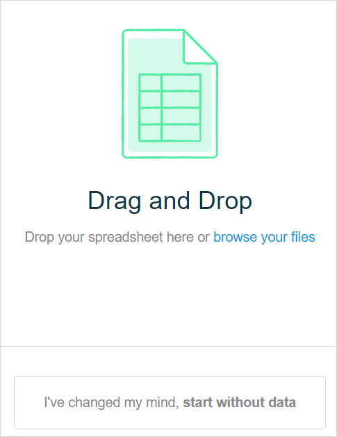
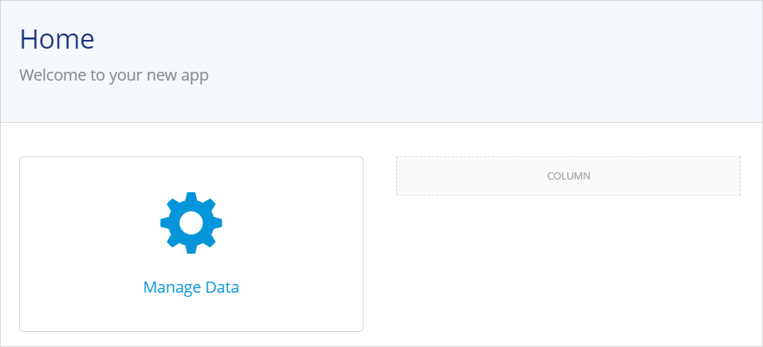

## 1 Introduction 

With the **App from a spreadsheet** you can import a Microsoft Excel spreadsheet and build an app using your data. The data of the spreadsheet will be analyzed and converted into entities, attributes, and associations. Also, pages and navigation items based on your data can be created. 

## 2 Prerequisites

To create an app based on a spreadsheet, you need to use the **App from a spreadsheet** in the Developer Portal. Do the following:

1. Make sure your spreadsheet is in the *.xlsx* format

2. Open the Developer Portal and click the **Create App** button in the top-right corner.

3. Choose **App from a spreadsheet** to create an app with the spreadsheet import functionality.

4.  Make sure that the spreadsheet meets the following requirements: 

	a. The size of your file does not exceed 1MB.  

	b. The number of worksheets does not exceed 50. 

	c. The number of columns per worksheet does not exceed 100. 

	d. A column name does not exceed 100 characters. 
  
5.  Make sure that you have normalized your data in the spreadsheet. Check if the following requirements are met: 

    a. Each column should name a unique name within a workbook. 

      {}If a column name consists of several lines, Mendix Studio will process the only first one. If your column does not have a name, but has values in it, it will be named "_EMPTY".

      {}

    b. Each cell of the worksheet (a row or a column) should contain a single value or be empty. 

    c. If you want to create links (associations) between two columns, make sure the conditions mentioned above for creating these links are met.  

## 3 Converting Your Data

During the import process, spreadsheet data is analyzed and converted the following way:

1. Your worksheets are converted into entities.

2. Your columns are converted into attributes.

3. The links between the worksheets are identified and can be converted into associations if all of the following conditions are met: 
	
    1. All values of one column in your spreadsheet are used in another column.
    2. The values of the other column are unique. 
    3. The type of data in these columns is converted to string or enumeration attribute types. For more information on correspondence between Excel data types and attribute types, see the [Correspondence Between Excel Data Types and Attribute Types](#excel-type-attribute-type) section.
    

Download this Excel spreadsheet example to check how data is normalized there: [Spreadsheet Example](attachments/start-with-data/Example.xlsx). You can also import it into an app and test how this spreadsheet is converted. For more information, see the [Importing a Spreadsheet](#importing-spreadsheet) section.

## 4 Starting an App From a Spreadsheet {#importing-spreadsheet}

When you create your app, a page where you can upload your spreadsheet is opened. Drag and drop your spreadsheet on the page or browse your files and choose the one you would like to import.

{}

If you choose to start without data, you will have just a blank app, and will not be able to import a spreadsheet later. 

{}

### 4.1 Previewing Spreadsheet Data

Once you select the spreadsheet for import, your data is analyzed and is converted to associations, entities, and attributes.  

#### 4.1.1 Correspondence Between Excel Data Types and Attribute Types {#excel-type-attribute-type}

In the table below, you can see how the Excel data corresponds to the attribute types: 

| Excel Data                                                   | Attribute Type It Is Converted to                            |
| ------------------------------------------------------------ | ------------------------------------------------------------ |
| One of the following conditions should be met: <ul><li>No data: no values, an empty column</li><li>If the value does not fall under any of the cases described below</li></ul> | String                                                       |
| Values in the columns should be exclusively one of the following: <ul><li>1 and 0</li><li>Y/y and N/n</li><li>yes and no</li><li>true and false</li><li>V/v and empty cells</li><li>X/x and empty cells</li></ul> | Boolean                                                      |
| Data of type General or Number that falls into a range from –2,147,483,648 to 2,147,483,647 and does not contain empty cells. | Integer                                                      |
| Data of type General or Number that falls into a range from –9,223,372,036,854,775,808 to 9,223,372,036,854,775,807 and does not contain empty cells. | Long                                                         |
| Other numbers that do not fall under Integer and Long attribute type conditions and the column does not contain empty cells. | Decimal                                                      |
| Data of type Date or Time that does not contain empty cells. | Date and Time **Note** If only the date is indicated, the time is set to 00:00 in the preview |
| All of the following conditions should be met:  <ul><li>The value is identified as a string</li><li>Values in the column are used more than once</li><li>The number of such values is less than or equals ten</li></ul>When all conditions listed above are met, the column is treated as enumeration, and the values are turned into enumeration items. Values which are identical apart from being spelled with a lowercase or an uppercase will be combined under the version which is most common, or under the first one if all values are used the same number of times. For example, the values "Test" and "test" will be combined. | Enumeration                                                  |

#### 4.1.1 Previewing Associations

After you upload the spreadsheet, worksheets that have relations (associations) are identified. 

{}Associations are not identified if the data is converted to *Integer*. In this case you can either change the column type to *Text* in Excel, or change the type of both columns to *String* when previewing your data. For more information on how to change attribute types, see the [Managing Attribute Types](#managing-attribute-types) section.
{} 

In the **Data Preview**, you can check the spreadsheet data before the actual import is completed. You can review tables and columns and untick the ones that you do not want to import. Tables that have relations (associations) detected are indicated with a link icon:

The columns which have associations cannot be deselected for the import, you need to delete the association first.   

To review a list of associations and unselect the ones that you do not want to be created, click **Manage Relations**. In the **Manage Relations** pop-up window, you can see which table and column will be used to create an association **from** and which will be used to create an association **to**. A column with unique data is the one the association goes **to**. 

For example, in the image above you can see that an association will be created from the **MarketingDocs** entity to the **Contributors** entity. This association was discovered through the column **Responsible** in **MarketingDocs** and the column **Name** in **Contributors**.  As a result, when data is imported the **MarketingDocs** entity will not have **Responsible** as an attribute, instead it will have an association to the **Contributors** entity and will get data from this entity through the association.

{}

A column can be used to create an association **from** it once only. If an association is created to lead **from** a column, no link can be created as a link **to** it. 

{}

#### 4.1.2 Managing Attribute Types {#managing-attribute-types}

At the bottom of each column (that will be turned into an attribute) an attribute type is automatically identified and indicated. Click the drop-down menu to change the attribute type. For more information on how Excel data types correspond to attribute types, see [Correspondence between Excel Data Types and Attribute Types](#excel-type-attribute-type).

If columns have empty values,the attribute type will be identified as *String*. However, if you change it to another attribute type, Studio will automatically choose and fill in a default value for the following attribute types:

* Booleans – empty values are converted to *False*
* Long and integer – empty values are converted to *0*

#### 4.1.3 Generate Pages for My Data 

**Generate pages for my data** will generate an overview page with a data grid for you, and *{EntityName}__NewEdit* pages for each entity. For more information, see [Generating Pages](#generating-pages). 

### 4.2 Importing Data

After you have reviewed all data, click **Import Data** at the bottom of the **Data Preview** screen. 

You can take a brief tour showing you how your file has been converted.

Open the domain model to see all created entities and attributes:

{}
{}

{}

After import is completed, you can [preview or publish your app](publishing-app) and see all your data or continue configuring your app.

{}

### 4.3 Generating Pages {#generating-pages}

If **Generate pages for my data** has been selected in the preview page, pages are created based on your spreadsheet. The following changes are made in the page editor and the navigation document :

* A *Manage_Data* page is created – an overview page with tabs for each Excel table and with data grids per each entity

    

* An *{EntityName}__NewEdit* page is created – a page for each of your entities for creating and saving a new object of this entity

* A link from the *HomePage* is created – a card with buttons linking to the *Manage_Data* page   

    

* The *Manage Data* menu item is created in the navigation with a link to the *Manage_Data* page

* Your data is transferred to the preview and publish environment, that means when you preview or publish your app, you can view your data there

## 5 Read More

* [Domain Model](domain-models)
* [Attributes](domain-models-attributes) 
