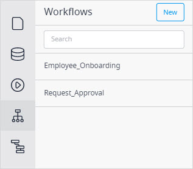

{}
This functionality is in Beta. For more information on Beta products, see  [Mendix Beta Features](/releasenotes/beta-features/).
{}

## 1 Introduction

Workflow is a visual language in Mendix Studios that allows you to build extendable processes. It is fully integrated with other visual languages, such as the microflow editor and page editor. 

To view the workflows of your app project in Studio, click the **Workflows** icon in the left menu bar:

Workflows is a visual way of expressing application logic. A workflow looks like a flow chart. On a new workflow a *start event* (a starting point of the workflow) and an *end event* (an endpoint of the workflow) are created by default. You can add various activities to a flow of a workflow that is called a *path*.

## 2 Workflow App Template

{}[Add information on the workflow-specific app template.]{}

You can use a workflow-specific app template **Approval App**. 

## 3 Performing Basic Functions

You can perform the following basic functions when working on workflows:

* [Open a workflow](#open)
* [Create a workflow](#create)
* [Duplicate a workflow](#duplicate)
* [Copy and paste a workflow](#copy-paste)
* [Delete a workflow](#delete)
* [Add elements to a workflow](#add-elements)
* [View element properties](#view-elements) 

### 3.1 Opening a Workflow {#open}

To open a workflow in Studio, do the following:

1. Click the workflow icon in the left menu bar.

2. In the displayed list of workflows, select the one you want to open and click it:

    

The selected workflow is opened.

### 3.2 Adding a Workflow {#create}

To add a workflow to your app project in Studio, do the following:

1. Click the workflow icon in the left menu bar.

2. Click **New** in the top right corner of the displayed side panel:

    

3. In the **Create new workflow** dialog box, fill in the name of the workflow and select a workflow entity (for more information on type of entities, see the [Entities and Their Types](domain-models#entity-types) section in *Domain Model*):  

    

4. Click **Create**.

The workflow is created.

### 3.3 Duplicating a Workflow {#duplicate}

To duplicate a workflow, do the following:

1. Click the **Workflows** icon in the left menu bar.

2. In the side panel, click the ellipsis icon and select **Duplicate** in the drop-down menu:

    

The workflow is duplicated.

### 3.4 Copying and Pasting a Workflow {#copy-paste}

To copy and paste a workflow, do the following:

1. Click the **Workflows** icon in the left menu bar.

2. In the side panel, click the ellipsis icon and select **Copy to clipboard** in the drop-down menu:

    

3. Open the Studio app where you want to paste the workflow and press <kbd>Ctrl</kbd> +<kbd>V</kbd> or <kbd>Cmd</kbd> +<kbd>V</kbd>. 

Your workflow is pasted. For more information on copy/paste function in Studio, see the [Copy/Paste Pages, Microflows, and Enumerations](general#copy-paste-documents) section in *General Info*. 

### 3.5 Deleting a Workflow {#delete}

To delete a workflow in Studio, do one of the following:

1. Open the workflow you want to delete and follow the steps below:
    1. Open the **Properties** tab.
    2. Click **Delete** at the bottom of the **Properties** tab.
2. Click the workflows icon in the left menu bar and do the following:
    1. In the side panel, click the ellipsis icon and select **Delete** in the drop-down menu:

The selected workflow is deleted. 

### 3.6 Adding Elements to a Workflow 

To add an element to a workflow, do the following:

1. Open the **Toolbox** tab.
2. Select an element you would like to add and drag and drop this element in the workflow path.

The selected element is added.

## 4 Toolbox Elements

The **Toolbox** tab contains elements that you can drag and drop on a path. Below is a categorized overview of all elements. The following sections are used:

* [General](#general)
* [User actions](#user-actions)
* [System actions](#system)

### 4.1 General {#general}

Elements in the **General** section help you control the workflow path, for example, add parallel paths or end them:

{}[Retake the screenshot above.]{}

The elements of this section are described in the table below:

| Element                                                      | Description                                                  |
| ------------------------------------------------------------ | ------------------------------------------------------------ |
| [Decision](workflows-general-activities#decision)            | Makes a choice based on a condition and follows one and only one of the outgoing paths. |
| [Jump activity](workflows-general-activities#jump)           | Allows you to jump to other activities in the workflow.      |
| [Parallel split](workflows-general-activities#parallel-split) | Adds two parallel paths to your workflow.                    |
| [End activity](workflows-general-activities#end)             | Ends the path of the workflow                                |

### 4.2 User Actions {#user-actions}

[User task](workflows-user-task) – a central element in a workflow that allows you to assign a task to a certain user using filters or microflows. 

### 4.3 System Actions {#system}

[Call microflow](workflow-system-actions) activity calls a selected microflow. 

## 5 Read More

* [Workflow Properties](workflow-properties)