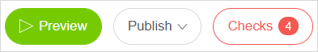
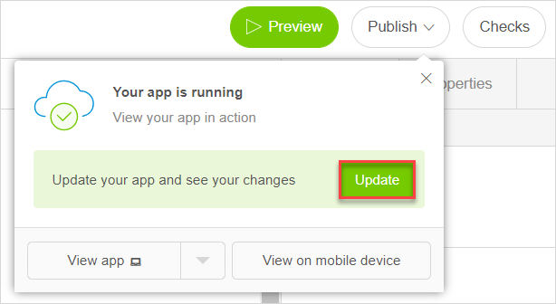
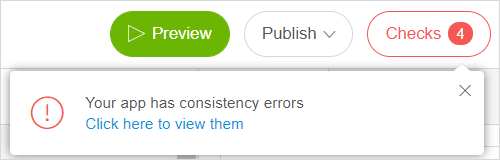
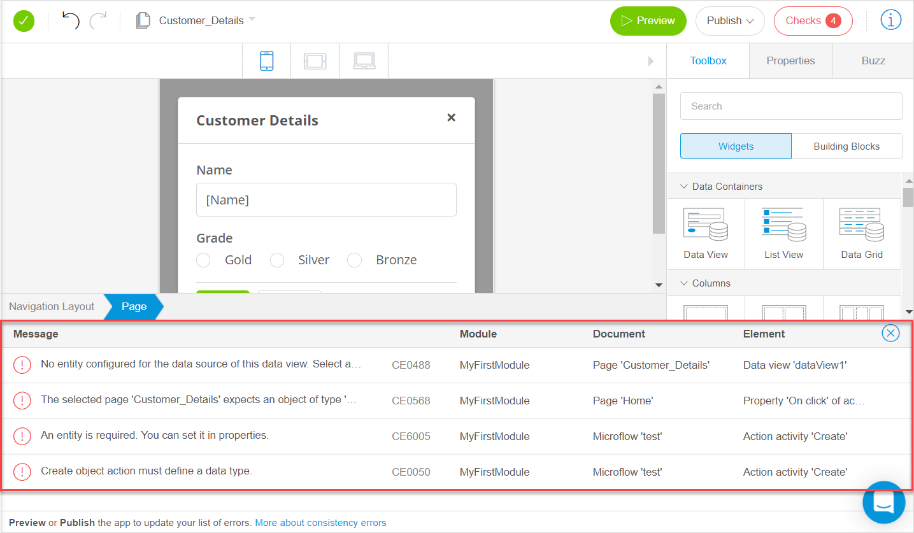

## 1 Introduction 

When [previewing or publishing your app](publishing-app#publishing-your-app), Mendix Studio checks your app on [consistency errors](consistency-errors). If there are any, the app cannot be published, and you see the **Checks** button goes red with the number of errors indicated.

## 2 Viewing Checks and Interacting with the Checks Panel {#viewing-checks}

To display checks for your app and view the faulty elements in it, do the following:

1. Click **Preview** or **Publish** > **Update** in the top-right of Studio. 

    

3.  If your app has consistency errors, the **Checks** button will have red border, the number of the errors will be indicated on the button, and a warning will be displayed. 

    

4.  Click the **Checks** button, the warning or press <kbd>C</kbd> to view all checks. 
   The panel with the list of checks appears at the bottom of the screen. For more information on the **Checks** panel, see section [3.2 Checks Panel Overview](#checks-panel-overview).

    

5.  To view the exact place and element that the error refers to, click the corresponding row in the **Checks** panel (you can click any place of the row, the whole row is responsive),  and the element that contains faults will be displayed.

7. To close the panel, either click the close button in the top-right corner of the panel, or click **Checks** in the top-right corner of Studio. 

{}

If there are no consistency errors, the app will be published, and the **Checks** panel will be empty. 

{}

## 3 Checks Panel Overview {#checks-panel-overview}

### {#checks-panel-overview}

The **Checks** panel is represented as a table and shows you a list of consistence errors that prevent your app from functioning in a correct way and being published (for example, if you do not specify an entity for the data view, your app cannot function correctly). For more information on consistency errors, see [Consistency Errors](consistency-errors). 

{}

The **Checks** panel is only refreshed after a user clicks **Update** again, it is not refreshed in real-time.

{}

The information displayed in the table of the **Checks** panel is represented below. 

| Item     | Description                                                  |
| -------- | ------------------------------------------------------------ |
| Message  | Contains an explanation of the error and an error code. If an error has documentation and an explanation how to fix it, the error code is clickable, and the corresponding documentation opens. |
| Module   | Indicates the module where the error is found.               |
| Document | Indicates the place of your app where the error is found (for example, a page, a microflow). |
| Element  | Indicated the exact element that is faulty (button, activity, etcetera ). |

## 4 Read More

* [Consistency Errors](consistency-errors)
* [Previewing & Publishing Your App](publishing-app)
* [General Info](general)
