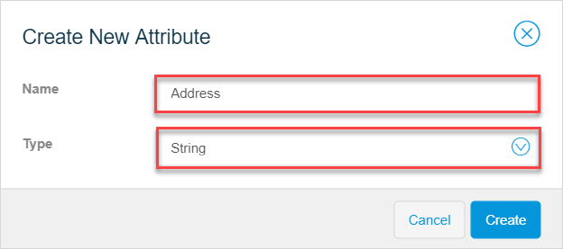
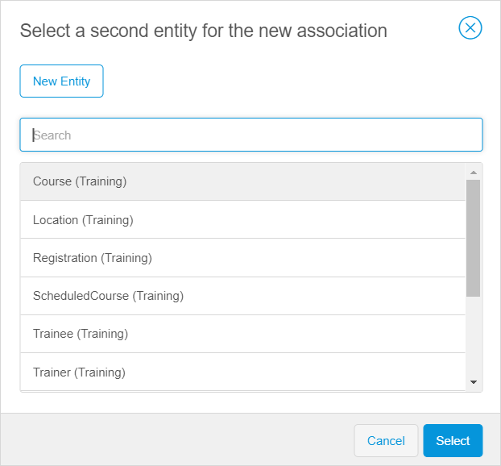

## 1 Introduction

The domain model is a data model that describes the information in your application domain in an abstract way. It is central to the architecture of your application. 

The domain model in Studio consists of the following:

* [Entities](#entity)
* [Associations](domain-models-association-properties) 

{}

Let us say you have a collection of CDs like the one in the table below.

| Title                           | Artist                   |
| ------------------------------- | ------------------------ |
| How to Dismantle an Atomic Bomb | U2                       |
| Exodus                          | Bob Marley & The Wailers |

The rows in the table are CDs. The type of the two rows is "CD" and this is the entity name. A specific CD like "How to Dismantle an Atomic Bomb" of the band U2 is called an object of the "CD" entity. Characteristics like the "Title" and "Artist" are called attributes.

{}

To view the **Domain Models** of your app in Studio, click the **Domain Models** icon in the left menu bar of Studio.

{}
{}

After opening a domain model, you will see an overview of all the entities, attribute, and associations of the entities. 

{}

The complexity of your domain model depends on the complexity of your app. 

{}

The **Auto Arrange** option above the domain model groups and aligns entities by associations. Entities with no associations will be vertically aligned. 

## 2 Components 

| Domain model components                                  | Description                                                  | Properties |
| -------------------------------------------------------- | :----------------------------------------------------------- | ------------------- |
| Entity                          | An entity represents a class of real-world objects, such as customers, invoices, work items, etc.  If we draw a parallel with databases, the entity is a table. | Name [Persistablity](/refguide/persistability) |
| [Attribute](domain-models-attributes) | Attributes are characteristics that describe and/or identify the entity. For example, a *Customer* entity typically has attributes for the name of the customer, an e-mail address, and other personal information. If we draw a parallel with databases, the attribute is a column. | Name Type |
| [Association](domain-models-association-properties) | An association describes a relation between entities. In the domain model, an association is represented by a line/arrow between two entities. If we draw a parallel with databases, the association is a foreign key. | Name [Multiplicity](domain-models-association-properties#multiplicity) [Delete behavior](domain-models-association-properties#delete-behavior) |

For examples and more technical details, see [Domain Model](/refguide/domain-model), [Entities](/refguide/entities), [Attributes](/refguide/attributes), and [Associations](/refguide/associations) in the *Studio Pro Guide*. 

## 3 Adding New Entities {#adding-new-entities}

You can add new entities in the **Toolbox**. 

{}
{}

To add an entity, do the following:

1. Open the **Toolbox** tab of the domain model.

2. Drag and drop **New Entity** to the working area.

3.  Fill out the name for it and click **Create**:

    

The new entity is added to the domain model.

{}
{}

## 4 Adding New Attributes {#adding-new-attributes}

To add attributes in the domain mode, do the following:

1.  Select a block with entity you want to add attribute to. The **New attribute** option appears:

    {}
    {}

2.  Click **New attribute** and specify its **Name** and **Type**:

    

3. Click **Create**.

New attribute is added to the entity. 

{}
{}

## 5 Adding New Associations

To add association in the domain model, do the following:

1. Select a block with entity you want to add association to.
2.  Click the arrow icon that appears:

    {}
    {}
   
3.  Select a second entity for the new association from the list of existing entities and click **Select**. You can also create a new entity for the association from the dialog box. 

    

{}

The module is indicated next to the entity name in the brackets. If you select the entity from another module, you will create a cross-  module association. For more information, see section [5 Cross-Module Associations](domain-models-association-properties#cross-module-associations) in *Association Properties*. The entities of the current module are listed first. 

{}  

## 6 Specifying Properties

In the domain model, you can manage the properties of the entities, attributes, and associations on the **Properties** tab.

At the bottom of the tab you can see the **Delete** button.

### 6.1 Specifying Entity Properties

You can manage the following properties of an entity:

* The **Name** of the entity

* [Persistability](/refguide/persistability) of the entity

	

To change the entity properties, click the entity in the domain model. The **Properties** tab for the selected entity is displayed automatically. 

### 6.2 Specifying Attribute Properties

You can manage the following properties of an attribute:

*   The **Name** of the attribute
*   The [**Type**](domain-models-attributes)  of the attribute

	

To change the attribute properties, click the attribute in the domain model. The **Properties** tab for the selected attribute is displayed automatically. 

{}

Fields that are displayed in **Properties** may vary depending on the type of the attribute.

{}

### 6.3 Specifying Association Properties

You can manage the following properties of an association:

*   The **Name** of the association
*   **Multiplicity** of the association
*   The delete behavior of the objects

For more information, see [Association Properties](domain-models-association-properties). 

To change the association, click the line in the domain model. The **Properties** tab for the selected entity is displayed automatically. 

If the association type is one-to-many or many-to-many, you can swap direction of it clicking the corresponding icon. For more information, see section [3 Multiplicity](domain-models-association-properties#multiplicity) in *Association Properties*. 

{}
{}

## 7 Deleting Entities, Attributes or Associations

To delete the entity, attribute or association, do the following:

1. Select the entity, attribute or association you want to delete.

2.  Press **Delete** or click the **Delete** button at the bottom of the **Properties** tab.

    {}
    {}

## 8 Read More

* [Attribute Types](domain-models-attributes)
* [Association Properties](domain-models-association-properties) 
