## 1 Introduction 

Mendix Studio has a lot of built-in logic that works out of the box (for example, buttons). But if you want to add custom logic, you need to create microflows.

Microflows is a visual way of expressing what traditionally ends up in textual program code.  A microflow can perform actions such as creating and changing objects, showing pages, and making choices. 

You need to use microflows for the following cases:

*  To change/extend the standard behavior of buttons
* To add custom logic to your application
* To integrate with other systems, databases, web services, etc.

Examples of using microflows can be the following:

*  You check the values that a user has entered, and you either show the user an error message or  another page
*  You're creating a to-do list and you want to use custom logic when the status of the item on the list has changed

To view the microflows of your app in Studio, click the **Microflows** icon in the left menu bar:

{}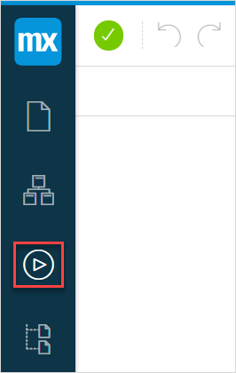
{}

## 2 Concepts and Definitions 

A microflow is like a flow chart. On a new microflow the start event (a starting point of the microflow represented by a green dot) and the end event (an endpoint of the microflow represented by a red dot) exist by default. They are also connected by a sequence flow (a line with an arrow), where you can add new events and activities. For more information, see section [3 Creating a New Microflow](#creating-new-microflow). If Mendix Assist is on, it will be represented with a blue dot in the middle. For more information, see [Mendix Assist](mx-assist).

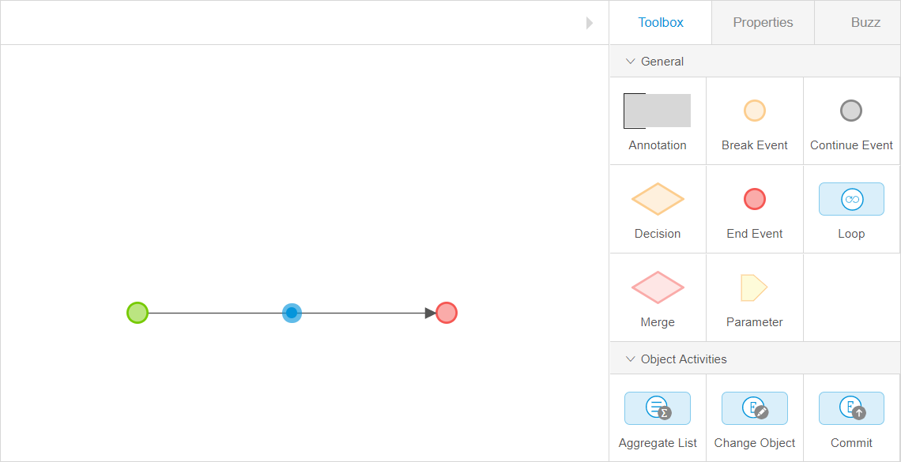

Before you start configuring microflows, familiarize yourself with the concepts and notions that the microflow editor uses:

| Concept    | Description                                                  |
| ---------- | ------------------------------------------------------------ |
| Activities | Blue boxes performing different functions. For example, with the help of an activity you can show users a home page. For more information, see section [5 Toolbox](#microflows-toolbox). |
| Flows      | Arrows that connect microflow events and activities. For more information, see section [6 Flows](#flows). |
| Events     | Other things placed in a flow not in a shape of a blue box are events. Decision is an example of the event. For more information, see section [5.1 General](#microflow-general-section). |
| Variable   | A variable is a temporary storage for data. Variables are used to store information and refer to it when needed. For this purpose variables should have a unique name.  In a microflow you can add a variable, assign a value to it and then use it in microflow activities. You can then change this value later if necessary. For example, you can create variable **$Discount** and assign it a value 0.5, and use it to calculate a price for a customer.  You can use the variable only in the microflow where it was created. |
| Parameter  | Parameters contain global variables, which means that you can use one and the same parameter in different microflows. |

## 3 Creating a New Microflow {#creating-new-microflow} 

To create a new microflow and to start building a microflow, do the following:

1. Click the **Microflow** icon in the left menu bar. 
2.  Click **New** on the **Microflows** side panel.

    {}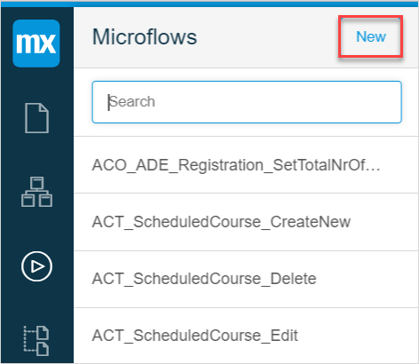
    {}

3.  Fill out the name of the microflow in the pop-up dialog and click **Create**.

    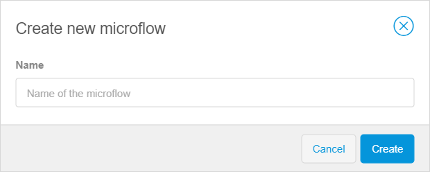    

The new microflow is created, you can now start adding logic to it by adding events or activities. 

## 4 Adding New Event or Activity {#adding-activity-to-microflow}

To add a new activity or event to the microflow, do the following:

1. Open the microflow you want to add the event or activity to.
2. Open the **Toolbox** tab.
3. Select the event or activity in the **General**, **Object Activities** or **Client Activities** section.
4. Drag and drop the event or activity in the microflow. 

## 5 Toolbox {#microflows-toolbox}

In the **Toolbox** tab, you can see that the microflow contains three sections with different elements and activities:

* [General](#microflow-general-section)
* [Object Activities](#microflow-object-activities)
* [Client Activities](#microflow-client-activities)

### 5.1 General {#microflow-general-section}

{}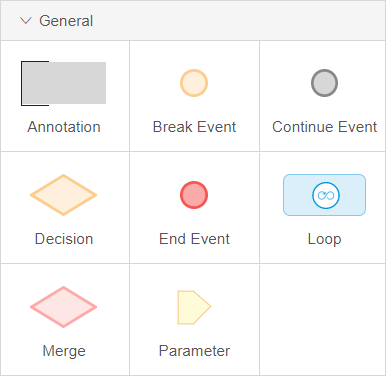
{}

Elements available in the **General** section are described in the table below.

| Element                         | Description                                                  |
| ------------------------------- | ------------------------------------------------------------ |
| Annotation                      | An annotation is an element that can be used to put comments in a microflow. |
| Break Event                     | A break event is used in loops only to stop iterating over a list of objects and continue with the rest of the flow in the microflow. For more information, see [Break Event](/refguide/break-event) in the *Studio Pro Guide*. |
| Continue Event                  | A continue event is used in loops only to stop the current iteration and start the iteration of the next object. For more information, see [Continue Event](/refguide/continue-event) in the *Studio Pro Guide*. |
| End Event                       | An end event defines the location where the microflow will stop. There can be more than one end event, for example when a **Decision** is used in the microflow. So, the number of end events depends on the number of possible outcomes of the microflow. For more information, see [End Event](/refguide/end-event) in the *Studio Pro Guide*. |
| [Decision](microflows-decision) | A decision splits the flow of the should be used if you want to add conditions. For example, if you want to show different order forms for the customers with different grades.  This element is based on a condition and will result in several outgoing flows, one for every possible outcome. The microflow checks the condition and follows one the flows. |
| [Loop](microflows-loop)         | A loop is used to iterate over a list of objects and perform actions on each item of the list. For example, you can retrieve a list of orders from your database, then loop over this list and mark orders as processed. |
| Merge                           | A merge can be used to combine flows into one.  If previously you split the microflow flow (for example, when adding a decision) and now one and the same action needs to be executed for these separated flows, you can combine the two (or more) paths using a merge. For more information, see [Merge](/refguide/merge) in the *Studio Pro Guide*. |
| Parameter                       | A parameter is an input data for the microflow and can be used in any activity in the microflow. For more information, see [Parameter](/refguide/parameter) in the *Studio Pro Guide*. |

### 5.2 Object Activities {#microflow-object-activities}

{}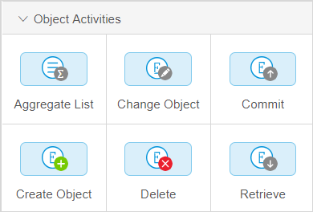
{}

The **Object Activities** are described in the table below.

| Activity       | Description                                                  |
| -------------- | ------------------------------------------------------------ |
| Aggregate List | **Aggregate List** can be used to calculate aggregated values such as the maximum, minimum, sum, average, and total amount of objects over a list of data objects. For more information, see [Aggregate List](/refguide/aggregate-list) in the *Studio Pro Guide*. |
| Change Object  | Can be used to change an existing data object or properties of this object. For more information, see [Change Object](/refguide/change-object) in the *Studio Pro Guide*. |
| Commit         | **Commit** saves changes you have not saved in the database yet. For more information, see [Commit](/refguide/committing-objects) in the *Studio Pro Guide*. |
| Create Object  | The **Create Object** action can be used to create a data object. For more information, see [Create Object](/refguide/create-object) in the *Studio Pro Guide*. |
| Delete         | **Delete Object** can be used to delete one data object or a list of objects. For more information, see [Delete](/refguide/deleting-objects) in the *Studio Pro Guide*. |
| Retrieve       | **Retrieve** can be used to get one or more objects, either by directly traversing an [association](domain-models-association-properties) of another object, or by retrieving objects from the database. For more information, see [Retrieve](/refguide/retrieve) in the *Studio Pro Guide*. |

### 5.3 Client Activities Section {#microflow-client-activities}

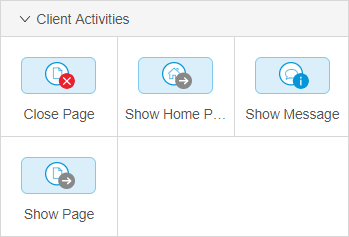

The **Client Activities** are described in the table below.

| Activity       | Description                                                  |
| -------------- | ------------------------------------------------------------ |
| Close Page     | This activity closes the currently open page. For more information, see [Close Page](/refguide/close-page) in the *Studio Pro Guide*. |
| Show Home Page | The **Show Home Page** action navigates to the home page for the current user. It goes to the same page as the user goes to after signing in and respects role-based home pages. For more information, see [Show Home Page](/refguide/show-home-page) in the *Studio Pro Guide*.  For details on setting the home page, see [Navigation Document](navigation). |
| Show Message   | With the **Show Message** action you can show a blocking or non-blocking message to the user. (Non-blocking message lets users continue their work in the app with the pop-up open, while the blocking message does not let the user continue work until the pop-up window is closed. ) For more information, see [Show Message](/refguide/show-message) in the *Studio Pro Guide*. |
| Show Page      | With this action you can show a page to the end user. For more information, see [Show Page](/refguide/show-page) in the *Studio Pro Guide*. |

### 5.4 Variable Activities

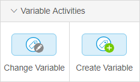

The **Variable Activities** are described in the table below:

| Activity        | Description                                                  |
| --------------- | ------------------------------------------------------------ |
| Change Variable | This activity is used to change the value of an existing variable in the current microflow. For more information, see [Change Variable](/refguide/change-variable) in the *Studio Pro Guide*. |
| Create Variable | With this activity you can create a variable and assign a value to it. The variable can be used to store, change, and reuse a value in activities of the microflow. For more information, see [Create Variable](/refguide/create-variable) in the *Studio Pro Guide*. |

For example, you can first create a variable named *Discount* to a microflow, and then change the variable Discount depending on the type of the customer's grade. You can give a discount for customers with Gold and Silver grades. 

{}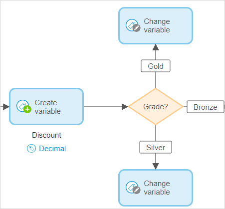
{}

## 6 Flows {#flows} 

Flows are lines connecting the elements. You can find the description of flows in the table below:

| Flow            | Image                                                        | Description                                                  |
| --------------- | ------------------------------------------------------------ | ------------------------------------------------------------ |
| Sequence Flow   | 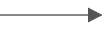   | A sequence flow is an arrow that links events, activities, decisions, and merges with each other. Thus, it defines the order of execution. Flows always flow in one direction where elements are executed one by one. A decision always leads to one direction so that means the microflow cannot follow two flows at the same time. |
| Annotation Flow | 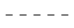 | An annotation flow is a connection that can be used to link an annotation to a flow object(s). |

## 7 Activity Icons 

When configuring the activities of the microflows you will notice icons above or underneath activities. You can find the description of icons in the table below:

| Name                  | Image Example                                                | Description                                                  |
| --------------------- | ------------------------------------------------------------ | ------------------------------------------------------------ |
| Entity                | 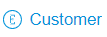       | Indicates that the data source for the activity is an entity. |
| Value                 | 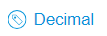  | Indicates that the data source for the activity is a simple value, such as decimal, boolean, date and time, etc. |
| Commit                |        | Indicates that the object will be committed. Committing means that the changes will be saved in the database. This can be useful, for example, when you want an object *NewCustomer* to be saved and updated in the tables that contain information about customers. |
| Commit without events | 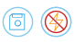 | Indicates that the object will be committed but without events. This means that the object will be saved in the database, but event handlers will not be triggered. For example, the information about a new customer will be saved, but the tables containing information about new customers will not be updated. |
| Refresh in Client     |  | Indicates that the result of the activity will be displayed to the end-user. |

## 8 Read More

* [General Info](general)
* [Decision](microflows-decision)
* [Microflow Expressions](microflows-expressions)
* [Set & Change a Value for Different Activities in the Microflows](microflows-setting-and-changing-value)
