## 1 Introduction 

This document describes a data grid in Mendix Studio.

A data grid shows a list of objects in a table format. For example, a data grid can show all the program items for an event. Using controls, end-users can browse, search, and edit objects in the data grid.

## 2 Data Grid Properties

Data grid contains the following properties:

* [Data Source](#grid-data-source)
* [Columns](#grid-columns)
* [Rows](#grid-rows)
* [Search](#grid-search)
* [Events](#grid-events)
* [Control Bar](#grid-control-bar)
* [Design](#grid-design-section)

### 2.1 Data Source {#grid-data-source}

The data source determines which objects will be shown in the data grid. 

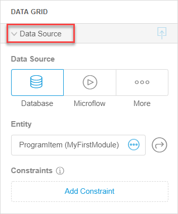

The **Data Source** section properties are described in the table below:

| Data Source Property | Description                                                  |
| -------------------- | ------------------------------------------------------------ |
| Database             | A data source that determines that the object or objects shown are retrieved directly from the database. You need to select an **Entity** (that you have in the domain model), or create a new entity, if you set database as the data source.  When you select an existing entity, the [grid columns](#grid-columns) are automatically created for each attribute of this entity.  **Filter** – limits data in the data grid. You can create a filter only after you specify an entity for the data grid. For more information on data filtering, see [Data Filters](filters). **Sort Order** – the order in which rows in the data grid are shown. You can specify a sort order only after you select an entity for the data grid. You can add multiple sorting rules. For example, you can add two sorting rules: one is to sort item by name in ascending order, and the other one is to sort items by email in descending order. Unique items will be sorted by name in ascending order, but if two or more items have the same name, then these items will be sorted by email. |
| Microflow            | A data source that runs a selected microflow and displays a return value (as in, a list of objects). |
| XPath                | Currently, this data source can only be configured in Studio Pro. For more information, see [XPath Source](/refguide/xpath-source). |
| Association          | Available to data grids placed inside a data view or a list view. The data grid is filled with the objects linked to a data view/list view object by an association. Sorting columns and searching is not possible in data widgets with an association data source. |

For general information on data sources, see [Data Sources](/refguide/data-sources) in the *Studio Pro Guide*.

### 2.2 Columns {#grid-columns}

In **Columns** section, you can set the width for the data grid columns, add columns, edit, and delete them. 

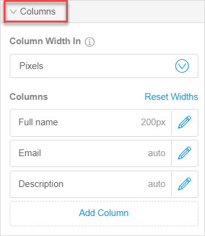

The **Columns** section properties are described in the table below:

| Property        | Description                                                  |
| --------------- | ------------------------------------------------------------ |
| Column Width in | Determines whether column widths can be set to fixed pixel values or if they should automatically scale to the width of the grid. Possible values of this property are the following: <ul><li>**Percentages** – column widths will be scaled to the widths of the grid, you can override width for each column, clicking the **Edit** icon and going to the [**Grid Column** properties](#grid-column-properties)</li><li>**Pixels** – column width will be set to fixed pixel values. *Auto* next to the **Edit** icon means that these columns have auto width and are evenly scaled in the data grid. You can override width for each column, clicking the **Edit** icon and going to the [**Grid Column** properties](#grid-column-properties). If you, for example, select a custom width for one column and make it bigger, the other columns with auto width will still be evenly scaled in the remained space.</li></ul> |
| Columns         | Lists all the columns in the data grid. If you want to change the order of columns, click and drag the column name. Possible actions of this property are the following: <ul><li>**Reset Widths** – resets all custom widths to default values</li><li>**Edit** icon– navigates you to the [**Grid Column** properties](#grid-column-properties), where you can change its data source, name and width of the column</li><li>**Add Column** – adds a new column to the data grid and navigates you to the [**Grid Column** properties](#grid-column-properties)</li></ul> |

#### 2.2.1 Grid Column Properties {#grid-column-properties}

In the **Grid Column** properties, you can select the attribute, change the name, width, and editability of the data grid column. 

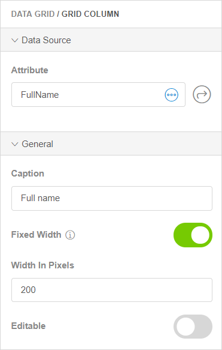

The properties are described in the table below:

| Property        | Description                                                  |
| --------------- | ------------------------------------------------------------ |
| Attribute       | Determines which attribute of the object will be displayed in this column. Note that you need to configure the grid's data source first to select an attribute. For more information, see section [2 Data Source](#grid-data-source). |
| Caption         | Defines which caption will be shown in the column header.    |
| Width           | Displayed for **Column Width In** set to *Percentages*. Determines how much space in percentage the column should take. |
| Fixed Width     | Displayed for **Column Width In** set to *Pixels*. Determines if this column should have a fixed width or use the available space. When enabled, you can type in the fixed width in **Width In Pixels** (see below). |
| Width In Pixels | Displayed only when **Fixed Width** is enabled. You can type in the value in this setting for the fixed column width. |
| Editable        | When enabled, clicking fields in this column will allow end-users to edit values directly, without the need for an edit form.  Only available if **Database** is selected as the data source of the grid. For more information on data source, see section [2 Data Source](#grid-data-source). |

### 2.3 Rows {#grid-rows}

In the **Rows** section, you can set up the number of rows to be displayed on the data grid page, and the way to display them. 

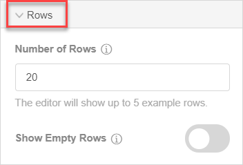

The properties are described in the table below:

| Property        | Description                                                  |
| --------------- | ------------------------------------------------------------ |
| Number of Rows  | The maximum number of rows shown on one page of the data grid. |
| Show Empty Rows | When enabled, the data grid will always show the specified number of rows, even when the grid does not contain enough items to fill them. |

### 2.4 Search {#grid-search}

End-users can search for objects in the data grid if you enable search. You can determine the behavior of  search bar controls, as well as add, edit, and delete search fields. 

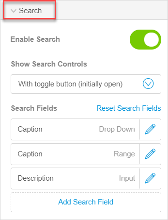

The **Search** section properties are described in the table below:

| Property             | Description                                                  |
| -------------------- | ------------------------------------------------------------ |
| Enable Search        | When enabled, the end-user can search for objects in the data grid; when disabled no search bar or search button are displayed. |
| Show Search Controls | Determines the way the search bar toggle button functions, and, as a result, how the search bar is displayed. This property is only displayed if **Enable Search** is on. Possible values of this property are the following: <ul><li>**With toggle button (initially open)** – the end-user can open and close the search bar using the **Search Bar Toggle Button**; the search bar is initially open (for more information on the **Search Bar Toggle Button**, see section [2.5.1. Grid Action Buttons](#grid-action-button))</li><li>**With toggle button (initially closed)** – the end-user can open and close the search bar using the **Search Bar Toggle Button**; the search bar is initially closed</li><li>**Always** – the search bar is always visible, there is no search bar toggle button</li></ul> |
| Search Fields        | Lists search fields in the search bar. To change the order of fields, click and drag the field name. Possible actions of this property are the following: <ul><li>**Reset Search Field** – deletes all custom search fields and re-populates the bar with the default set of search fields – one for each applicable attribute with default values.</li><li>**Edit** icon – navigates you to the [**Search Field** properties](#grid-search-fields), where you can edit the search field</li><li>**Add Search Field** –  creates a new search field and navigates you to the [**Search Field** properties](#grid-search-fields), where you can configure the new search field</li></ul> |

#### 2.4.1 Search Field Properties {#grid-search-fields}

You can select the type of the search field in the **Search Field Properties**. Each type has its specific properties. 

##### 2.4.2.1 Search Field Types 

Search field can be of three types:

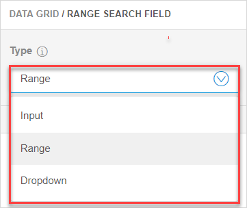

* **Input** – search results are filtered by comparing them to the given search term. If the search value matches the attribute value, this object will be a part of the search result. Possible attribute types: AutoNumber, Date and Time, Integer, Long, String, Decimal
* **Range** –  will apply a filter based on whether the search term falls between the values of two selected attributes. Possible attribute types: AutoNumber, Date and Time, Integer, Long, Decimal
* **Drop-down** – search results are filtered by comparing them to the given search term. If the search value matches the attribute value, this object will be a part of the search result. Possible attribute types: Boolean, Enumerations, Associations

##### 2.4.2.2 Search Field Common Properties

The following properties are common for all types of search fields:

* **Label** – the name of the search field

*  **Default Value** – defines a  prefilled value for the search field

    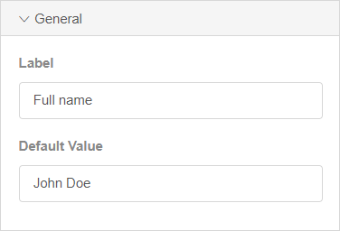

##### 2.4.2.3 Input and Drop-down Search Field Specific Properties

Input and drop-down search fields have the following specific properties:

* **Attribute** – the value of the selected attribute will be compared to the search term.  

*  **Comparison** – the method used to compare the attribute with the search term. 

    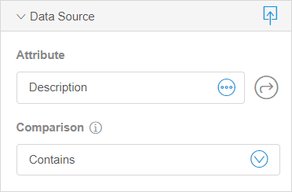

##### 2.4.2.4 Range Search Field Specific Properties

A range search field has the following specific properties:

* **Minimum Value** – determines which attribute of the entity the search term must exceed 

  * **Include Minimum Value** – when enabled, the minimum value is included into the range

* **Maximum Value** – determines which attribute of the entity the search term must fall below 

  *  **Include Maximum Value** –  when enabled, the maximum value is included into the range

      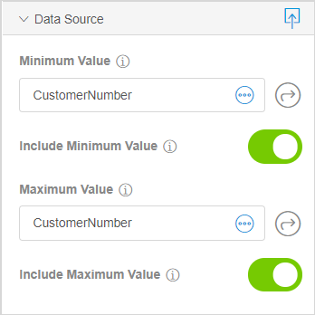

### 2.5 Control Bar {#grid-control-bar}

The control bar allows you to control the objects displayed in the data grid by means of buttons. 

The **Control Bar** section properties are described below: 

*  **Show Paging Controls** –  indicates if the buttons for paging through the data grid are visible. Hide these buttons if you are sure that the data grid will contain only one page

    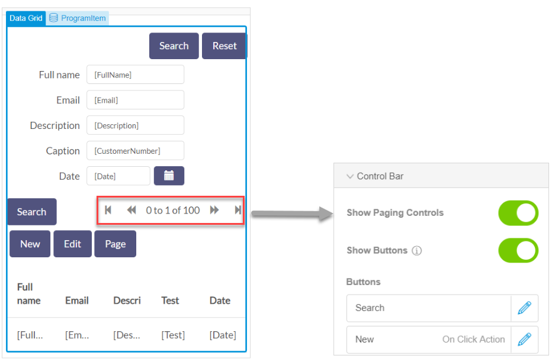

* **Show Buttons** – determines whether the buttons defined in the **Buttons** section are shown. If disabled, none of the buttons will be accessible in any way, other than the one designated as the **On Click Action**. For more information, see sections [2.5.1 Grid Action Button](#grid-action-button) and [2.6 Events](#grid-events)

*  **Buttons** – lists buttons in the control bar. A button set as **On Click Action** in the **Events** section will be indicated as *On Click Action.* This means that even if buttons are hidden, when the end-user clicks or double clicks (depending on settings in the [**Events**](#grid-events) section) the grid item, the default button (action) will be triggered

    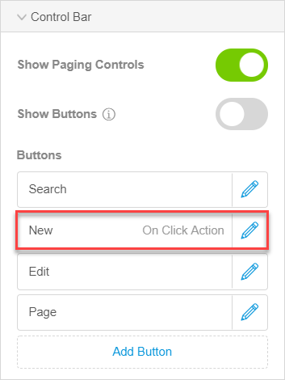

  * **Edit** icon – depending on the button navigates you either to [**Grid Action Button** properties](#grid-action-button), or to [**Search Bar Toggle** properties](#search-bar-toggle)
  * **Add Button** – navigates you to [**Grid Action Button** properties](#grid-action-button), where you can configure a new button for the data grid. When you create a new button, the action of this button is added to the list of possible on-click actions in the **Events** section (for more information, see section [2.6 Events](#grid-events))

#### 2.5.1 Grid Action Buttons {#grid-action-button}

A **Grid Action** button performs an action in the data grid. It can also be set as a default action for an **On Click Action** (except the **Search Bar Toggle**), this means that when an end-user clicks or double clicks (depending on the settings) the grid item, the default button will be triggered. 

By default, the data grid will be created with a **Search Bar Toggle Button**, **New**, **Edit**, and **Delete** button in the control bar. 

You can add more buttons to the data grid and configure them for a specific on-click action. 

In the **On Click Action** section, you can select a data grid specific action for a button (for example, deselect all or export to Excel), or a standard one (for example, execute a microflow or save changes). For more information on buttons and standard on click actions, see [Button Widgets](page-editor-widgets-buttons) and [Events Section in Widgets](page-editor-widgets-events-section).

Data grid specific actions are the following ones:

*   **Search Bar Toggle Button** – opens or hides the search bar when you click it and is specific for the data grid. This button cannot be used if the data source is set to *Microflow*. Note that if the **Show Search Control** property is set to **Always**, there is no search bar toggle button, as the search bar is always open

    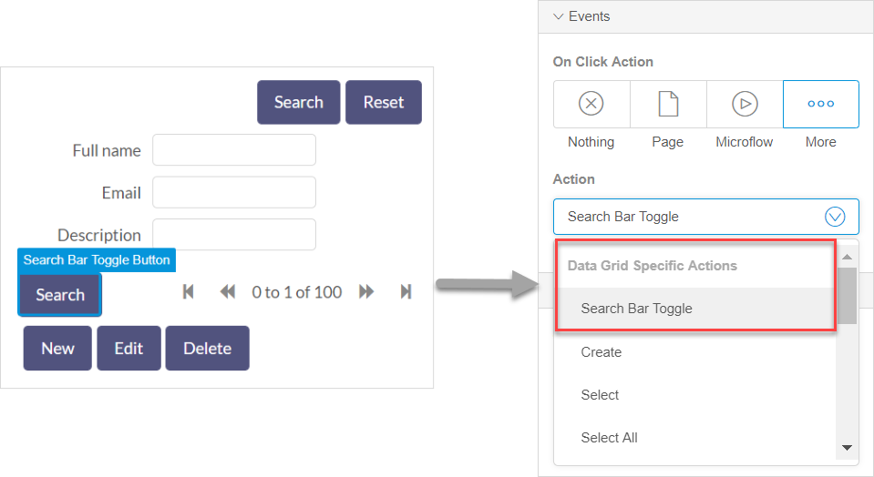

* **Create** – allows end-users to create new objects in a grid (for more information, see section [2.5.1.1 Grid Create Button](#grid-create-button))

* **Select** – confirms the choice of a row of the grid when it is used for selecting an object for a drop-down with an association selected as a data source or reference set selector. For this reason, the select button can only be placed on a grid that is connected to a drop-down with an association as a data source or a reference set selector

* **Select All** – allows the end-user to select all objects in the grid; can only be used if you set **[Selection Mode](#selection-mode)** to **Multi-selection** or **One-click multi-selection** (for more information, see section [2.6 Events](#grid-events))

* **Deselect All** – deselects all selected objects in the grid

* **Export to CSV** – export the contents of the grid to a CSV file. The csv export function relies on a specific data retrieval method, and cannot be used in a data grid with **Database** data source. 

	* **Maximum Number Of Rows** – defines the maximum number of rows to be exported.

* **Export to Excel** – export the contents of the grid to an Excel file. The Excel export function relies on a specific data retrieval method, and cannot be used in a data grid with **Database** data source. 

	*  **Maximum Number Of Rows** – defines the maximum number of rows to be exported.

	*  **Date Export Format** – defines how dates will be exported. When *Date value* is selected, date values will be exported as real dates, allowing Excel functions on them. When *Text* is selected, date values will be exported exactly as shown in the data grid without allowing Excel to format them.

      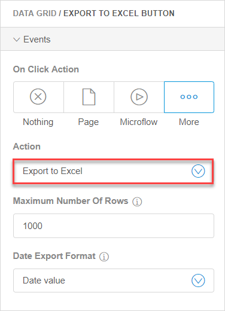

#### 2.5.1.1 Grid Create Button {#grid-create-button}

The **Create** button allows end-users to create new objects in the data grid.

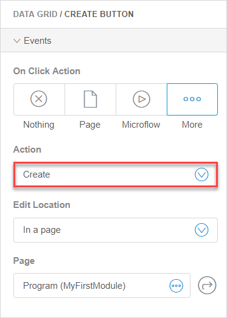 

Users can edit new objects in the location specified in the **Edit Location** option. You can choose the following locations: 

* **In a page** – the new object is added and can be edited in a page. The page in which this instance is being edited can be set with the page property.
	* **Page** – this property is only displayed when the **Edit Location** is set to **In a page** and it indicates the page that is shown to end-users when they click this button. The end-user can use this page to edit the newly created object before it is saved. This page should contain a data view connected to the same entity as the data grid.
* **Inline at a top** – the new object is added at the top of the grid and can be edited inline.
* **Inline at bottom** – the new object is added at the bottom of the grid and can be edited inline.

### 2.6 Events {#grid-events}

In the **Events** section, you can select the actions performed automatically when an end-user clicks an item in the grid. You can also determine whether the user can select items, and the way the user can select them. 

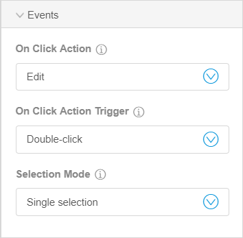

The **Events** section properties are described in the table below: 

| Property                                         | Description                                                  |
| ------------------------------------------------ | ------------------------------------------------------------ |
| **On Click Action**                              | Describes which control bar button should be triggered when clicking a grid item. You can create a new action in the **Control Bar** section and it will appear in the drop-down list of this property. Possible actions are the following ones: <ul><li>**None** – no action is taken</li><li>**New** – a new object is created</li><li>**Edit** – a user can edit the item</li><li>**Delete** – the item is deleted from the data grid</li></ul> |
| **On Click Action Trigger**                      | Determines how the action selected in the **On Click Action** property is triggered. Possible values of this property are the following: <ul><li>**Double-click** – a double click triggers the selected on-click action</li><li>**Single-click** – a single click triggers the selected on-click action. Single-click cannot be used in combination with **Single selection** mode (see below)</ul> |
| **Selection Mode**  | Determines the way an end-user selects item in the data grid. Possible values of this property are the following: <ul><li>**No selection** – the user cannot select items</li><li>**Single selection** –  the user can select one item at a time by clicking it</li><li>**Always one selection** – the user can select one item at a time by clicking it, however, the user cannot deselect an item (by default the first item will be selected)</li><li>**Multi-selection** – the user can select multiple items by clicking the first one and holding the <kbd>Ctrl</kbd> key while clicking other items. Simply clicking an item will deselect all items and make the clicked item the selection.</li><li>**One-click multi-selection** – the user can select multiple items by simply clicking them. Clicking an item will deselect all items and make the clicked item the selection.</li></ul> |

### 2.7 Design {#grid-design-section}

For information on the **Design** section and its properties, see [Design Section in Widgets](page-editor-widgets-design-section).

## 3 Read More

* [Pages](page-editor)
