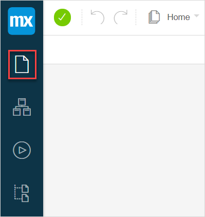
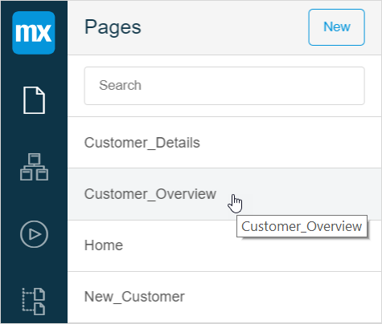
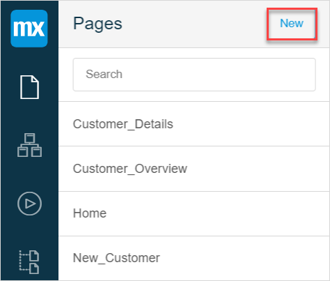
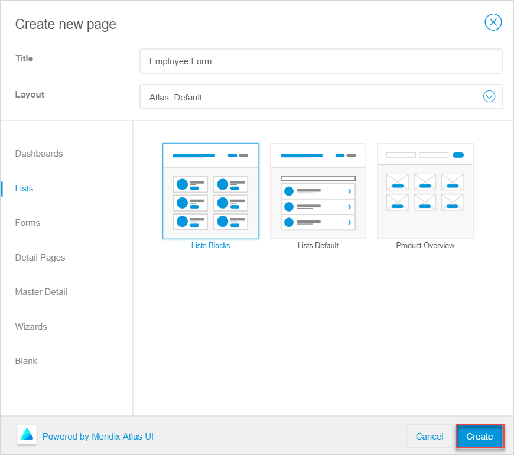
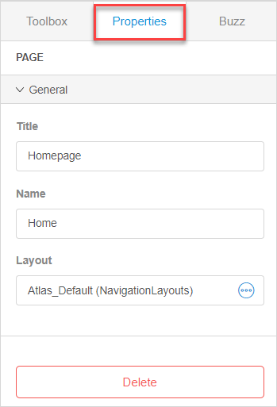
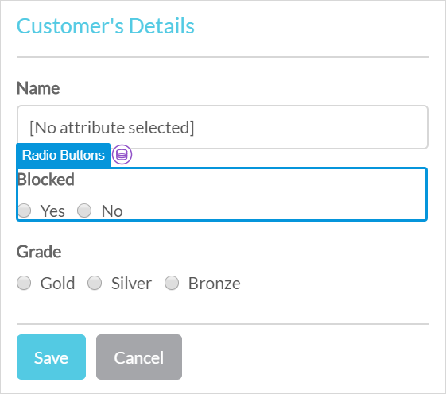
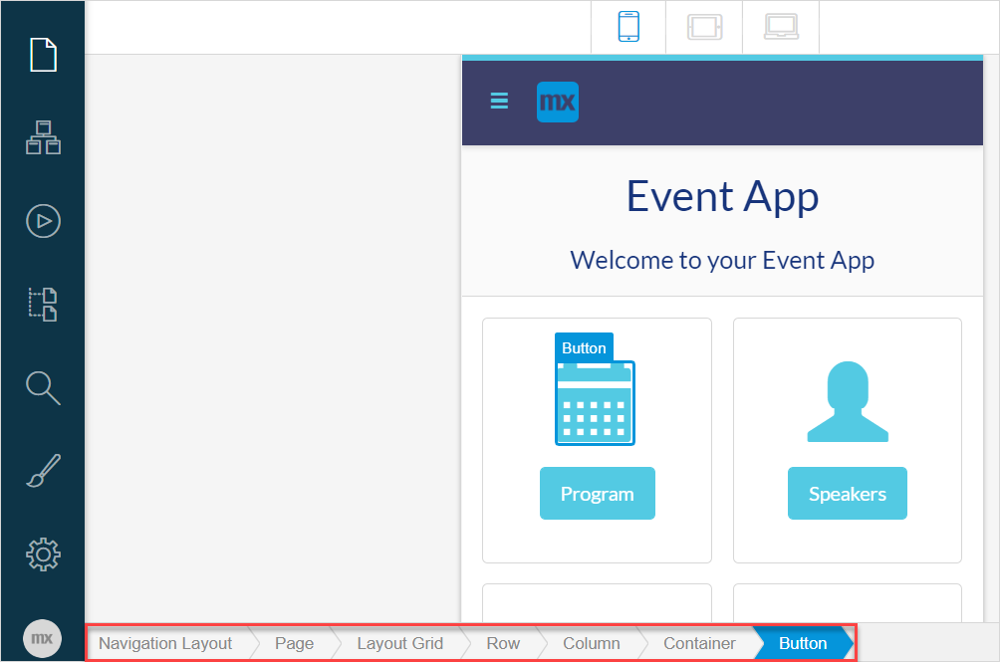
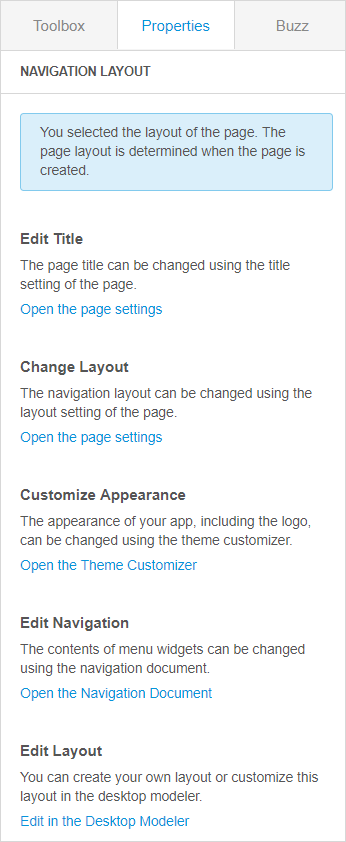
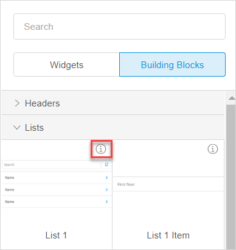
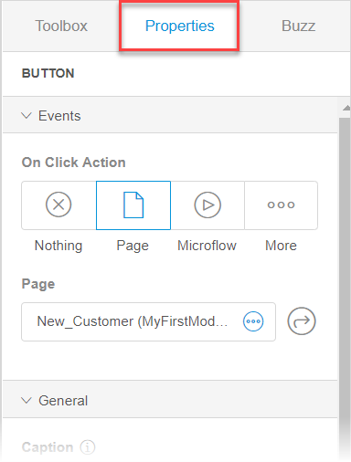

## 1 Introduction 

The page editor allows a user to define the end-user interface of a Mendix application. 

To view the **Pages** of your app in Mendix Studio, click the **Pages** icon in the left menu bar of Studio.

{}
{}

{}

Studio supports apps based on the Atlas UI framework only. For details on Atlas UI, see [Atlas UI](../../howto/front-end/atlas-ui).

{}

## 2 Components

Pages of Studio consist of the following components:

* **Layouts** structure your pages. Every page is based on a layout. For example, **Atlas_Default** or **PopupLayout** are types of layouts you can choose when creating a page.
* **Templates** – a starting point for creating new pages. Every time you create a new page, you select a template depending on data you want to display on your page and the way you want to display it: a list, a dashboard, a form. For example, **Dashboard Action Tiles**, **List Default**, **Master Detail** are types of templates. 
* **Widgets** – single user-interface elements. For more information, see section [5.2. Widgets](#widgets) and [Widgets](page-editor-widgets).
* **Building blocks** – pre-configured  set of elements that speeds up the process of building your page and styling it. For more information, see section [5.1 Building Blocks](#building-blocks). 

The components described above are powered by Atlas UI. For more information, see [Atlas UI](../../howto/front-end/atlas-ui). 

## 3 Performing Basic Functions {#page-editor-basic-functions}

### 3.1 Opening Pages

After opening Studio, it automatically opens the home page of the app.

To open a page in Studio, do the following:

1. Click the **Pages** icon in the left menu bar. 

2.  In the displayed list of app pages, select the one you want to open and click it.

    {}
    {}

The selected page is opened. 

### 3.2 Creating a New Page {#creating-new-page}

To create a new page in Studio, do the following:

1. Click the **Pages** icon.
2.  Click **New** in the top right corner of the displayed side panel.

    {}
    {}

3. In the **Create new page** dialog window, fill out the title of the page, select the layout and the page template.  
4.  Click **Create**.

    

A new page is created.

### 3.3 Deleting a Page

To delete a page in Studio, do the following:

1. Open the page you want to delete.
2. Open the **Properties** tab.
3.  Click **Delete** at the bottom of the **Properties** tab.

    

   The selected page is deleted.

### 3.4 Viewing Elements On a Page

To view an element and its [properties](#page-editor-properties), click this element. 

The selected element is indicated with an blue border. Additionally, if the element is inside a data container (data view or a list view), it will be indicated with a data container icon.

{}
{}

## 4 Breadcrumb Trail {#breadcrumb}

When you select an item on your page, there appears a breadcrumb trail in the left bottom corner of Studio.

The breadcrumb trail serves two functions:

* Shows a bottom-up layering of a selected item on a page
* Allows the user to select an element on the page and view its properties 

For example, when you select a button on a page, you will see that it is placed in a container, which is in a column.  Whereas, the column is in a row, and this row is placed in a layout grid on the page.

To view information on the element click this element in the breadcrumb trail and its properties are displayed automatically.

### 4.1 Viewing the Navigation Layout Information with the Breadcrumb Trail

You can also view the information on Navigation layout by clicking it in the breadcrumb trail.

The following options will be displayed in the **Properties** tab:

{}
{}

## 5 Toolbox Tab

The **Toolbox** shows the tools that can be used on pages. 

This tab consists of the following:

* [Widgets](#widgets)
* [Building Blocks](#building-blocks)

### 5.1 Widgets {#widgets}

Widgets are single user-interface elements that can be configured. You can [quickly configure](page-editor-widgets#quick-config) most of the non-custom widgets when adding them on a page. For more information, see [Widgets](page-editor-widgets). 

{}

You can update widgets in the [Widget Overview](settings-widget-overview). 

{}

### 5.2 Building Blocks {#building-blocks}

Building blocks consist of pre-set widgets that allow you to build a page faster: you only need to drag-and-drop them to the page.  

Building blocks of Studio are divided into the following categories:

| Building Block | Description                                                  |
| -------------- | ------------------------------------------------------------ |
| Headers        | A header combines the functionality of a page title and a control bar for your page. Due to its compact design and versatility it is often used in mobile pages. |
| Lists          | Use these blocks when you need to display a list of data.    |
| Cards          | Cards contain diverse building blocks for different purposes. |
| Charts         | Use these building blocks if you want to present your data as a chart. |
| Forms          | Use these building blocks for a form to be filled out by users in your app. |
| List Controls  | Represent data as a control list and help you to sort and search items in the list. |
| Master Detail  | Use these building blocks to display the list of many items, but to show the details only for the selected element. |
| Breadcrumbs    | Use these building blocks when you want to show the current page location in your application. |
| Timeline       | Contains building blocks that show a list of events.         |
| Wizards        | Use these building blocks for inputting information step by step. |
| Notifications  | Contain building blocks used for different notifications.    |
| Alignments     | Use these building blocks to align elements.                 |

To insert a building block, drag and drop the selected building block on the page.

If you want to read documentation on a particular building block and to know more about how and when to use it, click the small icon in the top right corner of the building block.

{}

Building Blocks categories may differ because Atlas UI can be customized using Studio Pro.

{}

### 5.2 Widgets {#widgets}

Widgets are single user-interface elements that can be configured. You can [quickly configure](page-editor-widgets#quick-config) most of the non-custom widgets when adding them on a page. For more information, see [Widgets](page-editor-widgets). 

{}

You can update widgets in the [Widget Overview](settings-widget-overview). 

{}

## 6 Properties Tab {#page-editor-properties}

The **Properties** tab displays the properties of the currently selected element and differs depending on this element. 

{}
{}

## 7 Read More

* [Data View & List View Properties](page-editor-data-view-list-view)
