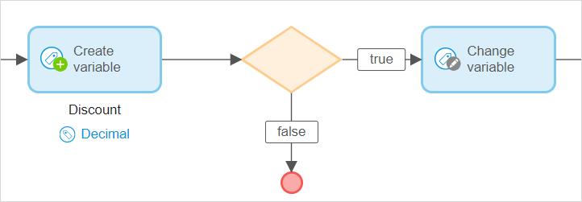

## 1 Introduction 

This document describes microflow expressions in Mendix Studio. For information on microflow expressions in Studio Pro, see [Expressions](/refguide8/expressions) in the *Studio Pro Guide*. 

Expressions can be used to create or change an object or a variable based on logic. 

The **Expression** tab is available for the following activities in a microflow:

*  End Event
*  [Decision](microflows-decision)
*  Create Object
*  Change Object
*  Create Variable 
*  Change Variable

For more information on setting and changing values for microflow activities, see [Set & Change a Value for Different Activities in the Microflows](microflows-setting-and-changing-value).

## 2 Writing an Expression

There are two ways of writing an expression:

* [Using suggestions](#suggestions)
* [Writing expressions manually](#manually)

If an error appears in the expression, error messages with explanations will be displayed. 

{}
{}

### 2.1 Writing an Expression Using Suggestions {#suggestions}

When you start typing your expression, a list of suggestions appears divided into the following categories:

* **Suggestions from your microflow** – variables or attributes that you have created or retrieved in your microflow
* **Enumeration values** – values of [enumeration type of attributes](domain-models-enumeration) that can be used in an expression
* **Keywords** – key phrases or words that you can use in an expression
* **Booleans** – true or false expressions
* **Operators** – code elements that perform logical or mathematical operations. You can use Boolean or relational expressions (for more information, see the [Expression Types](#expression-types) section below)

To write an expression using suggestions, do the following:

1. Browse through the list of suggestions and select the element for your expression with a mouse or a keyboard.
2. Select an element from the list.
4. Click **Add** when the expression is completed.

{}

To call the list of suggestions, press <kbd>Ctrl</kbd> + <kbd>Space</kbd>

{}

### 2.2 Writing an Expression Manually {#manually}

If you want to write the expression manually, pay attention to the following:

* Variables in the microflow can be called in an expression by inserting the dollar sign followed by the name of the variable. For example, *$Customer* refers to the variable *Customer*  
* Attributes and associations of object variables are accessed using a slash. For example, *$Customer/Name*, *$Customer/Grade* refer to the attributes Name and Grade of the entity Customer 
* Unary, Boolean, and relational types of expressions are available in Studio (for more information, see the [Expression Types](#expression-types) section)

### 2.3  Expression Examples

Below are two examples that illustrate how expressions can be used. 

#### 2.3.1 Example 1

You have a [Decision](microflows-decision) and you want to write an expression that checks whether the customer grade is gold and the price of the order is more than 100 (you can configure a discount after the **Decision** that is allowed if this expression is true):

 

The expression will look the following way:

#### 2.3.2 Example 2

You add a [Decision](microflows-decision) to check if an object (in the example below the object is *Customer*) exists. And you also check if the Customer's name matches a particular one (in the example below Customer's name is *Mendix*). The expression will look the following way:

## 3 Expression Types {#expression-types}

A list of the operators you can use in expressions in Studio can be found below:

### 3.1 Relational Expressions

You can use the following relational expressions:

* [Less than ( < )](/refguide8/relational-expressions)
* [Greater than ( > )](/refguide8/relational-expressions)
* [Less than or equal to ( <= )](/refguide8/relational-expressions)
* [Greater than or equal to ( >= )](/refguide8/relational-expressions)
* [Is equal to ( = )](/refguide8/relational-expressions)
* [Is not equal to ( != )](/refguide8/relational-expressions)

### 3.2 Boolean Expressions

You can use the following Boolean expressions:

* [and](/refguide8/boolean-expressions)
* [or](/refguide8/boolean-expressions)

## 4 Read More

* [Microflows](microflows)
* [Set & Change a Value for Different Activities in the Microflows](microflows-setting-and-changing-value)
* [Expressions](/refguide8/expressions)
