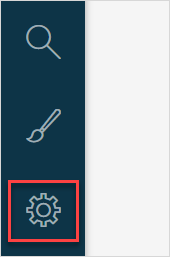

## 1 Introduction

**Settings** are settings on roles and permissions and app widgets. 

**Settings** consist of the following:

* [Roles and Permissions](settings-security) – you can manage access to your app and its documents via **Roles and Permissions**
* [Widget Overview](settings-widget-overview) – contains information on Mendix Marketplace widgets and local widgets in your app

To open the **Settings**, click the gear icon at the left menu bar.

## 2 Main Documents in This Category

* [Security, Roles & Permissions](settings-security) – describes security in Mendix Studio, user roles and permissions for them
* [Widget Overview](settings-widget-overview) – describes settings for Mendix Marketplace and local widgets in your app
