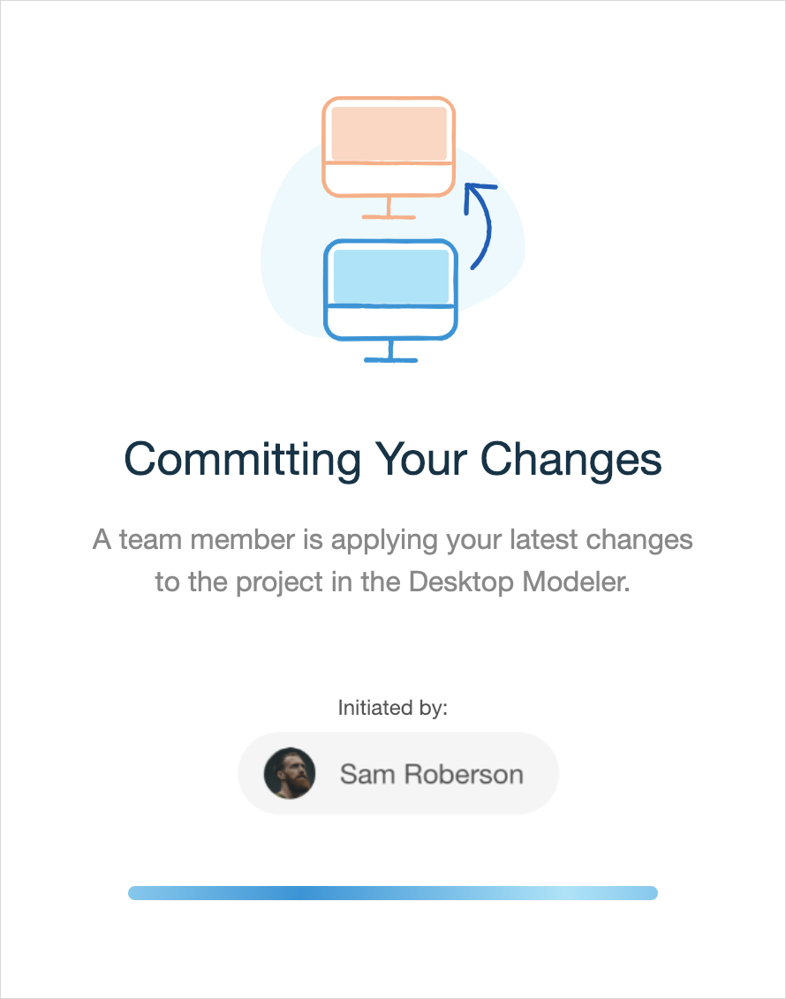
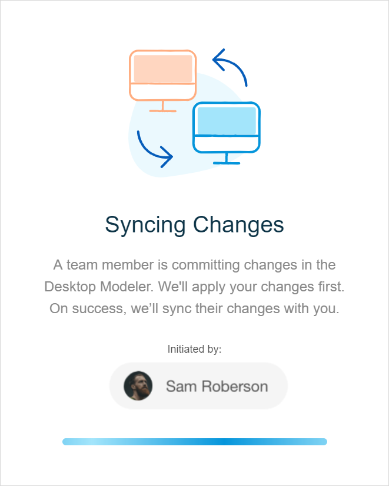
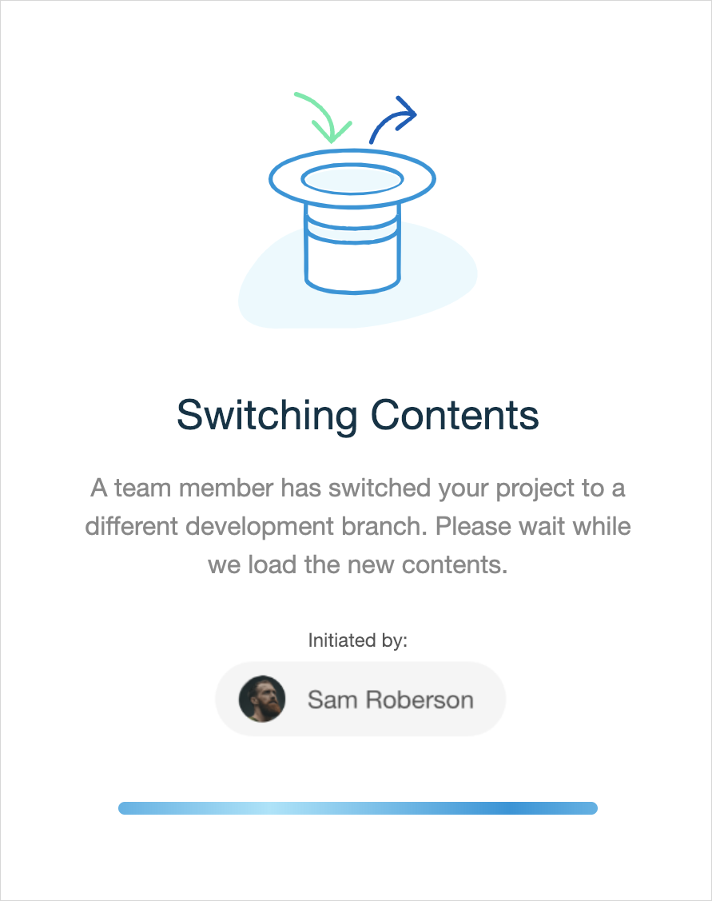

## 1 Introduction

{}

Collaborative development is only available if your project has Mendix version 7.23.3 or above. For projects that have Mendix version 7.23.2 and below, see [Sync the Web Modeler & Desktop Modeler](general-sync-webmodeler-desktopmodeler).

{}

Collaborative development is the process that allows team members work together on one project in the Desktop Modeler and the Web Modeler and easily synchronize changes made by others using [version control](/refguide/version-control). 

If you are working in a team (or switch from the Web Modeler to the Desktop Modeler yourself), it is easy to share app model changes. All changes made in the Web Modeler are auto-saved. Desktop Modeler users get these changes when they click **Update** or **Commit**. If they commit, they push their own changes at the same time, so both Web Modeler and Desktop Modeler are synchronized. For a more technical and detailed process overview, see [Collaborative Development](/refguide/collaborative-development) in *Version Control*. 

Multiple users can view the project in the Web Modeler at the same time: one user can edit it and others are in read-only mode. 

## 2 Concepts

For concepts and definitions, see section [2 Concepts](/refguide/version-control) in *Version Control*. 

## 3 Collaborative Development from the Web Modeler Perspective

As all Web Modeler changes are auto-saved, the collaborative development is indicated by pop-ups that you see when the content of the app is being changed or synchronized. This can happen in the following cases:

1. **Committing Your Changes** – if your team members are working on the same development line in the Desktop Modeler and they click **Update**, your screen gets locked for a few moments while your changes are automatically committed to the Team Server and then applied to the Desktop Modeler. For more information on the collaborative development process in the Desktop Modeler, see section [4 Desktop Modeler Perspective]() in *Collaborative Development* in *Version Control*.

    {}
   {}

2.  **Syncing Changes** – your screen gets locked for a few moments each time the Desktop Modeler users commit.  

    {} 

    {}

    There are two possible outcomes of this process: 

    a.  In the Desktop Modeler, there are no conflicts in the project, and changes from the Desktop Modeler will be applied to the Web Modeler. (Conflicts are changes that contradict each other and cannot be merged automatically. For example, one user has changed a caption of a button, while another user has deleted this button).

    b.  There are project conflicts which should be solved in the Desktop Modeler before the Desktop Modeler user can commit again. Your screen is unlocked without any changes to your app.  

3.  **Switching Contents** – in the Desktop Modeler, users can change the branch line the Web Modeler is enabled for. For more information on managing branches, see section [5 Managing Development Lines](#managing-branches) in the *Collaborative Development* in *Version Control*. 
	During this process the Web Modeler gets locked for a few moments, all changes are auto-saved on the current development line, and a pop-up dialog is shown that the Desktop Modeler user is changing the branch line for the Web Modeler. This means that the contents of your app will change. 

	{}
  {}

## 4 Read More

* [Version Control](/refguide/version-control)
* [Collaborative Development](/refguide/collaborative-development)

