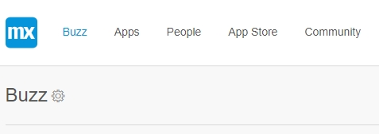
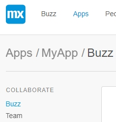

## 1 Introduction

In the **Developer Portal** there are 2 types of **Buzz**:

*   **The company Buzz**

*   **The app Buzz**

## 2 App Buzz

The Buzz of the App is the landing page after opening the App in the **Developer Portal**. Here you can view the latest updates on your App.

You can find the App Buzz by following these steps: 

1. Go to the [Developer Portal](http://home.mendix.com). 
2. Click **Apps** and select an App by double click. You will automatically be forwarded to the App Buzz page.

### 2.1 Conversations

The Buzz lets you see and share ideas as well as collaborate with your team. You can communicate with your team by the following actions:

*   Update status
*   Start a poll

### 2.2 Team

On the right side of the screen you can see your team members and invite new team members. To invite new members click the plus sign **+**. 
If you click **Show all**, you will be forwarded to the **Team** page.

## 3 Related content

*   [Collaborate](/developerportal/collaborate)
