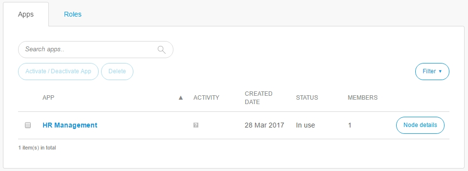

## 1 Apps

A Company Admin can manage the following items in the **Apps** section:

*   Apps
*   Roles

## 2 Apps

A Company Admin can manage the following items at the **Apps** tab:

* Activate/deactivate apps
* Delete apps
* View the node details

## 3 Roles

A Company Admin can edit user roles and add new user roles at the **Roles** tab.

## 4 Related Content

* [Company Admin](index)
* [Company](company)
* [Users](users)
* [Nodes](nodes)
