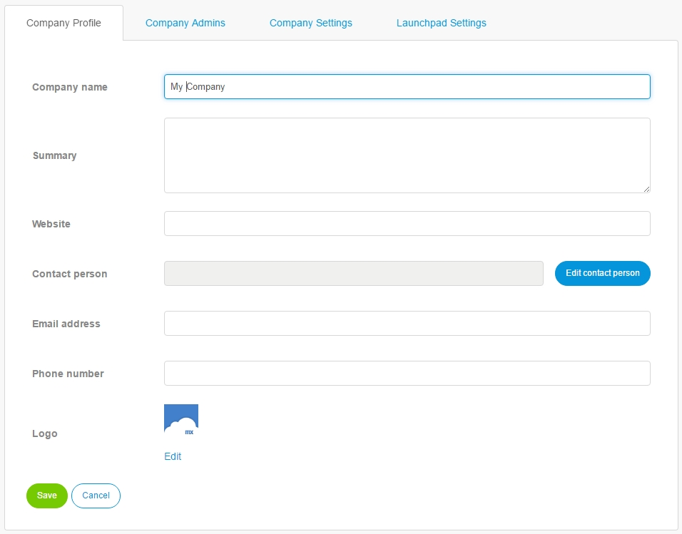

## 1 Introduction

A Company Admin can manage the following items in the **Company** section:

* Company Profile
* Company Admins
* Company Settings
* Launchpad Settings

## 2 Company Profile

A Company Admin can add or change the following items on the **Company Profile** tab:

*   Company name
*   Summary
*   Website
*   Contact person
*   Email address
*   Phone number
*   Logo

## 3 Company Admins

A Company Admin can manage the following items at the **Company Admins** tab:

*   Add/Edit/Remove Company Admin

## 4 Company Settings

A Company Admin can manage the following items at the **Company Settings** tab:

*   Change Password Expiration Settings
*   View Company Email Domains

## 5 Launchpad Settings

A Company Admin can manage the following items at the **Launchpad Settings** tab:

*   Choose your background image

To see the current background image of your own company, go to the **Mendix Launchpad** [https://home.mendix.com/home/](https://home.mendix.com/home/).

## 6 Related Content

* [Company Admin](index)
* [Users](nodes)
* [Apps](apps)
* [Nodes](nodes)
