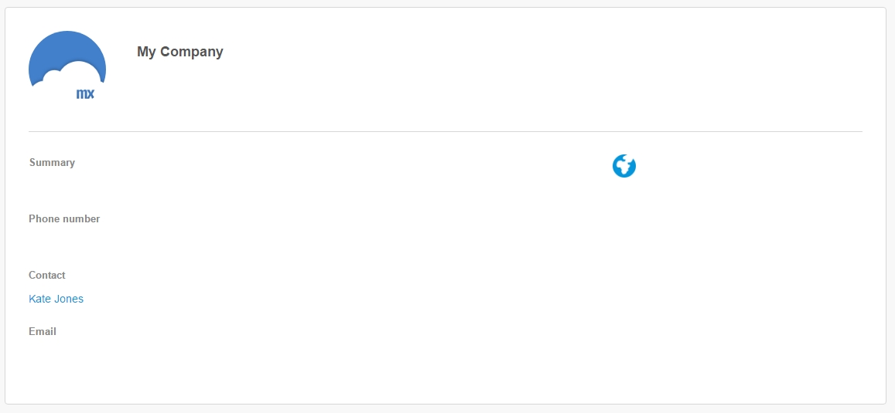
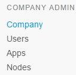
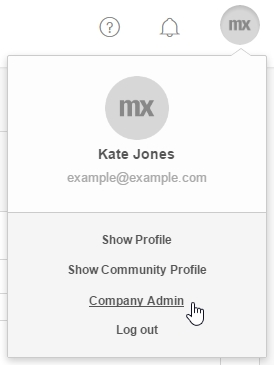

## 1 Introduction

Every company that uses Mendix can set up specific settings for apps, teams, and nodes. **Company Admins** can use the **Developer Portal** to manage the company's settings.

To see the **Company Admin** settings you need to:

*   Have a **MxID**. To create a MxID, click [here](https://www.mendix.com/try-now/).
*   Be a **Company Admin**. You can request information about the current Company Admin at [Mendix Support](https://support.mendix.com/hc/en-us).



Note that you need to have a MxID to get access to the [Developer Portal](http://home.mendix.com).



## 2 Company Contact

The Company Contact is internally the contact person about Mendix. All company members can see the Company Contact. Only a Company Admin can change the Company Contact.

There are two methods to see the Company Contact:

### Method 1
1.  Go to the [Developer Portal](http://home.mendix.com).
2.  Click on your **Avatar** (top right).
3.  Click **Show Profile**.
4.  Click the company name below your name.

### Method 2
1.  Go to the [Developer Portal](http://home.mendix.com).
2.  Click **People** in the top navigation.
3.  Click on a company member.
4.  Click on the company name.

## 3 Company Admin

A Company Admin can manage four categories of settings:

* Company settings
  * Edit company profile
  * Add and delete administrators
  * Manage the launchpad settings
* User settings
  * View all company users
  * Activate/deactivate users
  * Change password expiration settings
  * Accept company join requests
* App settings
  * View all company apps
  * Activate/deactivate apps
  * View app details
  * Delete apps
* Node settings
  * View all company nodes

A Company Admin can change the **Company settings** by following these steps:

1.  Go to the [Developer Portal](http://home.mendix.com).
2.  Click on your **Avatar** (top right).
3.  Click **Company Admin**.

  

## 4 Documents in This Category

* [Company](company)
* [Users](users)
* [Apps](apps)
* [Nodes](nodes)
