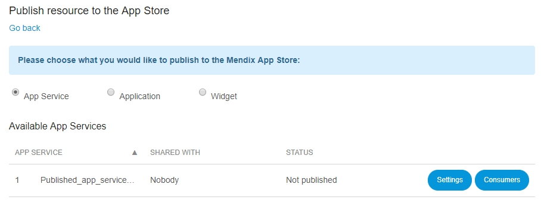

## 1 Introduction

The **App Services** page provides an overview of possible resources that can be published to the [Mendix App Store](https://appstore.home.mendix.com/):

*   App Service
*   Application
*   Widget

## 2 App Service

App Services are aimed to share a functionality between your Mendix Apps. You can create the App Services in your **Mendix Modeler** and publish the created App content and functionality within your company or to the entire Mendix Community. Users of your app service can directly drag and drop actions in the **Mendix Modeler** that you designed into their microflows and use your entities and data in their Apps. 

On the **App Service** page you can see an overview of the available app services, what the current status is and with who the App Service is shared with .

For more information, see the [Mendix App Services Video](https://www.mendix.com/videos/mendix-app-services-putting-work-projects-pieter-van-balen-mendix-developer/) or the [Published App Service documentation](/refguide/published-app-services).

### 2.1 Settings

In **Settings** you can manage the following:

*   App service info
*   Documentation
*   Screenshots

On the right side of the screen you can choose with who you want to **share this App Service** with:

*   Nobody
*   My company
*   Mendix Community

Saving your settings will update your App Service's listing in the App Store accordingly. Note that publishing to the community App Store is subject to an approval process; however your App Service will be available for your colleagues while it is awaiting approval.

#### App service info

In this tab you can manage as following:

*   General
    *   Edit **Name** of the App Service that will be published
    *   View the original **Modeler name** of the App Service
    *   Add or edit a **description** of the App Service
    *   Add or edit tags
*   Avatar
    *   Add or edit the App Service avatar -This small avatar will represent your App Service in grids.
    *   Add or edit the App Store avatar - This big avatar will showcase your App Service in the Mendix App Store.

#### Documentation

In this tab you can:

*   Write the **release notes** that are aimed to describe the changes between the two versions
*   View the **documentation** that is defined in the **Mendix Modeler** during the creation of the App Service
*   View the **service calls** that are used in the App Service

#### Screenshots

In this tab you can add schreenshots of the App Service to illustrate it's functionality. 

### 2.2 Consumers

On this page you can review which environments of which applications are currently consuming this App Service. 

## 3 Application

By selecting **Application** you can publish the application's model in the Mendix App Store.
Click **go to App Store** to publish your application's model.

For more information, read [Share App Store Content](/community/app-store/share-app-store-content).

## 4 Widget

By selecting **Widget** you can upload a widget to the Mendix App Store.
Click **go to App Store** to upload your widget.

For more information, read [Share App Store Content](/community/app-store/share-app-store-content).

## 5 Related Content

*   [Deploy](/developerportal/deploy)
*   [Mendix App Services Video](https://www.mendix.com/videos/mendix-app-services-putting-work-projects-pieter-van-balen-mendix-developer/)
*   [Published App Service](/refguide/published-app-services)
*   [Share App Store Content](/community/app-store/share-app-store-content)
