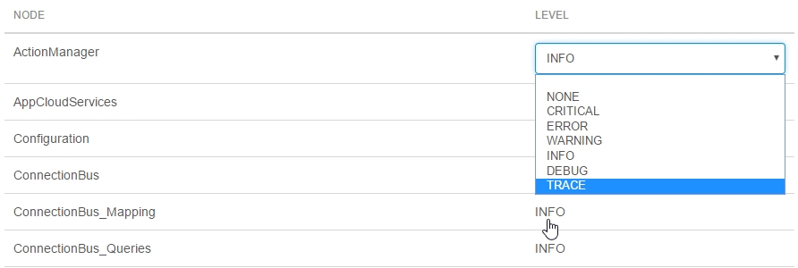

## 1 General

In **General**, you can find the following information about your node environment:

* Status
* Running since date
* Mode
* URL
* Java version
* Runtime version
* Administrator user name
* Database status
* Database version
* Region
* Mendix Cloud version

### 1.1 Actions

On the right side of the screen, you can find the following action buttons:

* **Start/Stop Application**
* **Show Logged in Users**
* **Change Admin Password**
* **View Current Log**
* **Disable Debugging**
    * For more information about enabling the debugger, see [Debug Microflows Remotely](/howto7/monitoring-troubleshooting/debug-microflows-remotely)

### 1.2 Overviews

At the bottom of the page, there are two overview grids with information about the following:

* License
* Deployment package that is loaded

### 1.3 License

The license overview contains the following information:

* Company owning the license
* License type
* Expiration date
* Runtime mode (Production/Acceptance/Test)
* Limitations
    * Limitation type
    * Amount type
    * Number of allowed users

Limitation types:

* Concurrent – the amount of named users that are logged in simultaneously
* Concurrent anonymous – the amount of anonymous users that are logged in simultaneously
* Named – the amount of named users registered in the database that are allowed to use the application

### 1.4 Loaded Deployment Package

In this section, you can find information about the deployment package that is currently loaded into the environment:

* Size of the deployment package
* Upload date
* Version of the deployment package
* Name of the deployment package

## 2 Model Options

On the second tab of the **Environment details** page, you can edit the following model options:

* Scheduled events
* Constants

### 2.1 Scheduled Events

In this section you can view your configured scheduled events.

If you select a scheduled event and click **Toggle**, you can switch the scheduled event off and on. 



You have to restart your application before the changes will be made.



With scheduled events, you can let the Runtime execute a microflow at a specific moment in time. The event can also be repeated with a given interval (for example, every day).

For more information, see [Scheduled Events](../../refguide/scheduled-events).

### 2.2 Constants

In this section, you can view the configured constants. Constants are used to define configuration values that can differ per environment.

To fill in a new value, select the constant and click **Edit**.



You have to restart your application before the changes will be made.



For more information, see [Constants](../../refguide/constants).

## 3 Network

On the third tab of the **Environment details** page, you can manage the following elements:

* Custom domains
* Preventing embedding your app in an IFrame
* Request handlers
* Access restriction profiles
* Environment access restrictions
* Request handler restrictions
* Outgoing connections certificates

### 3.1 Custom Domains

* Domain name
* Certificate
* Expire

You can perform the following actions:

* Create (here you have to provide the **domainname** and select the **certificate** from a drop-down menu)
* Edit
* Delete

### 3.2 Prevent Embedding Your App in an IFrame

Your application can be embedded in another site using an IFrame. To prevent this, you can deny embedding using the setting below. This will set an X-Frame-Options header for each HTTP response from your app. Please note that Chrome will ignore the **Allow from specific domain** option.

The embedding options are:

* Allow
* Never allow
* Allow on the same domain
* Allow from specific domain

### 3.3 Request Handlers

Configure custom request handlers for requests that will be sent to the runtime. If you enable `/ws/`, these requests will end up at the runtime. Everything not specified here (except for `/xas/` and `/file/`) will end up at the static file server which serves the web folder from disk.

*   Path
*   Match type
*   Enabled in the following:
    *   Environment: Production, Acceptance, Test
    *   N/A



If you are configuring the request handlers in, for example, the acceptance environment, and the request handlers are only enabled in, for example, the production environment, select the request handler and click **Toggle** to enable it in the environment that you are configuring.



You can perform the following actions:

* Toggle
* New request handler — you must provide the path and choose the match type between `starts with` and `exact match`
* Delete the request handler

### 3.4 Access Restriction Profiles

You can restrict access to your application by means of Client Certificates or IP ranges. Here you can define the profiles that can be used on the full application or specific request handlers.

*   Description
*   Used for

You can take the following actions:

*   New 
    *   Demand that: 
        *   Certificates should match
        *   Certificate or IP should match
        *   IP should match
    *   Add an Description
    *   View in which environment it is active - Production/Acceptance/Test
    *   Add an Certificate authority 
*   Edit
*   Delete

### 3.5 Environment Access Restrictions

You can restrict access to your application by means of client certificates or IP ranges. To enable this, first create an access restriction profile before selecting it from the drop-down menu below.

### 3.6 Request Handler Access Restrictions

Advanced users can override access restrictions for specific request handlers. To do this, please specify an access restriction per request handler in the list.

### 3.7 Outgoing Connections Certificates

Add client certificates (in the PKCS12 format) or certificate authorites (in the PEM format). These will be used when your application initiates SSL/TLS connections.

## 4 Log Levels

Log levels are used to distinguish the log messages and to highlight the highest priority ones so that they can receive the immediate intervention they require.

On this tab of **Environment details**, you can perform the following actions:

* Retreive the current log levels by clicking the **Refresh** button
* Change the log level type by clicking the specific level
* Click the **Set all to INFO** button to revert all the changes

The log level types are:

* None
* Critical
* Error
* Warning
* Info
* Debug
* Trace

For more information about log levels, see [How to Set Log Levels](/howto/monitoring-troubleshooting/log-levels).

## 5 Runtime

On this tab of the **Environment details**, you can perform the following actions:

* **Add** a new runtime **setting** with a new **value**
* **Edit** the runtime setting
* **Delete** the runtime settings

For more information about runtime settings, read the [Custom Settings](/refguide/custom-settings) documentation.

## 6 Maintenance 

There are two types of maintenance:

*  Regular weekly maintenance, which does not affect your app
    * Where you can change the preferred maintenance window
* Planned maintenance, which will affect your app in some ways
    * You will automatically receive an **email** about this and you can override the maintenance window

For more information about maintenance, see [How to Configure Maintenance Windows](/developerportal/howto/maintenance-windows).

### 6.1 Preferred Maintenance Window

You can view and change the preferred maintenance. 

### 6.2 Planned Maintenance

When a maintenance operation is planned, it will show up under **Planned Maintenance**. By default, this will be planned in your preferred maintenance window. You can override the maintenance window of a specific maintenance operation by clicking **Override**.

You will automatically receive **email notifications** about planned maintenance.
