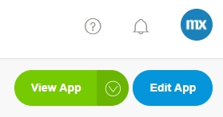

## Introduction

The **Develop** category exists of the following pages:

*   Model
*   Team Server
*   Planning

## 2 Model

In the **Developer Portal** you can open or edit the App anytime by clicking the buttons **View App** or **Edit App**

The **Model** page is a separate page where you can open de model of your App. There are two options to open your model:

*   Open the App model in the Desktop Modeler
*   Open the App model in the Web Modeler

For more details, see [Model](/developerportal/develop/model).

## 3 Team Server

Changes made through the Desktop Modeler are stored in the Mendix Team Server. This page provides an overview of the revisions committed by any of the team's members.

Here you can also find the Team Server URL. 
For example: 'https://teamserver.sprintr.com/<your AppID>' 

For more information, see [Team Server](https://docs.mendix.com/refguide/team-server).

## 4 Planning

The **Planning** page provides an overview of the progression of the **Stories** in the **Collaborate** category. This page exists of three tabs:

*   Sprint Status
*   Burndown Chart
*   Release Plan

### 4.1 Sprint Status

Under this tab there is a Kanban overview of the **Stories** in the current Sprint. You can **Mark current Sprint as completed** and change the status **To-do**, **Running** and **Done** of the stories. All changes made on this page are directly passed on to the **Stories** page and vice versa. 

### 4.2 Burndown Chart

The **Burndown Chart** tab shows graphically the progress of the current Sprint. Under **Sprint History** you can view the Burndown Charts of the completed Sprints.

### 4.3 Release Plan

Under this tab you will get an overview of all Sprints. You can edit the Sprints and **Plan Something**:

*   A Sprint
*   A Release
*   Other

All changes made on this page are directly passed on to the **Stories** page and vice versa. 

## 4 Related Content

*   [Model](/developerportal/develop/model)
