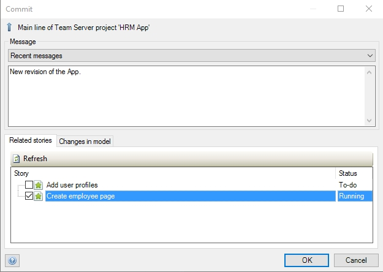

## 1 Introduction

Changes made through the Desktop Modeler are stored in the Mendix ***Team Server***. 
This page provides an overview of the revisions committed by any of the team's members.

## 2 Revision

In a revision you can see the following information:

*   The date of the committed revision
*   The team member that committed the revision
*   The branch that the revision was committed to
*   The Mendix Modeler version
*   The revision number

### 2.1 Details

If you click on **Details** of a revision, there will appear extra information about this revision:

*   The message in the revision commit
*   The related stories

The **Related Stories** will only appear if you select them in the commit dialog of the Desktop Modeler

## 3 Related Content

*   [Develop](/developerportal/develop)
*   [Model](/developerportal/develop/model)
