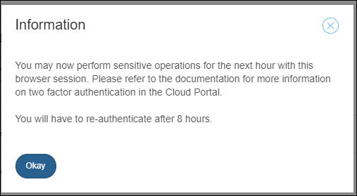

## 1 Introduction

In the **Deploy** and **Operate** categories of the [Developer Portal](http://home.mendix.com) there are several procedures that require a **Two-Factor Authentication**.
This document describes the goal and the fuctionality of the Google Two-Factor Authentication.

## 2 The Puropose

The **production environment** contains very sentative data. Every little change on this environment has a visible impact. It is important that only authorized persons can enter this environment. To make sure that the person is who authorized, there is a second check.

For more information, see [Google Authentication](https://www.google.com/landing/2step/#tab=how-it-protects)

## 3 How it Works

For security reasons, you must use the Google Two-Factor Authenticator if you want to make changes on the **Production environment** of your app. 

        

After entering the authentication code, the Authenticator will be disabled for the next 8 hours and you can make changes for 1 hour with your browser session.

      

## 4 Set Up and Disable

See [How to Set up your Two-Factor Authentication with Google](/howtogeneral/support/how-to-set-up-two-factor-authentication-with-google-authenticator).

If you chage your device or your phone number, you must contact [Mendix Support](https;//support.mendix.com) to disable the Google Authenticator on your **Mendix Account**.
After it's been disabled, you can set it up again.

## 5 Technical Contact

Team members with **App Team - Deploy Permissions** are authorized to have **node permissions**. The Technical Contact can grad those members different permissions that can differ per environment. 

For example, unexperienced team members are only allowed on the **acceptance environment** and will not be able to enter the **production environment**.

For more information, see [Security - Node Permissions](/developerportal/settings/node-permissions).

## 6 Related Content
 
*   [Settings](/developerportal/settings)
