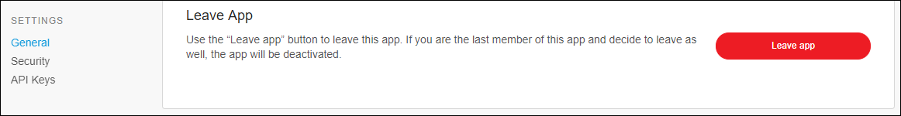
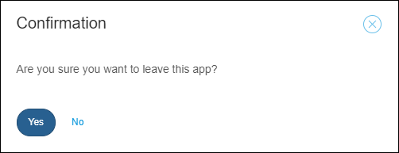
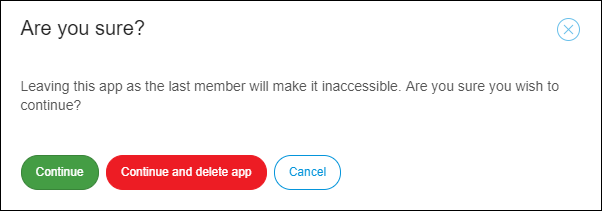

## 1 Introduction

{Add the introduction text here. Write about what this Mendix Reference Guide page will cover and what the user will learn.}

## 2 Leave, delete or deactivate your App

If you want to delete, deactivate or leave your App, follow these steps:

1. Go to the [Developer Portal](http://home.mendix.com).
2. Click **Apps** in the top navigation panel and select the app that you want to leave.
3. Click **General** under the **Settings** category.
4. Click **Leave app**.

        

### 2.1 Leave the App with team members

You can only leave the app when you are NOT the **Technical Contact**. 
After leaving, the app will still exist in the company and it will be available for other team members.
If you want to return to the app team, other team members can add you again by inviting you to the app.

     

### 2.2 Leave the App without team members

You can leave the app if you are the only team member of the app and still keep the app in the company. This way the app will be deactivated.
Because the app will still exist within the company, only the **Company Admin** can activate the app and invite members to it.

To leave and deactivate the app, click **Continue**

    

The Company Admin has to activate the app by following these steps:

1. In the [Developer Portal](http://home.mendix.com) go to the **Company Admin** Portal.
2. In the **Apps** tab, select the app that must be activated and click **Activate**.

### 2.3 Leave and Delete the App without team members

You can ‘Leave and delete the App’ when you are the only member in the App. This is irreversible. The App will be deleted from the company.

To leave and delete the app, click **Continue and delete app**.

     

## 3 Related Content

* [Apps](/developerportal/companyadmin/apps)
* [Company Admin](/developerportal/companyadmin)
* [General](/developerportal/settings/general-settings)
* [Settings](/developerportal/settings)
