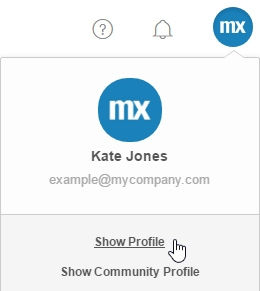
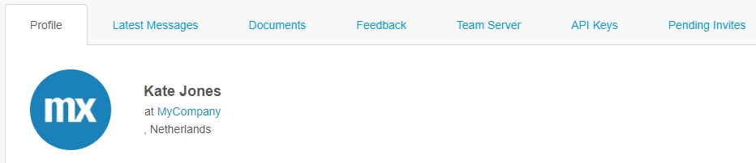
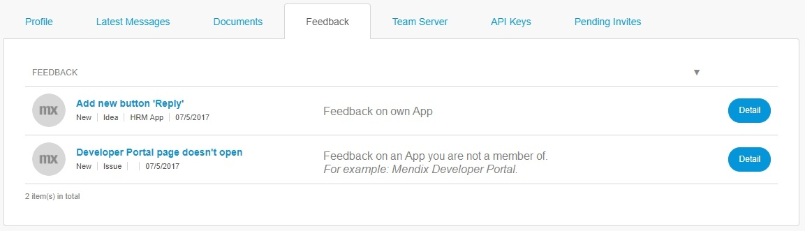
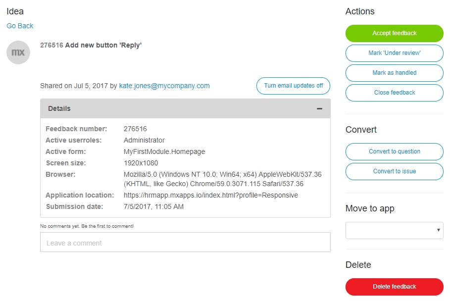
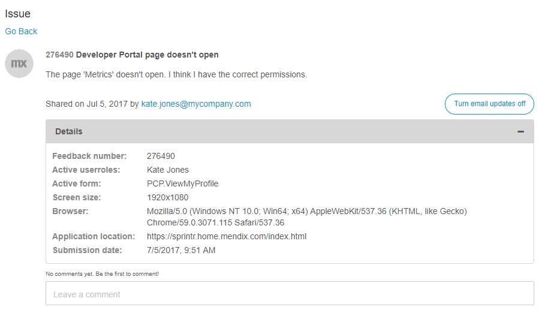

## 1 Show Profile

To view your own profile in the **Developer Portal** you can simply click on your **Avatar** in the top right corner of the navigation panel. 
Then select **Show Profile**.

Here you can manage the following tabs:

*   Profile
*   Latest messages
*   Documents
*   Feedback
*   Team Server
*   API Keys
*   Pending invites

### 1.1 Profile

In this tab you can view the following information:

*   Summary
*   Department
*   Birthday
*   Phone number
*   Email
*   OpenID  (an identifier generated by Mendix to uniquely identify a user)

### 1.2 Latest messages

In this tab you will get an overview of all notifications of the **Buzz** that you are a part of. For example:

*   created app/sprint/story
*   added file/comment
*   joined new App team 

### 1.3 Documents

In this tab you will get an overview of all documents that you have shared within different Apps in the **Developer Portal**. 

### 1.4 Feedback

In this tab you can view your provided Feedback on: 

*   Apps that you are a team member of
*   company's Apps that you are **not** a team member of or on external Apps (for example on Mendix).

If you click **Details** of the feedback on an App that you are a member of, you can manage it.

If you click **Details** of the feedback on an App that you are **not** a member of, you cannot manage it.

### 1.5 Team Server

Changes made through the Desktop Modeler are stored in the Mendix Team Server. 
This tab provides an overview of the revisions committed by you.

### 1.6 API Keys

In this tab you can view and create API keys which can be used by external applications to connect to the APIs of the Developer Portal on behalf of your user account. These keys allow you to execute operations (or have them executed on your behalf) which require authentication, but for which you would not want to pass your actual password. An example of this would be to use an API key to perform scripted operations on your application model with the Platform SDK.

For more information, see [Mendix Platform SDK](/apidocs-mxsdk/mxsdk).

### 1.7 Pending invites

In this tab you can view your **send** and **received** invitations.

There are 2 types of invitation:

*   Project invititation - invitation to join the development team to work on an App
*   App invitation - invitation to join the App as an end user

## 2 Edit Profile

In the right top corner of your profile page you can click **Edit** to manage your profile.
Here you can for example edit your avatar and manage:

*   general information
*   information about your work status
*   some contact info will come in handy
*   your password

### 2.1 General

In this section you can change your:

*   Fullname
*   Email
*   Email notifications
    *   Receive daily digest
    *   Receive updates for threads in which I am active
*   Date of birth

### 2.2 Information about your work status

In this section you can change your:

*   Job title
*   Department
*   Location
*   Country

### 2.3 Some contact info will come in handy

In this section you can change your:

*   Phone number
*   Website URL
*   Twitter name
*   LinkedIn URL
*   Skype name

### 2.4 Change password

Here you can change your password. By default, you are requested to change your password every 90 days. Only the **Company Admin** is allowed to change the experience period.
 
The password requirements are:

*   Use at least 8 characters
*   Use letters and numbers
*   Use special characters (such as ! + @)
*   Mix lower and uppercase

## 3 Related Content

*   [Company Admin](/developerportal/companyadmin)
*   [Feedback](/developerportal/collaborate/feedback)
*   [Mendix Platform SDK](/apidocs-mxsdk/mxsdk)
