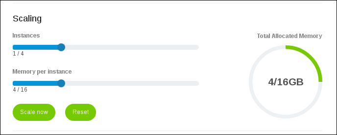

## 1 Introduction

To scale an evironment of your app, you will need to have a licensed app. All apps that are becoming licensed after April 2017, will be by default hosted in Mendix Cloud Version 4.

**This how-to will teach you how to do the following:**

* Scale your environment in Mendix Cloud v4

# 2 Prerequisites

Before starting this how-to, make sure you have completed the following prerequisites:

* You have a licensed app hosted in Mendix Cloud v4

## 3 Mendix Cloud Version

To see in which cloud version your app is hosted on:

1. Go to the [Developer Portal](http://home.mendix.com) and select your licensed app.
2. Click **Environments**.

    

3. Click **Details** of a selected environment.

    

4. Next to **Mendix Cloud Version** you will see the version of the cloud that your licensed app is hosted on.

The possible cloud versions are:

*   Mendix Cloud v3 - no scaling possible
*   Mendix Cloud v4 - scaling is possible

## 4 How to Scale Your Environment

If you want to scale your licensed app in Mendix Cloud v4, follow these instructions:

1. Go to the [Developer Portal](http://home.mendix.com) and select your licensed app.
2. Click **Environments**.
3. Click **Details** of a selected environment.
4. Set the amount of **instances** from 1 to 4 by dragging the scroller from the left side to the right side of the screen.
5. Set the amount of **memory per instance** that you want to use. You are not obligated to use the whole memory at once.

If you have 1GB RAM of the **Total Allocated Memory**, you have 1 **instance** available to store your memory. 
To scale your memory over multiple instances you need more memory.

     

### 4.1 Scaling Example 1

If you have more than 1GB (for example 16GB) RAM of the **Total Allocated Memory**, you can spread the memory among 4 **instances**. 

For example, you can scale 16GB of the **Total Allocated Memory** four times with 4GB over 4 **instances** (4 x 4GB = 16GB).

### 4.2 Scaling Example 2

You don't need to use the whole memory at once. You can just use part of it and then use the rest of the memory later.

For example, you can use one **instance** and store 4GB of RAM in there. The other 12GB of RAM will be unused.

    

## 5 Related Content

* [Deploy](/developerportal/deploy)
* [Environments](/developerportal/deploy/environments)
* [Mendix Cloud v4 - FAQ](/howtogeneral/mendixcloud/mxcloudv4)
* [Migrate to Mendix Cloud v4](/developerportal/howto/migrating-to-v4)
