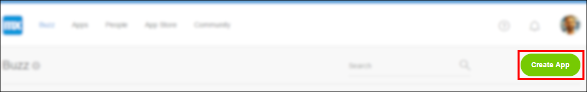
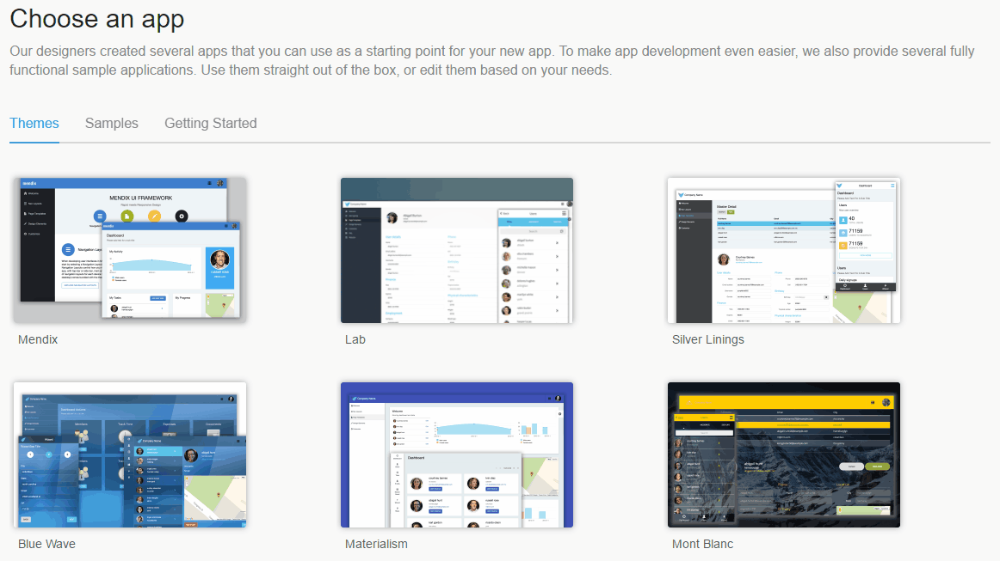
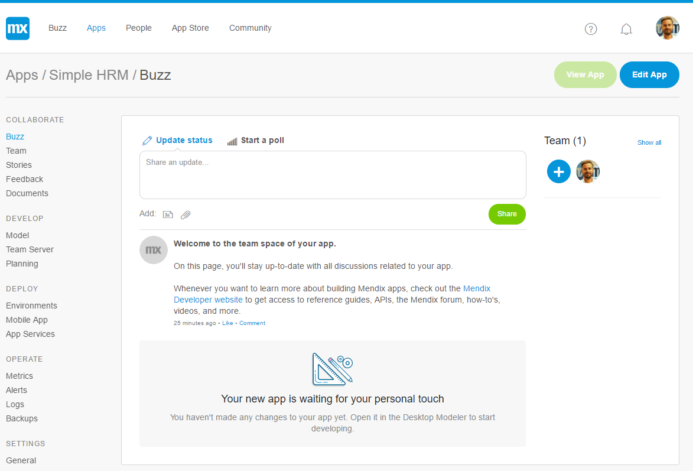
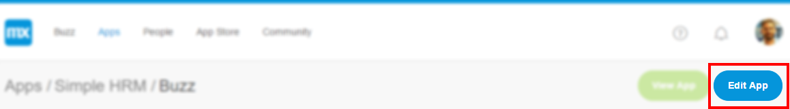
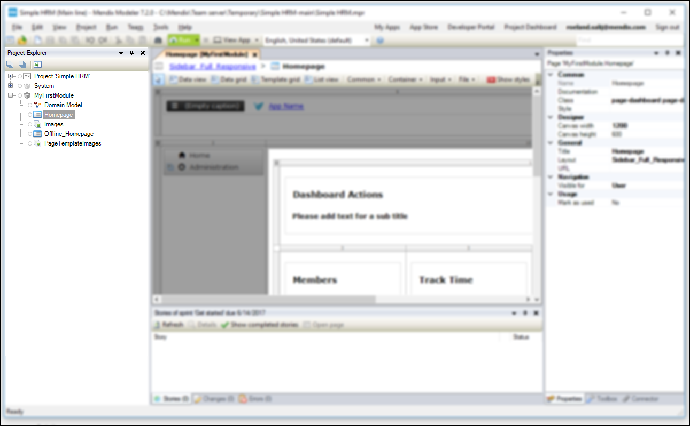
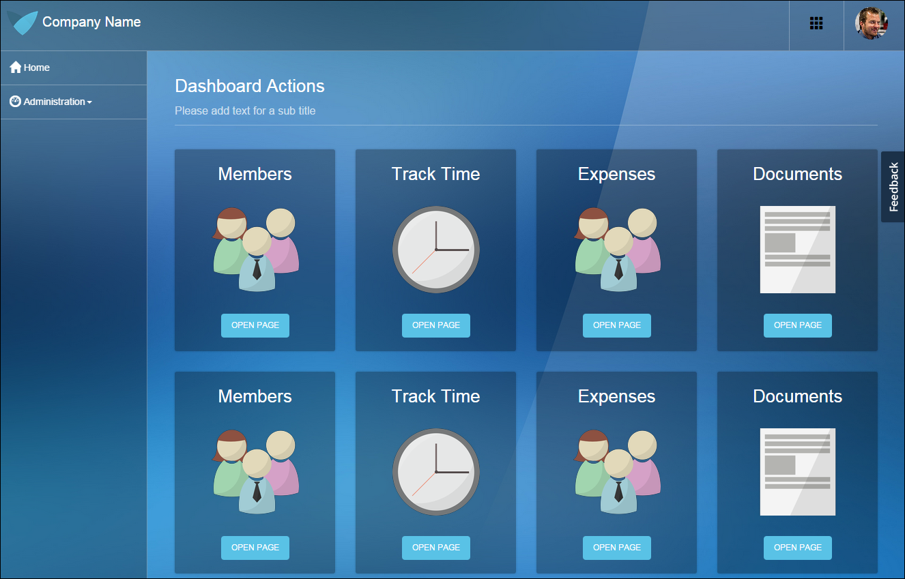

## 1 Introduction

This how-to is takes you through the basics of development in Mendix and let's you build a simple HRM file. 

**This how-to will teach you how to do the following:**

* Create an app
* Manage an app
* Deploy an app

## 2 Prerequisites

Before starting with this how-to, make sure you have completed the following prerequisite:

* Create a [Mendix account](https://www.mendix.com/try-now/?utm_source=documentation&utm_medium=community&utm_campaign=signup)

## 3 Creating Your App

To create your app, follow these steps:

1. Go to the **Mendix Platform Portal**  ([home.mendix.com](http://home.mendix.com)) and log in if you are not already logged in. 
    The Mendix Platform Portal is the central starting point for using, sharing, and building apps.

2. In the Mendix Developer Portal, click **Create App**. 
     
3. On the **THEMES** tab, select a theme. We use **Blue Wave** theme in this how-to. To learn more about themes, see [The Eye-Catching Mendix UI Framework](https://www.mendix.com/blog/the-eye-catching-mendix-ui-framework/).
4. Click **Use this app**, enter the name of your application and click **Create App**.
      

5. Your app is now being created! When your app is ready you will land on the **Buzz** page of your application you can see and share ideas as well as collaborate with your team.  
    In the tile on the right side of the screen, you can see your team and invite colleagues to join the project. 
    

## 4 Download Modeler and Edit Your App

To edit your app, follow these steps:

1. Make sure you have downloaded and installed the modeler. Download the latest modeler [here](https://appstore.home.mendix.com/link/modelers/). Note that this tutorial has been created with Mendix 7.2.0.

2. You can open your App from the My Apps overview in the modeler. You can also go back to the buzz page of your new app in the Platform portal and click the **Edit App** button to open your app in the modeler. 
     

    When your app is loaded into the Modeler you will find the **Project Explorer** dock on the left side of the Modeler. This dock lists all of the developer content of your app. You can add pages, logic, and other content here.
    

## 5 Deploying Your App

To deploy your app to a sandbox in the Mendix cloud so others can view and test the, follow these steps:

1. Click **Run** to deploy your app to a Free App deployment environment: 
    
2. Click **View App** to open the app in your browser: 
    

    Excellent! Check out the app you just deployed.
    

To use the second how-to for creating a simple HRM application, see [Build a Simple HRM App 2: Perform the First Steps in Building a Rich GUI](build-a-simple-hrm-app-2-first-steps-in-building-a-rich-gui).

## 6 Related Content

* [Build a Simple HRM App 2: Perform the First Steps in Building a Rich GUI](build-a-simple-hrm-app-2-first-steps-in-building-a-rich-gui)
* [Build a Simple HRM App 3: Show Related Data in the GUI](build-a-simple-hrm-app-3-show-related-data-in-the-gui)
* [Build a Simple HRM App 4: Enrich the GUI with Filter Options](build-a-simple-hrm-app-4-enrich-the-gui-with-filter-options)
* [Build a Simple HRM App 5: Smarten Up Your App with Business Logic](build-a-simple-hrm-app-5-smarten-up-your-app-with-business-logic)
* [Create and Deploy Your First App](create-and-deploy-your-first-app)
* [Testing Microflows Using the UnitTesting Module](../testing/testing-microflows-using-the-unittesting-module)
