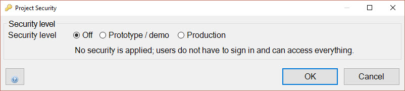
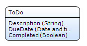

## 1 Introduction

In this how-to, you will create and prepare a new project, module, and domain model. This is the first how-to in the series for creating a to-do app in 20 minutes using the Mendix Mobile Quick Starter app.

**This how-to will teach you how to do the following:**

* Create a project that will speed up and simplify your mobile app development

## 2 Prerequisites

Before starting this how-to, make sure you have completed the following prerequisite:

* Download [Mendix Desktop Modeler 7.3 or later](https://appstore.home.mendix.com/link/modeler/)

## 3 Creating and Preparing a New Project

The basis for the to-do app is the Mobile Quick Starter App. Follow these steps to create a new app with the Mobile Quick Starter App:

1. Open the **Mendix Desktop Modeler** and log in.
2. Click **Create App**.
3. Go the the **Samples** tab.
4. Click **Mobile Quick Starter App**.
5. Click **Use this starting point >**.
6. Enter the app details and click **Create app**.
7. Open the **Security** settings of your project.
8. Switch the **Securiy level** to **Off** and click **OK**.

Switching the security level to *Off* is done for fast development. Make sure you change it back to *Production* and configure the security of your app when you are going to use the app in a production environment.

## 4 Creating a New Module

The to-do app will use a separate module, so you can keep all the to-do app documents in one location. Follow these steps to create a new module:

1. Right-click your **ProjectName** in the Project Explorer.
2. Click **Add module** and give it the name **ToDo**.

## 5 Creating the Domain Model

The domain for the to-do app is pretty simple. It contains one entity with some attributes. Follow these steps to create the entity and attributes:

1. Open the **Domain Model** in the **ToDo** module.
2. Add a new **Entity** to the Domain Model.
2. Rename the entity to **ToDo***.
3. Add the following three attributes:
  * *Description* (String)
  * *DueDate* (Date and time)
  * *Completed* (Boolean with default value *False*)

  

For the next step in this series, move on to [How to Create a Mobile To-Do App Step 2: Create the Pages](create-a-to-do-app-2).

## 6 Related Content

* [How to Create a Mobile To-Do App Step 2: Create the Pages](create-a-to-do-app-2)
* [How to Create a Mobile To-Do App Step 3: Improve the Look and Feel of the App](create-a-to-do-app-3)
* [How to Create a Mobile To-Do App Step 4: Add Logic to the Microflows](create-a-to-do-app-4)
* [How to Deploy Your First Hybrid Mobile App](../mobile/deploy-your-first-hybrid-mobile-app)
* [How to Publish a Mendix Hybrid Mobile App in Mobile App Stores](../mobile/publishing-a-mendix-hybrid-mobile-app-in-mobile-app-stores)
* [Push Notifications](../mobile/push-notifications)
