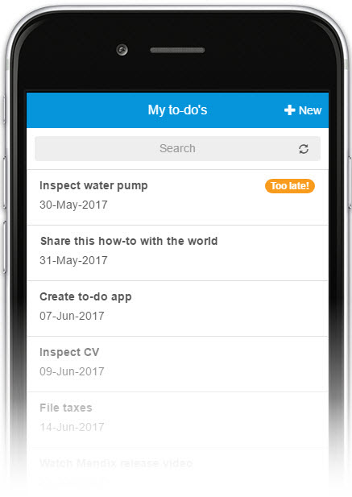
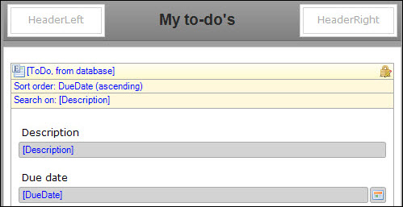
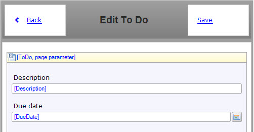
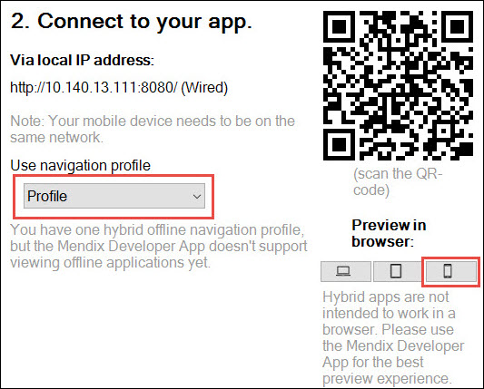
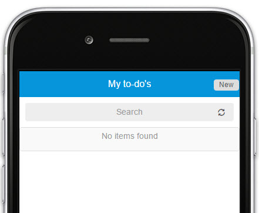

## 1 Introduction

_______

**This how-to will teach you how to do the following:**

[EDIT - WHICH TO INCLUDE?]

* Create a project that will speed up and simplify your mobile app development
* Build a to-do app
* Configure several widgets to realize a rich mobile app with a native look and feel

## 2 Prerequisites

Before starting this how-to, make sure you have completed the following prerequisite:

* Complete [Create a Mobile To-Do App Step 1: ]()

## 3 Creating the Pages
In this chapter you will create the Homepage and NewEdit pages to create and adjust to-do's.

### 3.1 Create the Home Page
The app will use the home page as the landing page when users open the to-do app. It contains a list of their to-do's. Follow these steps to create the home page:

1. Right click your newly created ToDo module and select **Add > Page**.
2. Go to the **Phone Specific** tab and click **Yes** when you're asked to create a new Phone Profile.
3. Name the page **Home_Phone_Default**.
4. Select *Phone_HeaderOnly* as **Navigation layout**.
5. Click **Blank** on the left side and select the *Blank* page template.
6. Click **OK** to create the page.
7. Open your project's **Navigation** and set the **Home_Phone_Default page** in the ToDo module as default home page.

### 3.2 Configure the Home Page
Let's add some content to the home page so it can show a list of to-do's. Follow these steps to add a list view to the home page:

1. Change the page title to **My to-do's** in the **Properties** pane on the right side of the Modeler.
2. Remove the **Layout grid** from the page.
3. Add a **List view** to the page.
4. Right-click the **List view** and select **Select data soure**.
5. Click **Select** and select the **ToDo** entity for the **Entity (path)**.
6. Click **OK** and then **Yes** to automatically fill the content of the list view.
7. Remove the **Completed** attribute.
8. Double-click the **Sort order: (default)** and add the **DueDate** attribute with the **Ascending** sort direction.

You can now see a list of to-do's on your home page. Let's configure a page to create to-do's.

### 3.4 Create and Configure the New and Edit Page
Users also need to be able to add new to-do's to the list, that's why you're going to add a page that lets them do this. Follow these steps to create a new and edit page:

1. Add a **Create button** to the **HeaderRight** placeholder on the page.
2. Select the **ToDo** entity in the pop-up.
3. Right-click the **New** button and select **Generate page**.
4. Select **Form default** and click **OK**.
5. Right-click the **New** button and select **Go to page**.
6. Delete the **Completed** attribute.

  
7. Run the app locally. Click **Save and continue** if you did not save your page(s) yet.
8. Click **Yes** to create a default database if this is asked.
9. Open the **View App** dropdown and select **View Hybrid Mobile App**.
10. Select the **Profile** profile and click the iPhone form factor for **Preview in browser**.
  

This is an easy way to see your app. There is also a way to simulate the touch behavior of a user on a mobile device. This is explained later on in this how-to.

## 4 Related Content

[EDIT]

* [How to Deploy Your First Hybrid Mobile App](../mobile/deploy-your-first-hybrid-mobile-app)
* [How to Publish a Mendix Hybrid Mobile App in Mobile App Stores](../mobile/publishing-a-mendix-hybrid-mobile-app-in-mobile-app-stores)
* [Push Notifications](../mobile/push-notifications)
